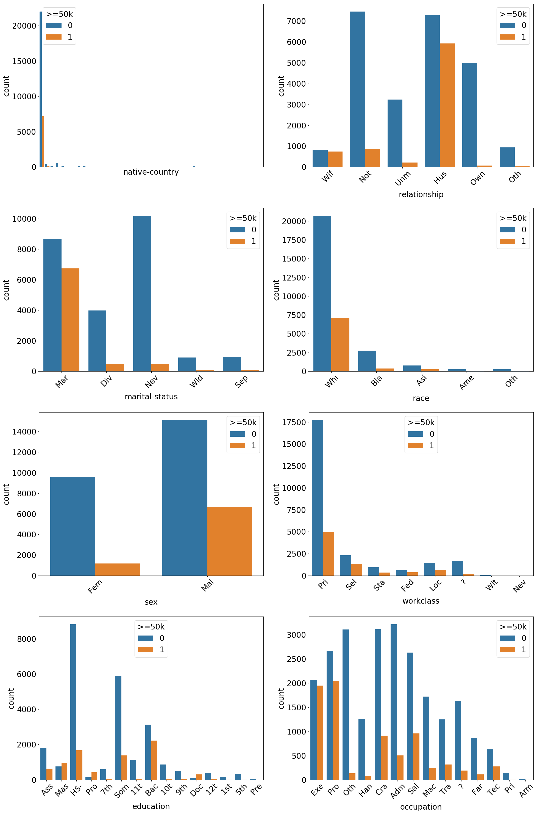

# Datasets

Details of each of the datasets used in \Cref{chp:exp} and elsewhere.

## Adult Dataset

The Adult dataset, originally used in [@Kohavi1996], is data that was extracted from the census bureau database[^cens] and can be accessed from this link[^adult_dl].
The task here is to predict whether or a not a certain person's income exceeds $50,000 per year.
Thus it is posed as a binary classifcation problem.

[^cens]: http://www.census.gov/en.html
[^adult_dl]: http://archive.ics.uci.edu/ml/datasets/Adult

In total there are 14 features and 48,842 observations.
Two-thirds of the observations were randomly selected to form the training set and the rest allocated to the test set.
Note, that we will not use any of the observations in the test set during our experiments.
The details for each of the features are listed below.
We indicate the continuous features and the classes for the categorical features.

+ *age*: continuous

+ *workclass*: Private, Self-emp-not-inc, Self-emp-inc, Federal-gov, Local-gov, State-gov, Without-pay, Never-worked

+ *fnlwgt*: continuous

+ *education*: Bachelors, Some-college, 11th, HS-grad, Prof-school, Assoc-acdm, Assoc-voc, 9th, 7th-8th, 12th, Masters, 1st-4th, 10th, Doctorate, 5th-6th, Preschool

+ *education-num*: continuous

+ *marital-status*: Married-civ-spouse, Divorced, Never-married, Separated, Widowed, Married-spouse-absent, Married-AF-spouse

+ *occupation*: Tech-support, Craft-repair, Other-service, Sales, Exec-managerial, Prof-specialty, Handlers-cleaners, Machine-op-inspct, Adm-clerical, Farming-fishing, Transport-moving, Priv-house-serv, Protective-serv, Armed-Forces

+ *relationship*: Wife, Own-child, Husband, Not-in-family, Other-relative, Unmarried

+ *race*: White, Asian-Pac-Islander, Amer-Indian-Eskimo, Other, Black

+ *sex*: Female, Male

+ *capital-gain*: continuous

+ *capital-loss*: continuous

+ *hours-per-week*: continuous

+ *native-country*: United-States, Cambodia, England, Puerto-Rico, Canada, Germany, Outlying-US(Guam-USVI-etc), India, Japan, Greece, South, China, Cuba, Iran, Honduras, Philippines, Italy, Poland, Jamaica, Vietnam, Mexico, Portugal, Ireland, France, Dominican-Republic, Laos, Ecuador, Taiwan, Haiti, Columbia, Hungary, Guatemala, Nicaragua, Scotland, Thailand, Yugoslavia, El-Salvador, Trinadad&Tobago, Peru, Hong, Holand-Netherlands

The distributions of the continuous features are plotted in \autoref{fig:ad_cont} and the counts of the categories for each of the categorical features can be found in \autoref{fig:ad_cat}.
The highest reported accuracy in the original paper [@Kohavi1996] was 85.9% by the NBTree algorithm and in an unpublished experiment[^kag_exp] one researcher achieve ~88% accuracy with boosted trees.

[^kag_exp]: https://www.kaggle.com/kanav0183/catboost-and-other-class-algos-with-88-accuracy

