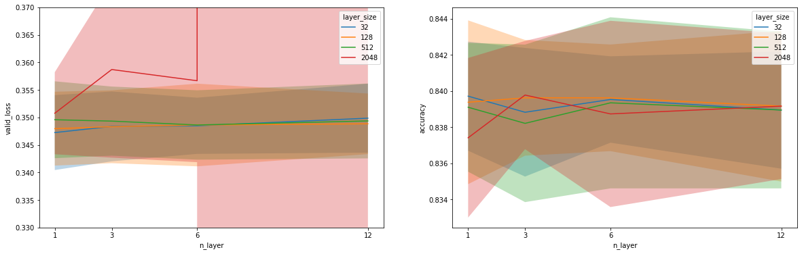
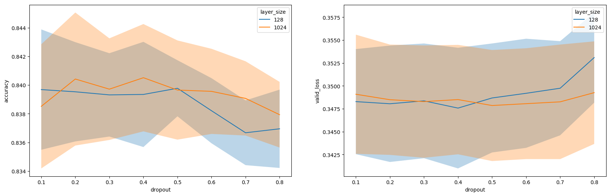

# Hyperparameter Search \label{app:B}

## Width and Depth of Network

This is a very common hyperparameter to train, for exmaple, done by [@Guo2017; @Qu2016; @Zhang2016].
Here we investigate the effect of the size of the network on the different datasets.
We compare the performance of the models at different numbers and sizes of layers.
Larger networks are more flexible and therefore we expect it to act similarly to any learning model flexibility parameter.
Increasing the network size will be beneficial up until a certrain point until it becomes too big and be more prone to overfitting.
We also want to get a feel for how important these hyperparameters are.
On the Adult dataset we experimented with layer depths of 1, 3, 6 and 12, and layer widths of 32, 128, 512, 2048.
Note give all layers the same width as this is found to work good enough in practice [@Guo2017, @Qu2016, @Zhang2016].
The results of the experiment are displayed in \autoref{fig:widthdepth}.
The results are mixed between the accuracy and the validation loss and there is not much separating any of the models.
Except for the very wide network that had a diverging validation loss.
For the sake of simplicity we would recommend to use a 3-layer network with 128 units.

## Dropout

Dropout is almost always used in deep learning and it is a typical parameter to tune before modelling.
We wanted to find out what the best dropout ratio is for our models and how the performance varies over different values.
We tested dropout proportions of [0.1,0.2,...,0.8] on a wide and narrow network respectively.
The results are given in \autoref{fig:exp_drop}.
From these results we see that any dropout ratio between 0.2 and 0.5 will suffice for both types of networks.

