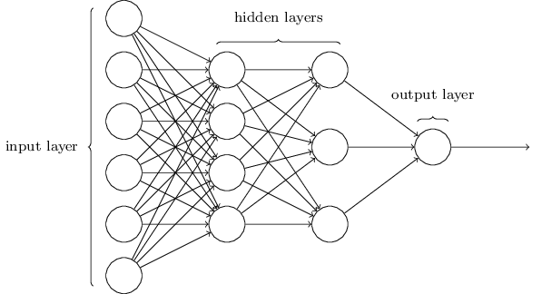

# Neural Networks

## Introduction

A Neural Network (NN), like any other machine learning model, is a function that maps inputs to outputs, *i.e.* 
$$
f:\boldsymbol{x}\to y.
$$
The NN, $f$, receives input, $\boldsymbol{x}$, and produces output, $y$.
What happens inside of $f$ is loosely based on biological neural systems, or the brain.
The brain consists of a collection of interconnected neurons, each sending and receiving signals between each other.
An artifical NN tries to copy this stucture by modelling what happens inside of a single neuron by outputting a weighted combination of its inputs, combined with a simple non-linear transformation.
The output of a neuron is referred to as activations.
These neurons are grouped in so-called layers.
At each layer the input is passed through each of the neurons and their activations, then in turn, gets passed to the next layer.
See \autoref{fig:nn} for an illustration of this structure.
A more detailed explanation of the structure of a NN is given in \autoref{sec:structure}



The transformation at each neuron is controlled by a set of parameters, also known as weights.
These weights can be tuned to obtain a desired output.
When training a NN to perform a certain machine learning task, for instance classification, the NN is fed a bunch of data and tweaks its weights so that the resulting output matches the true target as close as possible.
This process of tweaking the weights according to the data is done by an optimisation algorithm called Stochastic Gradient Descent (SGD).
SGD and NN training is covered in detail in \autoref{sec:training}.

There has been plenty of excitement around NNs recently, but in fact NNs have quite a bit of history.
The development of NNs dates at least as far back as Perceptrons in [@rosenblatt1962].
It is also interesting to compare modern NNs with the Projection Pursuit Regression algorithm [@friedman1981] developed in statistics.
Only recently a series of breakthroughs allowed NNs to be more efficient and effective and therefore the revitalisation of the field.

The modular nature of a NN allows it to accept inputs and produce outputs of various shapes and sizes.
Therefore NNs can be used for just about any machine learning task, from doing simple binary classification on tabular data, to generating full color images from black and white sketches.
Modern structures like the Convolutional Neural Network and the Recurrent Neural Network are all based on the vanilla NN structure and training procedure explored in the rest of this chapter.

## The Structure of a Neural Network \label{sec:structure}

Recall, a NN processes an input by sending it through a series of layers, each applying some transformation to its input, to eventually produce an output and each layers consists of smaller computational units, called neurons.
To understand and formulate the NN structure, we will start by describing the operation inside a single neuron and then gradually put the pieces together to form layers and then a complete NN.
Suppose we want a function that estimates a taxi fare given the distance travelled, duration of the trip and number of passengers.
A single neuron can act as such a function by taking a weighted average of these three inputs to produce an estimate of the taxi fare.
\autoref{fig:neuron} is a graphical representation of this function.
In equation form, this function can be written as:
$$
w_{1}\cdot \text{distance} + w_{2}\cdot\text{time}+w_{3}\cdot\text{passengers}+b=\text{fare},
$$
where $w_{i}$, $i=\{1,2,3\}$, are the weights applied to each of the inputs and $b$ a constant added to the equation, better known as the bias term in machine learning.
Clearly, this equation is simply the very common linear model and thus also can be written as:
$$
\boldsymbol{x}^{\intercal}\boldsymbol{w} + b=z,
$$
where $\boldsymbol{x}=[\text{distance}\quad\text{time}\quad\text{passengers}]^{\intercal}$ is the input, $\boldsymbol{w}=[w_{1}\quad w_{2}\quad w_{3}]^{\intercal}$ the weights and $z$ the output, *i.e.* the taxi fare. For convenience, we sometimes compress the above equation to $\boldsymbol{x}^{\intercal}\boldsymbol{w}=z$, where $\boldsymbol{x}$ includes the bias term and the weight vector $\boldsymbol{w}$ a unit element, *i.e.* $\boldsymbol{x}=[b\quad \text{distance}\quad\text{time}\quad\text{passengers}]^{\intercal}$ is the input, $\boldsymbol{w}=[1\quad w_{1}\quad w_{2}\quad w_{3}]^{\intercal}$.

<!--  -->

The weights determine how much each of the inputs contribute to the fare.
For example, the distance (in km's) may be the most important driver of the taxi fare but the duration of the trip (in minutes) has little influence and the number passemgers has no effect.
Then the weights may look something like this:
$$
w_{1}=10, \quad w_{2}=0.5 \quad \text{and} \quad w_{3}=0.
$$
But we do not know what these weights are before hand and therefore need to estimate them.
With the classical linear model, these weights (or coefficients) are estimated using the ordinary least squares (OLS) method.
Since a NN consists of many inter-conncected neurons, the OLS methods will not suffice.
This is the topic of the next section.

Suppose a single neuron (or a linear model if you like) is not flexible enough to model the taxi fare given the distance, time and number of passengers.
Now we decide to add another neuron.
This neuron also accepts the same inputs as the first, but uses a different set of weights to estimate the fare.
Now we have two neurons, each producing a different output:
$$
\boldsymbol{x}^{\intercal}\boldsymbol{w}_{1} = z_{1}\quad \text{and}\quad \boldsymbol{x}^{\intercal}\boldsymbol{w}_{2} = z_{2}.
$$
So how do we get a final estimate of the fare from these two initial estimate?
We feed it to another neuron of course, *i.e.*
$$
\boldsymbol{z}^{\intercal}\boldsymbol{w}_{3}=y
$$
See \autoref{fig:simple_nn} for a graphical representation.

<!--  -->

The first two neurons both took in the distance, time and passengers as input and produced a single output.
These operations can be expressed as a single equation, *i.e.*
$$
\boldsymbol{x}^{\intercal}W=\boldsymbol{z}^{\intercal},
$$
where
$$
W=\begin{bmatrix}
\boldsymbol{w}_{1}&\boldsymbol{w}_{2}
\end{bmatrix}=
\begin{bmatrix}
1 & 1\\
w_{11}&w_{12}\\
w_{21}&w_{22}\\
w_{33}&w_{32}\\
\end{bmatrix} \quad \text{and}\quad \boldsymbol{z}=[z_{1}\quad z_{2}]^{\intercal}.
$$
The collection of these two neurons is what is called a layer.
Since our third neuron (which is also a layer but with a single neuron) takes the output of this layer as input, it is possible to express the complete input-output relationship in one equation, *i.e.*
$$
\boldsymbol{z}^{\intercal}\boldsymbol{w}_{3}=\boldsymbol{x}^{\intercal}W\boldsymbol{w}_{3}=y.
$$
Note here that the weights from the first layer, $W$, and the third neuron, $\boldsymbol{w}_{3}$, can collapse into a single vector $\boldsymbol{w}$, effectively reducing all of the neuron operations back into a single neuron representation and thus is clearly not a good way to model a network

However, a NN has a way to prevent this collapsing from happening and to allow for non-linear relationships between the inputs and outputs.
It does this through the use of an activation function, a simple non-linear transformation.
An activation is applied after each linear layer.
So now the NN equation can be represented as:
$$
a_{2}\left(a_{1}(\boldsymbol{x}^{\intercal}W)\boldsymbol{w}_{3}\right)=y,
$$
Where $a_{1}$ is the activation function after the first linear layer and $a_{2}$ the activation after the final layer.

By introducing the non-linear activations, it greatly enlarges the class of functions that can be approximated by the network.

**TBC**

The activation function, $a(\cdot)$, was usually chosen to be the sigmoid function, $a(v)=\frac{1}{1+e^{-v}}$

In the previous section, we introduced activation functions, which are simple non-linear functions of its input. 
These are usually applied after a fully connected layer (linear transformation) and are crucial for the flexibility of a deep neural network. 
We also mentioned that the sigmoid activation, which was originally the go-to activation, is currently not the most popular choice.
Another activation function originally thought to work well was, $a(x)=\tanh(x)$. 
However, by far the most common activation function used at the time of writing is the Rectified Linear Units (ReLU) non-linearity.
Its definition is much simpler than its name and is defined as $a(x)=\max(0,x)$. 
It was introduced in [@Krizhevsky2012] and they showed that using ReLUs in their CNNs reduced the number of training iterations to reach the same point by a factor of 6 compared to using $\tan(x)$.
The ReLU limits the gradient vanishing problem as its derivative is always one when x is positive.
Gradient vanishing problem?

There are a plethora of proposals for activation functions, since any simple non-linear (differentiable?) function can be used. 
Some of the recent most popular choices are exponential linear units (ELUs) [@Clevert2015] and scaled exponential linear units (SELUs) [@Klambauer2017]. 
The choice of activation function usually influences the convergence time and some might protect the training procedure from overfitting in some cases. 
The different activation functions can be experimented with, however it would be sufficient in most cases to use ReLUs. 
The other mentioned proposals have inconsistent gains over ReLUs and therefore it remains the standard choice.

However, very recently [@Ramachandran2017] used automated search techniques to discover novel activation functions. 
The exhaustive and reinforcement learning based searched identified a few promising novel activation functions on which the authors then did further empirical evaluations. 
They found that the so-called *Swish* activation function,

$$
a(x)=x\cdot\sigma(\beta x),
$$
where $\beta$ is a constant (can also be a trainable parameter), gave the best empirical results. 
It consistently matched or outperformed ReLU's on deep networks applied to the domains of image classification and machine translation.

The number of units in the hidden layer, $M$, is also a value to be decided on.
Too few units will not allow the network enough flexibility to model complex relationships and too many takes longer to train and increases the chance of overfitting. 
$M$ is mostly chosen by experimentation. 
A good starting point would be to choose a large value and training the network with regularisation (discussed shortly).

The difference between the above discussed neural networks and current state-of-the-art deep learning methods, is the number and type of hidden layers. 
The following section discusse the popular activation functions used in DNNs.

The units in $\boldsymbol{Z}$ are called hidden since they are not directly observed. The aim of this transformation is to derive features, $\boldsymbol{Z}$, so that the classes become linearly separable in the derived feature space [@Lecun2015].
Many more of these hidden layers (combination of linear and non-linear transformations) can be used to derive features to input into the final classifier.
This is what we refer to as deep neural networks (DNNs) or deep learning methods.

+ comment on number and size of layers
+ lead into modern architectures
+ lead into parameter optimisation

## Training a Neural Network \label{sec:training}

### Optimisation \label{sec:optimisation}

As mentioned before, fitting a linear regression model can be reduced to finding the optimal weights to minimise the MSE function (with or without weight decay). In fact, typically model training procedures can be described as the search for its internal parameters that minimises or maximises some *objective function*. Therefore statistical learning and optimisation are closely related. Optimisation refers to the task of either minimising or maximising some function $J(x)$ by altering $x$. The function we want to optimise is called the objective function. When we are minimising the objective function, we may also refer to the objective function as the *cost* or *loss function*. These terms will be used interchangeably throughout the remainder of the thesis.

As mentioned in the previous section, parameter estimation (or optimisation) of a linear (or logistic regression) model is usually done using OLS or maximum likelihood estimation (MLE). In this section, however, we discuss an alternative parameter estimation method which is also relevant for the optimisation of neural networks.

Consider the MSE loss function:

$$
\begin{aligned}
L&=\sum_{i=1}^{N}L_{i}\\
&=\sum_{i=1}^{N}\sum_{k=1}^{K}(y_{ik}-f_{k}(\boldsymbol{x}_{i}))^{2}\\
&=\sum_{i=1}^{N}\sum_{k=1}^{K}(y_{ik}-\boldsymbol{w}_{k}^{T}\boldsymbol{x}_{i})^{2},
\end{aligned}
$$
where $f_{k}(\cdot)$ in this case is the linear model used to predict the $k$-th class posterior probability. Although the MSE loss is mostly used in a regression setup and not really well suited for classification, we make use of it here for illustration purposes.

To find the weights, $\boldsymbol{w}$, that minimise $L$, we can follow a process of iterative refinement. That is, starting with a random initialisation of $\boldsymbol{w}$, one iteratively updates the values such that $L$ decreases. The updating steps are repeated until the loss converges. In order to minimise $L$ with respect to $\boldsymbol{w}$, we calculate the gradient of the loss function at the point $L(\boldsymbol{x};\boldsymbol{w})$. The gradient (or slope) of the loss function indicates the direction in which the function has the steepest rate of increase. Therefore, once we have determined this direction, we can update the weights by a step in the opposite direction - thereby reaching a smaller value of $L$.

The gradient of $L_{i}$ is computed by obtaining the partial derivative of $L_{i}$ with respect to $\boldsymbol{w}_{k}$, *i.e.*:

$$
\frac{\partial L_{i}}{\partial\boldsymbol{w_{k}}}=-2(y_{ik}-\boldsymbol{w}_{k}^{T}\boldsymbol{x}_{i})\boldsymbol{x}_{i}.
$$
After obtaining the above ${N}$ partial derivatives, an update at the $(r+1)$-th iteration may be obtained as follows:

$$
\boldsymbol{w}_{k}^{(r+1)}=\boldsymbol{w}_{k}^{(r)}-\gamma\sum_{i=1}^{n}\frac{\partial L_{i}}{\partial\boldsymbol{w_{k}^{(r)}}},
$$
where $\gamma$ is called the *learning rate* and determines the size of the step taken toward the optimal direction. One typically would like to set the learning rate small enough so that one does not overshoot the minimum, but large enough to limit the number of iterations before convergence. This value can be determined via a line search but is not always ideal since this may render the training time of DNNs too long. Another option is to reduce the learning rate after every fixed number of iterations. More detail regarding the implication of the learning rate will be given in \Cref{chp:dnn}.

The procedure of repeatedly evaluating the gradient of the objective function and then performing a parameter update, is called *gradient descent* [Cauchy, 1847]. Gradient descent forms the basis of the optimisation procedure for neural networks.

Note that a weight update is made by evaluating the gradient over a set of observations, $\{\boldsymbol{x}_{i},i=1,\dots,n\}$. One of the advantages of gradient descent is that at an iteration, the gradient need not be computed over the complete training dataset, *i.e.* $n\le N$. When updates are iteratively determined by using subsets of the data, the process is called *mini-batch gradient descent*. This is extremely helpful in large-scale applications, since it obviates computation of the full loss function over the entire dataset. This leads to faster convergence, because of more frequent parameter updates, and allows processing of data sets that are too large to fit into a computer's memory. The choice regarding batch size depends on the available computation power. Typically a batch consists of 64, 128 or 256 data points, since in practice many vectorised operation implementations work faster when their inputs are sized in powers of 2. The gradient obtained using mini-batches is only an approximation of the gradient of the full loss but it seems to be sufficient in practice [@Li2014]. Note at this point that the collection of iterations needed to make one sweep through the training data set is called an *epoch*.

The extreme case of mini-batch gradient descent is when the batch size is selected to be 1. This is called *Stochastic Gradient Descent* (SGD). Recently SGD has been used much less, since it is more efficient to calculate the gradient in larger batches compared to only using one example. However, note that it remains common to use the term SGD when actually referring to mini-batch gradient descent. Gradient descent in general has often been regarded as slow or unreliable but it works well for optimising DNNs. SGD will most probably not find even a local minimum of the objective function. It typically however finds a very low value of the cost function quickly enough to be useful.

### Optimisation Example

To illustrate the SGD algorithm, consider the linear model in a classification context. Suppose we are given a training data set with two-dimensional inputs and only two possible classes. Let the data be generated in the same way as described in [@Hastie2009, pp. 16-17]. 

We want to fit a linear regression model to the data such that we can classify an observation to the class with the highest predicted score. In the binary case it is only necessary to model one class probability and then assign an observation to that class if the score exceeds some threshold (usually 0.5), otherwise it is assigned to the other class. Therefore the decision boundary is given by $\{\boldsymbol{x}:\boldsymbol{x}^{T}\hat{\boldsymbol{w}}=0.5\}$.

The example is illustrated in \autoref{fig:sgd}. The colour shaded regions represent the parts of the input space classified to the respective classes, as determined by the decision boundary based upon OLS parameter estimates. Gradient descent was applied to the determine the optimal weights using a learning rate of 0.001. Since the total number of training observations are small, it is not necessary to use SGD. In \autoref{fig:sgd}, the dashed lines represent the decision boundary defined by the gradient descent parameter estimates at different iterations. We observe that initially the estimated decision boundary is far from the OLS solution, but as the update iterations proceed, the decision boundary is rotated and translated until finally matching the OLS line. It took 29 iterations for the procedure to reach convergence.

```{r, cache=TRUE,eval=FALSE, fig.cap = "Plots of the gradient descent example. (a) The data points in input space. The shades in the background represent the class division in input space, with the decision boundary determined by linear least squares estimation. The dashed lines represent the decision boundaries learned at different iterations. (b) The loss calculated at each iteration. \\label{fig:sgd}"}
# generate the data
set.seed(1)

K <- 2
m <- lapply(list(c(1, 0), c(0, 1), c(3, 3))[1:K], 
            function(a) mvrnorm(n = 10, mu = a, Sigma = diag(2)))

X <- lapply(m, function(b) {
  t(sapply(1:100, function(a) {
    mvrnorm(n = 1, mu = b[sample(10, 1), ], Sigma = diag(2)/5)
  }))
})

D <- data.frame(X = do.call("rbind", X), Y = rep(0:(K-1), each = 100))
D <- cbind(X.0 = 1, D)
#D[, -3] <- scale(D[, -3])

# SGD
lin_model <- function(x, b) sum(x * b)
L <- function(y, yhat) sum((y - yhat)^2)

set.seed(125)
B <- mvrnorm(1, mu = c(0, 0, 0), Sigma = diag(3))
B_mat <- B
yhat <- apply(D[, -3], 1, function(a) lin_model(a, B))
loss <- L(D$Y, yhat)
lr <- 0.001
for(i in 1:200) {
  gradient <- c(-2*t(as.matrix(D[, -4])) %*% (D$Y - yhat))
  B_new <- B - lr * gradient
  
  yhat <- apply(D[, -4], 1, function(a) lin_model(a, B_new))
  loss <- c(loss, L(D$Y, yhat))
  
  if(abs(loss[i+1] - loss[i]) < 0.00001) {
    return()
  } else {
    B <- B_new
    B_mat <- rbind(B_mat, B_new)
  }
  #B <- B_new
}

x <- as.matrix(D[, -4])
Bhat <- solve(t(x)%*%x)%*%t(x)%*%D$Y

d_bounds <- t(apply(B_mat, 1, function(a) c(slope = -a[2]/a[3], intercept = (0.5-a[1])/a[3])))
rownames(d_bounds) <- NULL
d_bounds <- data.frame(iteration = 0:(nrow(d_bounds)-1), d_bounds)
d_bounds <- d_bounds[c(1, 5, 10, 30), ]

xlims <- range(D$X.1) * 1.1
ylims <- range(D$X.2) * 1.1

shade_x <- seq(xlims[1], xlims[2], len = 100)
shade_y <- -shade_x*Bhat[2]/Bhat[3] + (0.5 - Bhat[1])/Bhat[3]
shade_y[shade_y>ylims[2]] <- ylims[2]

db_coords <- t(sapply(1:nrow(d_bounds), function(a) {
  ycut <- xlims[2] * d_bounds[a, "slope"] + d_bounds[a, "intercept"]
  if(ycut < ylims[2]) {
    c(xlims[2], ycut)
  } else {
    c((ylims[2] - d_bounds[a, "intercept"])/ d_bounds[a, "slope"], ylims[2])
  }
}))
colnames(db_coords) <- c("dx", "dy")
d_bounds <- cbind(d_bounds, db_coords)

library(latex2exp)
# Plot
p <- D %>% 
  ggplot() + 
  geom_point(aes(X.1, X.2, color = factor(Y)), show.legend = FALSE)+
  #coord_fixed() +
  theme(panel.background = element_rect(fill = "white")) +
  geom_abline(data = d_bounds, aes(slope = slope, intercept = intercept), linetype = "dashed") +
  geom_ribbon(data = data.frame(shade_x, shade_y),
            aes(x = shade_x, ymin = ylims[1], ymax = shade_y), alpha = 0.15, fill = "red") +
  geom_ribbon(data = data.frame(shade_x, shade_y),
            aes(x = shade_x, ymin = shade_y, ymax = ylims[2]), alpha = 0.15, fill = "blue") +
  scale_y_continuous(expand = c(0, 0), name = TeX("$X_2$"), breaks = NULL) + 
  scale_x_continuous(expand = c(0, 0), name = TeX("$X_1$"), breaks = NULL) +
  geom_text(data = d_bounds, aes(dx, dy, label = paste0("i=", iteration)), hjust = c(1, rep(0, 3)), 
            vjust = c(0, rep(1, 3)), nudge_y = c(0, rep(-0.02, 3)), nudge_x = c(-0.02, rep(0, 3))) +
  panel_border(colour = "black")

loss_data <- data.frame(loss = loss, iteration = 0:(length(loss) - 1)) 
library(ggthemes)
p_loss <- loss_data %>% 
  ggplot(aes(iteration, loss)) + 
  geom_line(color = "blue") +
  theme(axis.ticks.y = element_blank()) +
  # theme(panel.background = element_rect(fill = "white"),
  #       axis.ticks.x = element_blank()) +
  geom_segment(data = loss_data[c(1,5,10,30), ], aes(x = iteration, xend = iteration, yend = 0), linetype = "dashed") +
  scale_y_continuous(expand = c(0, 0), labels = NULL) + 
  scale_x_continuous(expand = c(0.05, 0), breaks = c(0, 4, 9, 29))

plot_grid(p, p_loss, labels = c("(a)", "(b)"), nrow = 1, align = "vh", rel_widths = c(3,2))
```


### Backpropogation

In \Cref{sec:optimisation} we discussed how to fit a linear model using the Stochastic Gradient Descent optimisation procedure. 
Currenlty, SGD is the most effective way of training deep networks. 
To recap, SGD optimises the parameters $\theta$ of a networks to minimise the loss,

$$
\theta = \arg\min_{\theta}\frac{1}{N}\sum_{i=1}^{N}l(\boldsymbol{x}_{i}, \theta).
$$
With SGD the training proceeds in steps and at each step we consider a mini-batch of size $n\le N$ training samples. 
The mini-batch is used to approximate the gradient of the loss function with respect to the paramaters by computing, 

$$
\frac{1}{n}\frac{\partial l(\boldsymbol{x}_{i},\theta)}{\partial \theta}.
$$
Using a mini-batch of samples instead of one at a time produces a better estimate of the gradient over the full training set and it is computationally much more efficient.

This section discusses the same procedure, but applied to a simple single hidden layer neural network. 
This is made possible by the *backpropogation* algorithm. 
Note, this process extends naturally to the training of deeper networks.

The neural network described in the previous section has a set of unknown adjustable weights that defines the input-output function of the network. 
They are the $\alpha_{0m}, \boldsymbol{\alpha}_{m}$ paramters of the linear function of the inputs, $\boldsymbol{X}$, and the $\beta_{0k}, \boldsymbol{\beta}_{k}$ paramaters of the linear transformation of the derived features, $\boldsymbol{Z}$. 
Denote the complete set of parameters by $\theta$. 
Then the objective function for regression can be chosen as the sum-of-squared-errors:

$$
L(\theta) = \sum_{k=1}^{K}\sum_{i=1}^{N}\left(y_{ik}-f_{k}(\boldsymbol{x}_{i})\right)^{2}
$$
and for classification, the cross-entropy:

$$
L(\theta) = -\sum_{i=1}^{N}\sum_{k=1}^{K}y_{ik}\log f_{k}(\boldsymbol{x}_{i}),
$$
with corresponding classifier $G(\boldsymbol{x})=\arg\max_{k}f_{k}(\boldsymbol{x})$.
Since the neural network for classification is a linear logistic regression model in the hidden units, the paramaters can be estimated by maximum likelihood. 
According to @Hastie2009 [p. 395], the global minimiser of $L(\theta)$ is most likely an overfit solution and we instead require regularisation techniques when minimising $L(\theta)$.

Therefore, one rather uses gradient descent and backpropogation to minimise $L(\theta)$.
This is possible because of the modular nature of a neural network, allowing the gradients to be derived by iterative application of the chain rule for differentiation. 
This is done by a forward and backward sweep over the network, keeping track only of quantities local to each unit.

In detail, the backpropogation algorithm for the sum-of-squared error objective function,

$$
\begin{aligned}
L(\theta)&=\sum_{i=1}^{N}L_{i}\\
&=\sum_{i=1}^{N}\sum_{k=1}^{K}(y_{ik}-f_{k}(\boldsymbol{x}_{i}))^{2},
\end{aligned}
$$
is as follows. The relevant derivatives for the algortihm are:

$$
\begin{aligned}
\frac{\partial L_{i}}{\partial \beta_{km}}&=-2(y_{ik}-f_{k}(\boldsymbol{x}_{i}))g_{k}'(\boldsymbol{\beta}_{k}^{T}\boldsymbol{z}_{i})z_{mi},\\
\frac{\partial L_{i}}{\partial \alpha_{ml}}&=-\sum_{k=1}^{K}2(y_{ik}-f_{k}(\boldsymbol{x}_{i}))g_{k}'(\boldsymbol{\beta}_{k}^{T}\boldsymbol{z}_{i})\beta_{km}\sigma'(\boldsymbol{\alpha}_{m}^{T}\boldsymbol{x}_{i})x_{il}.
\end{aligned}
$$

Given these derivatives, a gradient descent update at the $(r+1)$-th iteration has the form,

$$
\begin{aligned}
\beta_{km}^{(r+1)}&=\beta_{km}^{(r)}-\gamma_{r}\sum_{i=1}^{N}\frac{\partial L_{i}}{\partial \beta_{km}^{(r)}},\\
\alpha_{ml}^{(r+1)}&=\alpha_{ml}^{(r)}-\gamma_{r}\sum_{i=1}^{N}\frac{\partial L_{i}}{\partial \alpha_{ml}^{(r)}},
\end{aligned}
$$
where $\gamma_{r}$ is called the learning rate. Now write the gradients as

$$
\begin{aligned}
\frac{\partial L_{i}}{\partial \beta_{km}}&=\delta_{ki}z_{mi},\\
\frac{\partial L_{i}}{\partial \alpha_{ml}}&=s_{mi}x_{il}.
\end{aligned}
$$
The quantities, $\delta_{ki}$ and $s_{mi}$ are errors from the current model at the output and hidden layer units respectively. 
From their definitions, they satify the following,

$$
s_{mi}=\sigma'(\boldsymbol{\alpha}_{m}^{T}\boldsymbol{x}_{i})\sum_{k=1}^{K}\beta_{km}\delta_{ki},
$$
which is known as the backpropogation equations.
Using this, the weight updates can be made with an algortihm consisting of a forward and a backward pass over the network. 
In the forward pass, the current weights are fixed and the predicted values $\hat{f}_{k}(\boldsymbol{x}_{i})$ are computed. 
In the backward pass, the errors $\delta_{ki}$ are computed, and then backpropogated via the backpropogation equations to give obtain $s_{mi}$. 
These are then used to update the weights.

Backpropogation is simple and its local nature (each hidden unit passes only information to and from its connected units) allows it to be implented efficiently in parallel. 
The other advantage is that the computation of the gradient can be done on a batch (subset of the training set) of observations. 
This allows the network to be trained on very large datasets. 
One sweep of the batch learning through the entire training set is known as an epoch. 
It can take many training epochs for the objective function to converge. 

### Learning Rate

The convergence times also depends on the learning rate, $\gamma_{r}$. 
There are no easy ways for determining $\gamma_{r}$. 
A small learning rate slows downs the training time, but is safer against overfitting and overshooting the optimal solution.
With a large learning rate, convergence will be reached quicker, but the optimal solution may not have been found. 
One could do a line search of a range of possible values, but this usually takes too long for bigger networks. 
One possible strategy for effective training is to decrease the learning rate every time after a certain amount of iterations.

Recently, in (https://arxiv.org/abs/1711.00489) (no bibtex entry), the authors found that, instead of learning rate decay, one can alternatively increase the batch size during training. They found that this method reaches equivalent test acccuracies compared to learning rate decay after the same amount of epochs. 
But their method requires fewer parameter updates.

### Basic Regularisation

There are many ways to prevent overfitting in deep neural networks. 
The simplest strategies for single hidden layer networks are by early stopping and weight decay. 
Stopping the training process early can prevent overfitting. When to stop can be determined by a validation set approach. 
Weight decay is the addition of a penalty term, $\lambda J(\theta)$, to the objective function, where,

$$
J(\theta)=\sum_{km}\beta^{2}_{km} + \sum_{ml}\alpha^{2}_{ml}.
$$
This is exactly what is done in ridge regression [@Hastie2009, Ch. 4]. 
$\lambda \ge 0$ and larger values of $\lambda$ tends to shrink the weights towards zero. 
This helps with the generalisation ability of a neural network, but recently more effective techniques to combat overfitting in DNNs have been developed. 
These are dicussed in \Cref{sec:over}.

It is common to standardise all inputs to have mean zero and standard deviation of one. 
This ensures that all input features are treated equally. 
Now we have covered all of the basics for simple (1-layer) neural networks.

+ move regularisation to next chapter
+ lead into modern learning policies
+ lead into what it is learning

## Representation Learning

+ What is the Neural Network actually doing?

+ See [@Bengio2013]

Each layer of the network is trained to produce a higher-level representation of the observed patterns, based on the data it receives as input from the layer below, by optimizing an objective function.
Every level produces a representation of the input pattern that is more abstract than the previous level because it is obtained by composing more non-linear operations.

The most central idea in deep learning is that of representation.
Traditionally, input features to a machine learning algorithm must be hand-crafted from raw data, relying on practitioner expertise and domain knowledge to determine explicitpatterns of prior interest. 
The engineering process of creating, analyzing, selecting, and  evaluating  appropriate  features  can be  laborious and time consuming, and is often thought of as a ”black art” requiring creativity,  trial-and-error, and oftentimes luck.  
In contrast, deep learning techniques learn optimal features  directly from the data itself, without any human guidance, allowing for the automatic discovery of latent data relationships that might otherwise be unknown or hidden.

That being said, preprocessing of data in deep learning is not totally free of human engineering.
See in the Normalisation section what measures should be taken to ensure a NN can learn effectively from tabular data.

## Summary