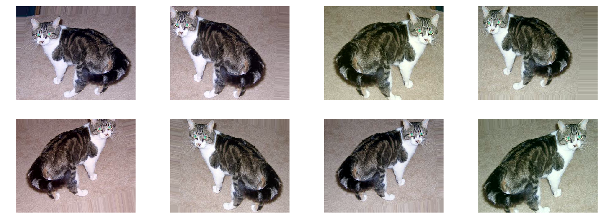
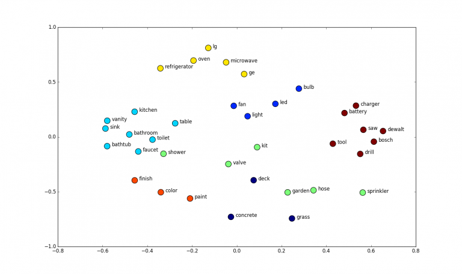
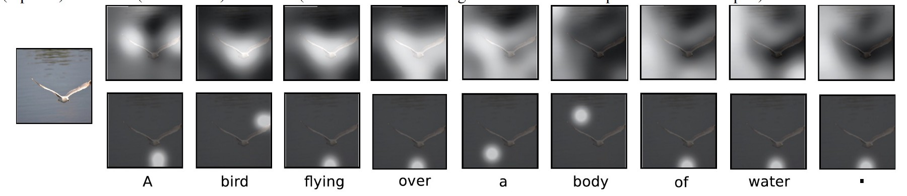
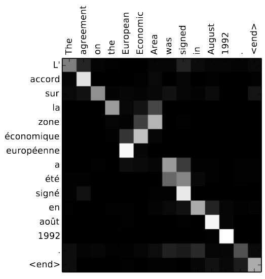
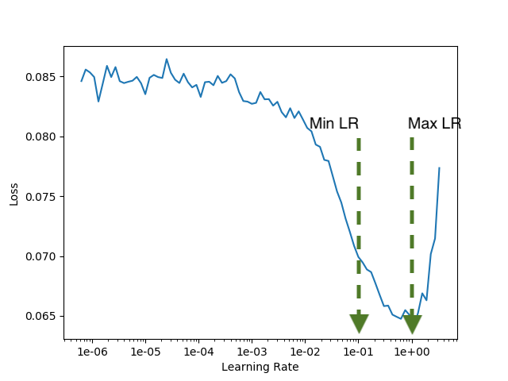
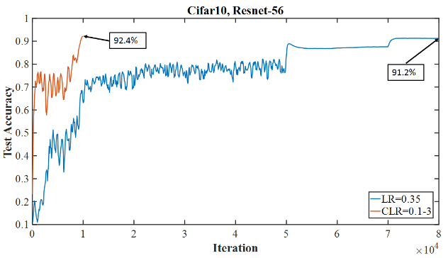

# Deep Learning \label{chp:dl}

## Introduction

Deep learning is a broadly used term.
To many, the difference between a classical neural network and a deep neural network lies merely in the number of network layers.
Even a network with two hidden layers is sometimes referred to as 'deep'.
From this perspective, deep (multilayer) neural networks were already proposed by Alexei Ivakhnenko and colleagues more than half a century ago [@Alexei1965].
In the paper by @Vincent2008 it is stated that "the belief that additional levels of functional decomposition will yield increased representational and modeling power is not new". 
The authors then cite @McClelland1986, @Hinton1989, and @Utgoff2002.

Still the boom in deep learning research may be said to have started only a bit more than a decade ago, since effective training of a multi-layer network was only made possible after a breakthrough presented in the paper by @Hinton2006.
From that time, tons of contributions have been made to the neural network field. 
New types of layers, more effective training strategies, and novel approaches to guard against overfitting have been proposed.
A more general definition of *deep learning* therefore encompasses all modern developments in the neural network space.
Because of the large number of deep learning contributions during the past decade, note that in this chapter we restrict attention to developments that form a basis for deep learning in the context of tabular data.

Conceptual categorisation of modern contributions to the deep learning field is a difficult task.
Perhaps one way to order some of the more important developments, is to use the aim or effect of their implementation as criterion.
Since representation learning is such an important characteristic of NNs, many deep learning developments focus on this aspect. 
As mentioned before, neural networks are able to approximate any function.
However, learning algorithms are not necessarily able to find these solutions, therefore we need more efficient ways to learn from the available data. 
An example is the class of neural networks called *autoencoders* (\Sref{sec:ae}).
These neural networks are mostly used as unsupervised learning methods with the aim of aiding us to learn more robust data representations, which may subsequently be transferred to supervised learning algorithms.
We have mentioned in Chapter 1 that the process of transferring knowledge from one network to another is called transfer learning. Note that more detail regarding transfer learning is provided in \Sref{sec:tl}.

A large number of deep learning developments are explicitly geared toward regularisation in order to prevent overfitting.
We discuss two important modern proposals that fall into this category, *viz.* the use of the so-called *dropout* method in (\Sref{sec:dropout}) and the use of *data augmentation* in (\Sref{sec:daug}).

A miscellaneous group of modern deep learning proposals that succeed in hitting several targets, are discussed in (\Sref{sec:bnorm}), (\Sref{sec:resnet}), (\Sref{sec:embeds}) and (\Sref{sec:attention}).
Among others, the successes of this group of developments include regularisation, increasing speed, reducing sensitivity to starting weights (batch normalisation); improving accuracy (skip connections); representing and visualising categorical variables and representation learning (embeddings); and visualising and interpreting NNs (attention).
The use of these modern architecture have become standard practice in deep learning applications.

With regard to optimisation of the neural network, a method has been proposed which provides a way of automatically finding a good learning rate.
This leads to a drastic reduction in the number of training iterations needed.
The aforementioned training method (referred to as the *one-cycle policy*) is discussed in (\Sref{sec:onecyc}).

We conclude the chapter with a discussion on the interpretability of neural networks in (\Sref{sec:interp}).

## Autoencoders \label{sec:ae}

Autoencoders play a pertinent role in deep learning.
According to @Goodfellow, the idea of autoencoders have been around since the late 1980's - see for example @LeCun1987, @BourlardKamp1988 and @HintonZemel1994.
In those years, autoencoders were used for dimensionality reduction and for learning important features in a more general domain than neural networks. 
From 2006 onwards, their application in neural networks facilitated efficient training of deep neural nets, which in turn caused the upsurge in deep learning research [@Hinton2006; @HintonSalak2006; @Bengio2007].
Autoencoders are also used to facilitate transfer learning, which we will see is an important way of ensuring efficient training in deep neural networks.

Some of the most popular types of autoencoders are so-called *denoising autoencoders* [@Vincent2008] and *stacked denoising autoencoders* [@Vincent2010], *sparse autoencoders* (refernce), *contractive autoencoders* [@Rifai2011], *semi-supervised recursive autoencoders* [@Socher2011], and *variational autoencoders* [@Kingma2013]. 
In this section, we start with an explanation of a plain vanilla autoencoder.
This is followed with a brief description of the differences among the other kinds of autoencoders listed above, starting with denoising autoencoders.

A basic autoencoder is a neural network which is trained to attempt to reconstruct its inputs.
The simplest form of an autoencoder is a neural network with one hidden layer and with an output layer having the same size as the input layer. 
This architecture is illustrated in \autoref{fig:ae}).
The linear layer transforming the input to the hidden layer is referred to as the *encoder*, *viz.* $\boldsymbol{z}=f(\boldsymbol{x})$, and the layer producing the output from the hidden layer is called the *decoder*, *viz.* $\boldsymbol{x}'=g(\boldsymbol{z})$.
The autoencoder can be trained in the same way as any other neural network, however the loss function to be minimised is called *reconstruction loss*. 
The reconstruction loss function measures the difference between the reconstructed and actual input, hence the MSE loss function is a common choice in the case of continuous data.
Hence technically, note that autoencoders belong to the self- (or semi-) supervised class of methods, although many still think of it as unsupervised.
It is unsupervised in the sense that it does not require labelling, but it is supervised in the sense that it does predict an ouput.

```{r, fig.cap="A simple single hidden layer autoencoder with four-dimensional inputs and with two neurons in the hidden layer.\\label{fig:ae}", out.height="30%", fig.align='center'}
knitr::include_graphics('figures/ae.png')
```
If the number of neurons in the hidden layer of an autoencoder is greater than or equal to the number of input features, it is possible  to perfectly reconstruct $\boldsymbol{x}$ from $\boldsymbol{z}$, *i.e.* $\boldsymbol{x}'=\boldsymbol{x}$.
This is however not a very useful model.
A useful autoencoder is an NN that succeeds in finding latent representations of the data that are of a smaller dimension than that of the input domain, thereby learning useful hidden data features.
These data features may then be carried over to neural networks for supervised learning tasks.
In this way, autoencoders are frequently use to initialise the weights of a supervised learning network.
That is, the learned weights of the autoencoder are use to initialise the weights of the supervised learning network (of the same size) [@Larochelle2009].

Note that in order to encourage representation learning by means of an autoencoder, they are typically constructed with some type of constraint imposed.
A common option is to restrict the number of neurons in the hidden layer to be smaller than the number of input features.
This forces the autoencoder to capture only the most useful properties of the data in the hidden representation and can thus effectively be used as a way of dimensionality reduction [@Hinton2006a].
Indeed, if there are no non-linear activation functions after the linear layers, one can show that this autoencoder is equivalent to application of *Principal Component Analysis* (PCA) to the inputs.
Of course there is no restriction to the number or the size of the layers used in the encoder and decoder, and if activation functions are used, one can potentially learn a more powerful non-linear generalisation of PCA.
It is difficult to verify whether or not an autoencoder has learned a useful latent representation of the data.
One way to evaluate the representation is to use the features extracted by the encoder in a supervised learning task and to then compare its performance to that of a model using only the raw data as inputs.

An alternative way of imposing constraints in autoencoders, is to add noise to the inputs before passing it to the encoder.
This is the strategy implemented by *denoising autoencoders* (DAEs) [@Vincent2008].
Thus in order to minimise the reconstruction loss, DAEs are required to learn how to reconstruct the original inputs from a corrupted version of themselves. 
The choice of the type of noise added to the inputs depends on the data types.
One may block out inputs with zeros if zeros have no other meaning in the data, or one might want to add Gaussian noise to continuous outputs as long as it falls within the true range of the features.
The type and amount of noise to be used are factors that practitioners typically experiment with.
If  too much noise is added in the corruption step, the DAE might not learn anything useful.
The interested reader is referred to the paper by @Alain2014, where it is shown how DAEs are able to learn useful data structures.

Instead of limiting the number of neurons in the hidden layer, one may instead use a hidden layer with more neurons than the number of inputs.
However, the number of hidden neurons that may be active at the same time, is restricted.
The restriction is enforced by means of the addition of a regularisation term in the reconstruction loss, or one may manually set all but $k$ of the weights with largest absolute value equal to zero.
In this way we may fit a so-called *sparse autoencoder*.

Another type of autoencoder is a *variational autoencoder* (VAE) [@Kingma2013].
In VAEs, it is assumed that the input was generated by a directed graphical model $p(x|z)$.
The aim is then to learn the posterior distribution $p(z|x)$.
In the decoding step, observations are then sampled from the learned distribution before passing it to the fully connected layers.

Finally in this section, in a *contractive autoencoder* (CAE) [...] one encourages learning useful features by means of the use of a regularised reconstruction loss function.

## Transfer Learning \label{sec:tl}

Semi-supervised (or 'unsupervised) learning exploited for example in autoencoders played a key part in the rise of deep learning (debatedly starting with [@Hinton2006]).
This is so eloquently stated in the paper by @Vincent2010:
"Training a deep network to directly optimise only the supervised objective function of interest by gradient descent, starting from random initialised parameters, does not work very well. 
What works *much* better is to use a local unsupervised criterion to (pre)train each layer in turn, with the goal of learning to produce a useful higher-level representation from the lower-level presentation output by the previous layer. 
From this starting point on, gradient descent on the supervised objective leads to much better solutions in terms of  generalisation performance."
Indeed, autoencoders and related methods facilitated successful deep neural networks using transfer learning or *pretraining*.
For example, it is possible to use a DAE to learn the latent features from unlabelled data, and then to use these features to initialise a deep neural net for a related supervised learning task based on the same type of inputs.

Note that instead of using autoencoders in pretraining, one may also do supervised pretraining.
This is for example done by first training the network to estimate a certain target variable (say $A$), and by then using those weights or features when trying to predict a different target variable (say $B$).

Unsupervised pretraining for supervised learning is very common in NLP [@Devlin2018, @Howard2018] , whereas supervised pretraining for supervised learning is widely used in computer vision [@Yosinski2015, @He2015].
To our knowledge, theoretical proofs towards understanding why pretraining works, cannot yet be found in the literature.
It is postulated that using the pretrained weights as initialisation to the supervised model provides a better starting position on the loss surface, thereby inducing regulatory effects [@Goodfellow2016, Ch. 14].
Pretraining is most effective in scenarios where a relatively small dataset is available for the supervised task, but where a lot of data are available for the pretraining task.

We conclude this section with the following illustration of pretraining and transfer learning, taken from @Zeiler2014.
By observing the types of features extracted from a trained image model (\autoref{fig:zeil}), one gains insight into why they are also effective in other image analysis tasks.
The learned filters seem to identify generic image features such as edges and color gradients which should prove useful in most computer vision tasks.

```{r, fig.cap="Visualising the first layer convolutional filters leared by a neural network in a large image dataset. \\label{fig:zeil}", out.height="50%", fig.align = "center"}
knitr::include_graphics("figures/zeiler_filters.jpeg")
```
## More Regularisation

In \Sref{sec:basicreg} we discussed basic regularisation methods for neural networks.
There are however many alternative ways of combatting overfitting.
Here we discuss two regularisation techniques proven to be extremely powerful in almost every application of deep learning.

### Dropout \label{sec:dropout}

*Dropout* was proposed in a paper by Srivastava and co-authors [@Sriva2014].
The term refers to the process of temporarily removing sets of neurons and their connections during NN training.
In @Sriva2014, the authors explain that the dropout invention started with the challenge of attempting to optimise neural networks by means of averaging multiple neural networks.
This pursuit was motivated by the following two notions.
First, it may be viewed as a gold standard for 'regularising' the network across all possible parameter values.
Here the idea is to fit a train a huge number of fixed size neural networks, where each network is optimised using a different parameter value. 
This is done for all possible settings of the parameter values.
Conceptually, one would then obtain the final NN by averaging the weights of all these neural networks, where the output corresponding to each parameter setting should be weighted by its poster probability given the training data.
Of course obtaining this golden standard is impracticable, but in dropout @Sriva found a way to approximate it.
Second, it is well known in statistical learning and in machine learning that model averaging typically leads to an improvement in generalisation performance. 
Construction of an ensemble neural network using the classical ensemble framework is however infeasible.
For ensemble models to be successful, predictions resturned by base learners should be as uncorrelated as possible.
In order to obtain uncorrelated output, neural networks should either be trained using different training datasets, or different architectures. 
The former idea requires huge amounts of data during training, which may not be available, whereas the latter idea implies the daunting task of experimenting with and finding the optimal set of parameters for each network. 
Dropout solves these problems.
 
The following explanation of dropout follows the description in @Sriva2014.
Consider a neural network with $r$ nodes.
Note that this network can be seen to consist of $2^{r}$ *thinned neural networks*, where each thinned network consists of the neurons that survived dropout.
Importantly, the weights in each thinned network are shared by the other thinned networks, therefore the number of weights remain in the order of $r^{2} at the most.
During training, with each input presented to the network, dropout reoccurs.
That is, each neuron is temporarily omitted from the network with probability $p$.
This implies that with each input presented, a new thinned network is trained.
At test time, a single neural network is fitted.
The weights of this neural network are obtained by reducing the weights from the thinned models by a factor $p$, thereby obtaining an approximate estimate of the average weights of the thinned models.
The reader may refer to \autoref{fig:dropout} for an illustration of how dropout effects the connections between neurons.

In @Sriva2014, note that $p=0.5$ is suggested to work well for hidden nodes, whereas a $p$ value closer to 1 is recommended for visible nodes. 
The optimal value of $p$ depends on the use case and is typically found via experimentation.
Also note that during test time, no units are dropped and the output of each node is multiplied by $1-p$ in order to compensate for all units now being active.


In mathematical notation, the dropout model may be described as follows.

...

In summary of this section, dropout basically involves setting the output of a hidden neuron equal to zero with probability $p$.
The neurons that are omitted in this way do not contribute to the forward pass and do not participate in backpropogation. 
Every time an input is presented, the neural network samples a different set of neurons to be dropped out. 
This ensures that a neuron does not rely on the signals of a particular set of other neurons, and discourages neurons to co-adapt.
Thereby the neural network is forced to learn more robust features that are useful in conjunction with many different random subsets of the other neurons [@Krizhevsky2012]. 

Furthermore, we have seen that there are parallels to be drawn between dropout and ensembling approaches [@Hinton2012].
In each training iteration a unique set of neurons are active, and a unique network is fitted.
During testing these different models are combined.
This is of course the same paradigm as in ensemble learning.

It has been shown that dropout does tremendously well in guarding against overfitting.
Unfortunately however, it slows down the covergence time of training.

```{r, fig.align="center", fig.cap="The effect that dropout has on connections between neurons.\\label{fig:dropout}", out.width="80%"}
knitr::include_graphics('figures/dropout.png')
```

### Data Augmentation \label{sec:daug}

Recall that our aim with predictive models is to generalise well to an unseen test set.
In an ideal world we would train a model on all possible variations of the data to capture all interactions and relationships.
This is of course not possible in the real world.
Such a dataset is not available and would be infinitely large.
of course if it were available, machine learning would be unecessary, since all possible observations would be available and one could simply use a lookup or a search in order to predict outcomes.

In reality we have a finite subset of the full data distribution to train on.
Any new samples with unique feature combinations will likely improve the models generalisablity.
If the collection of new samples is not available, we can try to artificially create these through *data augmentation*.

This is a standard approach followed especially in computer vision applications. 
For example, a single image can be rotated, flipped horizontally or vertically, shifted in any direction, and cropped.
Many other transformations are also possible without destroying the semantic content of the image.
By means of such transformations we are able to artificially increase the size of the training set in order to avoid overfitting.

Consider for example \autoref{fig:aug}, used to illustrate the way in which a single image of a cat may be converted into eight images through random transformations of the original image.
In all of these images, a cat is still recognisable.
Of course data augmentation cannot be as effective as observing genuine new data samples, still it is a very effective and efficient substitute [@Perez2017]. 
In fact, it is well known that data augmentation consistently leads to improved generalisation.

```{r, fig.cap="An example of data augmentation for images.\\label{fig:aug}", out.width="80%", fig.align = "center"}

```
Data augmentation may be formalised by means of the *Vicinal Risk Minimisation* principle [@Chapelle2001].
According to this principle, human knowledge is required to describe a vicinity around each observation in the training data so that artificial examples can be drawn from the vicinity distribution of the training sample in order to enlarge it.
In image classification one may define the vicinity of an image as, for example, the set of its horizontal reflections and minor rotations.

With respect to the types of data augmentations that may be applied, one is typically guided by the dataset and application domain, since all augmentations should preserve the semantic content or the signal in the original observations.
For example, making too small crops of an image will ignore the context and may make it impossible to recognise its objects.
Moreover, augmentations that are suitable for image data are not necessarily sensible for text data.

## Modern Architectures

In the following sections we highlight some of the recently developed neural network layers and modules. 
Among others, these operations were designed to make training more robust and efficient, to help learn more robust representations, and to be able to model more useful features.

### Normalisation \label{sec:bnorm}

A factor which complicates the training of neural networks is the fact that hidden layers have to adapt to the continuously changing distribution of their inputs. 
The inputs to each layer are affected by the parameters of all preceding layers, and a small change in a preceding layer can lead to a much bigger difference in output as the depth of the network increases. 
When the input distribution to a learning system changes, it is said to experience covariate shift [@Shimodaira2000].

The use of ReLUs, careful weight initialisation, and small learning rates should all help a network to deal with internal covariate shifts. 
However, a more effective approach is to ensure that the distribution of inputs remains more stable while training the network.
For this purpose @Ioffe2015 proposed *batch normalisation* (BN).

A batch normalisation layer normalises its inputs to a fixed mean and variance (similar to the way in which the inputs of the network are normalised).
Therefore BN can be applied before any hidden layer in a network in order to prevent internal covariate shift. 
The addition of BN layers facilitates the use of higher learning rates, thereby dramatically accelerating the training process of deep neural networks. 
Moreover, implementing batch normalisation assists with regularisation [@Ioffe2015], so much so that in some cases its use obviates the need for dropout to be used.

In more detail, the batch normalising transform over a batch of univariate inputs, $x_{1}, \dots,x_{n}$, where $n<N$ is performed as follows:

1. The mini-batch mean, $\mu$, and variance, $\sigma^{2}$ are obtained:
    $$
    \begin{aligned}
    \mu &= \frac{1}{n}\sum_{i=1}^{n}x_{i}\\
    \sigma^{2}&=\frac{1}{n}\sum_{i=1}^{n}(x_{i}-u)^{2}
    \end{aligned}
    $$

2. The inputs are normalised, *i.e.*
    $$
    \hat{x}_{i} = \frac{x_{i}-\mu}{\sqrt{\sigma^{2}+\epsilon}},
    $$
    where $\epsilon$ is a constant to ensure numerical stability.

3. The output values are scaled and shifted, *i.e.*
    $$
    y_{i}=\gamma\hat{x}_{i}+\beta,
    $$
    where $\gamma$ and $\beta$ are the only two learnable parameters in a batch normalisation layer.

The motivation for Step 3 is to allow the layer to represent the identity transform in cases where the normalised inputs are not suitable for the following layer.
That is, the scale-and-shift step will reverse the normalisation step if $\gamma=\sqrt{\sigma^{2}+\epsilon}$ and $\beta=\mu$. 
Note that the application of batch normalisation has become standard practice when training deep convolutional NNs.

### Skip Connections \label{sec:resnet}

A further modern architecture which speeds up training of deep neural networks considerably, is the use of so-called *skip connections* or *shortcut connections*.
The invention of skip connections is attributed to @He2015a, @He2016, @Huang2016 and @Sriva2015.
Note that our discussion is largely based on the exposition given in @He2015a.
The inspiration for skip connections was the occurrence of the *degradation problem*, whereby from a certain point, the addition of hidden layers in deep neural networks leads to a decrease in their training accuracy.
Since any deep neural network can be made shallower by means of setting the transformations in some hidden layers equal to the identity, intuitively deeper neural networks should always be able to achieve higher training accuracy than shallower networks.
This phenomenon indicates that multiple non-linear transformations in deep neural networks are unable to learn identity mappings.
In @He2016, the degradation problem is addressed by rephrasing the learning objective of a deep neural network.
Instead of requiring a group of layers to learn some undefined non-linear mapping, say $H{\boldsymbol{\x}}$, the objective is to learn a *residual function*, *viz.* $F{\boldsymbol{\x}}==H{\boldsymbol{\x}}-\boldsymbol{\x}$.   
in their paper @He2016 postulates that it is more tractable to find $F{\boldsymbol{\x}}$ than $H{\boldsymbol{\x}}$.
For example, in the problematic scenario where $H{\boldsymbol{\x}}$ should be $H{\boldsymbol{\x}}==$\boldsymbol{\x}$, it is easier to truncate $F{\boldsymbol{\x}} to zero than for multiple non-linear layers to learn the identity mapping.
This is indeed supported by the results of empirical work in their paper.
The original sought after function H{\boldsymbol{\x}} may subsequently be found via the mapping $H{\boldsymbol{\x}}==F{\boldsymbol{\x}}+\boldsymbol{\x}$.

The above framework is referred to as *deep residual learning*.
Residual Networks (ResNets) became very popular after they were used in the winning model of one of the ImageNet competitions [@He2015].
It is in these models that skip connections come into play.
Very simply, skip connections are additional connections between different layers in NNs that bypass one or more layers of non-linear transformations [@Orhan2018].
This idea is illustrated in \autoref{fig:skip_conn}.

```{r, fig.align="center", fig.cap="Diagram conceptualising a skip connection.\\label{fig:skip_conn}", out.width="80%"}
knitr::include_graphics('figures/skip_conn.png')
```
In feedforward neural networks, if skip connections output identity mappings, they can efficiently be used to obtain $H{\boldsymbol{\x}}$ via $F{\boldsymbol{\x}}+\boldsymbol{\x}$: the skip connection output $\boldsymbol{\x}$ is just added to the $F{\boldsymbol{\x}}$ output obtained from a set of stacked layers.
Note that although here, the skip connection and stacked layer output are combined using addition, other ways such as multiplication or concatenation may also be used.

Multiple benefits to using skip connections have been reported in the literature.
They have been shown to alleviate the vanishing-gradient problem, strengthen feature propagation, encourage feature reuse, and may also reduce the number of parameters required [@Huang2016].
Furthermore, it is interesting to note that one can draw a parallel between ResNets and boosting methods since both are approaches for fitting models to residuals [@Huang2017].

For a final word on skip connections in this chapter, we refer to the remark of in @Orhan2018, *viz.* that a completely satisfactory explanation for the success of skip connections remains elusive.
The authors then proceed by proposing a novel explanation for being able to substantially improve the performance of deep neural networks.

### Embeddings \label{sec:embeds}

An embedding is a layer that maps a discrete input to a numeric vector representation.
It was first used in NLP in order to represent words as numbers so that they may be processed by numeric models.
For instance the word 'woman' may be represented by the vector $[1,3,5]$, and the word 'man' by $[2,4,6]$.
In finding appropriate embeddings, the objective is to map discrete inputs to a meaningful vector space wherein items with similar meanings are found in close proximity to each other.
This is in contrast to using a so-called *one-hot encoded* representation of words, where all words lie equally far apart.
The reader may refer to \autoref{fig:emb} for an illustration of such a space[^emb_src].

```{r, fig.cap='Learned word embeddings in a two-dimensional space.\\label{fig:emb}', fig.align="center", out.width="90%"}

```
[^emb_src]: https://www.shanelynn.ie/get-busy-with-word-embeddings-introduction/

Initially mappings were configured independenty of neural networks using approaches based upon co-occurences [@Mikolov2013].
The real breakthrough came when mappings were defined as learnable layers in the network [@Howard2018, @Devlin2018].
Thus embeddings may now be tuned just like any other parameter in the network.
Of course the parameters of the embedding function (or layer) first needs to be (randomly) initialised.
Thereafter during training, they are tuned along with the rest of the neural network weights.

An embedding operation can either be viewed as a table lookup or a matrix multiplication of the discrete input in a one-hot encoded form, *i.e.* $\boldsymbol{e}=W\boldsymbol{x}$, where $\boldsymbol{x}$ is a discrete input in one-hot encoded form, and where $W:k\times p$ is the matrix containing the embedding, with $p$ the number of discrete categories and $k$ the embedding size.
An embedding layer may be re-used by all input features having the same input type, thereby improving efficiency and reducing the memory footprint of the model.

### Attention \label{sec:attention}

The incorporation of *attention* modules in networks is one of the standout breakthroughs made in deep learning in recent times.
They especially played an integral part in advances in NLP and other sequence related tasks [@Vaswani2017, @Devlin2018].
Attention was first popularised in the neural machine translation field [@Bahdanau2014].
Currently it is almost used ubiquitously in NLP applications.
Also in computer vision applications, the use of attention modules have been found useful.
Examples include image captioning [@Xu2015] audio processing tasks [@Duong2016].

The main idea of an attention module is to force a layer to only focus on a certain subset of its inputs at different stages of computation.
For example, in image captioning, one may use a recurrent neural network (RNN) to sequentially output words describing the image.
With the use of an attention model, the network is at each step restricted to only consider certain parts of an image, thereby avoiding to have to consider the full image everytime.
This is illustrated in \autoref{fig:imattn}.
Notice how the network focuses on the bird part of the image when predicting the word "bird" and "flying", whereas it focuses on the water part of the image when predicting the words "body" and "water".
Similarly, when used in machine translation, we may visualise attention weights to capture the way in which a network focuses on a different subset of words when predicting each word in the target language (\autoref{fig:nlpattn}).

```{r, fig.cap="Attention applied to image captioning.\\label{fig:imattn}", out.width="90%", fig.align='center'}

```

```{r, fig.cap="Attention applied to machine translation.\\label{fig:nlpattn}", out.width="90%", fig.align='center'}

```

In an ideal world, an attention module should not be necessary.
Instead it is preferred that a network learns which sections of images to pay more attention to.
Nevertheless, currently this built-in prior proves to be extremely beneficial in current learning algorithms.

An insightful discussion of attention modules may be found in @Xu2015.
In this section, a summary of the core of an attention module through the following three equations suffice:
$$
\begin{aligned}
\boldsymbol{z}&=f(\boldsymbol{x})\\
\boldsymbol{\alpha} &=\text{softmax}(f_{att}(\boldsymbol{x}))\\
\boldsymbol{y}&=\boldsymbol{z}\otimes\boldsymbol{\alpha},
\end{aligned}
$$
where $\boldsymbol{z}$ denote the ordinary activations produced by a layer $f$ given input $\boldsymbol{x}$.
The symbol $\boldsymbol{\alpha}$ represent the weights produced by the attention layer, $f_{att}$, after a logit transform to ensure the weights to sum to 1.
The output of the attention module, $\boldsymbol{y}$, is then obtained through an elementwise multiplication $\otimes$ of $\boldsymbol{z}$ and $\boldsymbol{\alpha}$, although it should be noted that alternative combinatorial operations may also be used.

Finally in this section, note that we elaborate on the concepts of *self-attention* [@Cheng2016a] and *multi-head attention* [@Vaswani2017] in \Cref{sec:tab_att}.

## Super-Convergence \label{sec:onecyc}

Specifying the hyperparameters for learning algorithms is a difficult process.
It requires expertise, typically involves extensive trial-and-error and is often described as more of an art form than a science.
Moreover, there are many hyperparameters that need to be considered: thus far in the thesis we have encountered learning rate, batch size, momentum and weight decay.
Although there are no easy ways to find them, appropriate parameter values do have a huge effect on training time and on the performance of neural networks.
A grid search or random search in the parameter space seems not to be an option because of its computational expense. 

In this section we summarise the work on structuring specification of NN hyperparameters presented in the papers by Smith in 2015 and 2018, and by Smith and Topin in 2017.
Through these approaches, the necessity of running complete grid or random searches is eliminated, rendering tremendous improvements in training time and accuracy.

In his 2015 paper Smith considers specification of the learning rate parameter.
This is a worthwhile enterprise: in \Cref{chp:nn} the importance of the appropriately specifying the learning rate became evident.
To re-emphasise, the learning rate is viewed as the hyperparameter whose appropriate specification is most important compared to all other neural network hyperparameter values.
We saw that one may choose to keep its value fixed throughout training, or to allow it to decrease from a certain point in training onwards.
The latter was the preferred approach until *cyclical learning rates* (CLR) were proposed in Smith (2015). 

In CLR, as training of a network progresses, the learning rate is varied cyclically between two boundary values.
A cycle consists of two steps, *viz.* a stage when the learning rate increases to a pre-specified maximum value, and a stage where the learning rate decreases to a chosen minimum value.
Different cyclical functions of the learning rate were experimented with.
Since they performed similarly, the simplest function, *viz.* the so-called *triangular learning rate policy* was adapted.
In a triangular function, the learning rate increases linearly up to the maximum, and then decreases linearly back to the minimum.
Note that during training, many cycles of learning rates are traversed.

In order to implement cyclical learning rates, one needs to specify the number of epochs during each stage (also known as the step size), as well as the minimum and maximum learning rates to be attained.
In Smith (2015), a simple method for finding reasonable learning rate boundaries is provided.
In this learning rate range test, training starts with a small learning rate which is then slowly increased in a linearly fashion throughout a pre-training run.
Typically with an increase in the learning rate, the training loss decreases until a point where the network converges.
After this point the learning rate becomes too large, causing the loss to start increasing.
Hence this is the largest learning rate one should consider using during training.
In CLR it is suggested that the lower bound of the learning rate be set to a factor of 3 or 4 times less than the maximum learning rate.
For an update of the CLR proposal, the reader is referred to Smith (2017).

Importantly, during application of the learning rate range test towards fitting ResNets to specific image datasets, Smith and Topin (2017) discovered that the test loss remains constant up to very large values for the learning rate.
This surprising phenomenon is called *super-convergence*.

The implication of super-convergence is that in some setups one may simply use a single learning rate cycle together with unusually large learning rates values in order to train neural networks an order of magnitude faster than when using standard training methods.
Whether or not super-convergence may occur in a specific network architecture may be verified using the learning rate range test, similar to the way in which the super-convergence discovery was made.
If super-convergence is possible, Smith and Topin (2017) suggest a slight modification of CLR, *viz.* to "use a single cycle that is smaller than the total number of iterations/epochs and to allow the learning rate to decrease several orders of magnitude less than the initial learning rate for the remaining iterations". 
Note that the initial learning rate is an abnormally large value. 
The unusually large learning rate used leads to an additional benefit, *viz.* the facilitation of regularisation.
The above learning rate methodology is called *1cycle*, and its learning rate setting is illustrated in \autoref{fig:onecyc}.


Clearly also in the 1cycle regime, bounds for the learning rate need to be set.
For this purposes the learning rate range test may be used, but with the lower of the learning rate set to a factor of about 10 times less than the maximum learning rate.
\autoref{fig:range_test} illustrates an example of output obtained from the learning rate range test and of how to determine the learning rate bounds to be used in the 1cycle policy.



Note that one should be careful of specifying a too small step size since this increases the rate by which the learning rate parameter increases, which in turn might render the training process unstable.

Next consider \autoref{fig:supercon}, taken from Smith and Topin (2017).
Here the test loss over each training iteration in the 1cycle methodology is compared to that of a fixed learning rate policy.



From \autoref{fig:supercon} it is clear that using the proposed method, the model achieves improved accuracy compared to the standard approach. 
This is done in an eigth of the number of training iterations required in the original framework.

In his most recent work, Smith (2018) considers a more comprehensive methodology which recognises the interdependence
of specification of the learning rate, batch size and other regularisation techniques such as weight decay.
An important remark in this paper is that contributions to the amount of regularisation on a network should be balanced across the various hyperparameter values.
For example, since large learning rates also act as a form of regularisation (Smith, 2015), if one uses a large learning rate in the 1cycle regime, one would have to reduce some of the other regularisation controls.

In the 2018 paper, specification of batch size and of weight decay is also considered.
It is shown that larger batch sizes allow for training with larger learning rates, thus convergence can be reached quicker.
Therefore when setting the batch size, the recommendation is to select the largest possible size that fits into memory.

The weight decay parameter is another important value that needs to be properly specified during the 1cycle policy.
Since it is a regularisation parameter it should be in balance with the learning rate.
The proposed way of setting the weight decay is by means of a grid search.
A few short training runs are performed at different weight decay values.
The validation loss function is then inspected for any hints with regard to a preferred choice. 
Alternatively, various weight decay values may be used during the learning rate range test and their behavior compared.
The preferred weight decay value is the one which produces the most stable loss and which allows the use of the largest learning rate.
Note that in our experiments we follow the abobve suggestions in order to tune the hyperparameter values specific to each different model.

## Model Interpretation \label{sec:interp}

Although deep learning has become the state-of-the-art approach in many machine learning tasks, it is still trailing behind other algorithms in terms of model interpretability.
This is however is not an unusual occurrence: in statistical learning the trade-off between prediction performance and interpretability is well known.
Deep neural networks are occasionally referred to as "black boxes" since it is very difficult to interpret what is going on inside the stacks of linear and non-linear layers.
This is one of the biggest criticisms against the deep learning field, and a stumbling block for deployment in production environments. 
For example, in the clinical domain, model transparency is of utmost importance, given that predictions might be used to affect real-world medical decision-making and patient treatments [@Shickel2017].
Fortunately some work has been done to gain insight from neural networks.
This topic is briefly discussed in the following sections.

### Neural Network Specific \label{sec:interp_ns}

We have showed in \Sref{sec:rep} that it is possible to inspect activations and weights of layers at different levels of a neural network.
If the network is small, one might gain insight into what the network has learned, or why it is making certain decisions.
However, most useful neural networks are at least three layers deep, making its activations and weights more complex to interpret.

When fully convolutional networks are used, there are ways to visualise which parts of the inputs were important in making a certain decision.
These visualisations are called class activation maps [@Zhou2016; @Selvaraju2017].
They can unfortunately only be used with fully convolutional networks, and not with fully connected layers.

Another common interpretation tool in order to gain insight into what specific neurons are looking for, is to rank inputs by the magnitude of their activations at those neurons.
Then, if it is possible to spot similarities between the highest ranked inputs, this provides a potential description patterns triggering neurons.
The above approach is called *Activation Maximisation* [@Erhan2009].
Since it relies on human inspection, Activation Maximisation is infeasible in the face of many neurons to investigate.

An interesting take on model interpretation is described in @Frosst2017 and @Che2016.
Their ideas are based on the process of *knowledge distillation* [@Hinton2015] and leverages the fact that decision trees are easier to interpret.
Knowledge distillation entails the process of transferring knowledge from one model (or an ensemble of models) to another model by means of training the target model to estimate the predictions of the source model (or ensemble).
@Frosst2017 and @Che2016 respectively use a soft-decision tree and boosted trees to learn the mapping between the inputs and the neural network predictions.
Once the tree based methods have been trained, the usual intepretation tools of tree based models, like feature importance or evaluating the way in which a sample traverses the tree, may be used in an attempt to understand the neural network.
It is interesting that in both publications the authors note that tree based models trained on the neural network predictions achieved improved performances over the ones trained using the actual targets.
This is indicative of the value knowledge distillation is able to add.

### Model Agnostic \label{sec:interp_ma}

Besides interpretation tools specifically designed for neural networks, one may of course also make use of model agnostic tools, *i.e.* methods ones that may be used in combination with any machine learning model.
The so-called *permutation importance algorithm* is such a tool, computing feature importance scores corresponding to each input feature.
The importance measure of a feature is determined by the sensitivity of that feature to random permutations of its values.
The expectation is that when a feature with a strong signal is shuffled before input to a model, the performance of the model will drop significantly.
On the other hand, if a feature has little effect on the target predictions, shuffling its values will not exhibit major effect on its performance.

Permutation importance was first introduced by @Breiman2001 in the random forest algorithm, but may be generalised to other models.
The steps for calculating feature importances are provided below:

1. Train a neural network on a dataset with $p$ input features.
2. Evaluate the network on a validation set in order to obtain a performance metric $m_{0}$.
3. For each of the $p$ input features:
    - Create a copy of the validation set and randomly shuffle the feature in this copy.
    - Evaluate the neural network on this version of the validation set, thereby obtaining $m_{j}$, $j=1,\dots,p$.
4. Rank the features based upon $m_{j}-m_{0}$ (if a bigger $m$ is preferred).

Unfortunately note that permutation importance only produces sensical results if the assumption of independent features holds.
Permuting features independently creates examples that never occurr in real life and the importance of features in that invalid space may be misleading.
The test however can still be useful to identify inputs that are not important, *i.e.* features that are not used by the model.
If randomly permuting a feature does not affect the model performance at all, it may be a good indication that the model does not depend on that feature.

A second example of a interpretation tool that is independent of the particular model fitted, is the use of *partial dependence plots*.
These graphs may be used to visualise relationships between a target and input features [@Friedman2001].
Once a neural network is trained, we may evaluate the effect of a change in any input feature on a single prediction by observing the change in the prediction.
Suppose for example we evaluate the way in which a feature $X_{1}$ influences predictions.
By taking a single observation from the data we can evaluate how the model prediction changes by changing the value of $X_{1}$ to other possible values of $X_{1}$.
And since this behaviour will most likely vary for different observations, the above process should be repeated for a subset of observations from the dataset.
The average effect on the predictions at different values of $X_{1}$ can subsequently be obtained, along with standard errors of these effects.

For more model agnostic interpretation tools (for instance the use of so-called *SHAP values*), the reader is referred @Lundburg2017.
Examples of implementation of these model interpretation techniques may be found in the next two chapters.
