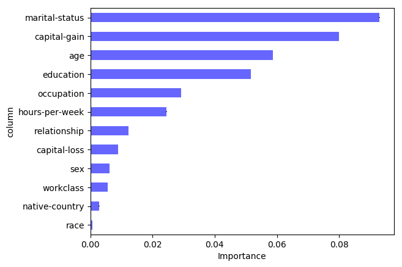

# Deep Learning for Tabular Data \label{chp:td}

## Introduction

In Chapters 2 and 3 we covered the basics of neural networks, as well as the more recent advances in deep learning.
The aim of this chapter is to explore ways in which the modern deep learning approaches in Chapter 3 may be leveraged in the application of deep learning for tabular data (DLTD).
In Chapter 1 we alluded to the differences of tabular data compared to unstructured data (such as images, and data used in text and speech applications).
The widely acclaimed successes of deep learning typically occur in areas such as image classification, machine translation and speech recognition.
However, in the literature only a handful of publications report successful implementation of deep learning for tabular data.
In these papers, applications include recommender systems [@haldar2018]; click-through rate prediction[^ctr] [@Song2018]; analysis of electronic health records [@Rajkomar2018]; and transport related problems [@Brebisson2015].
Not much research has been done in the area of deep learning for tabular data, therefore it is often unclear how to solve certain modelling challenges.
Hence the tabular data domain is still dominated by tree-based models such as random forests and gradient boosted trees.
This begs the question as to why deep learning is not nearly as effective here as it is in most other data domains.
The aim of this chapter is to help illuminate this issue, and to indicate promising directions towards improving current state-of-the-art performances.

The structure of the chapter is based upon the challenges that occur when using deep learning for tabular datasets, as identified and described in \Sref{sec:tabchal}.
For each challenge, we reconsider the issue, review the literature to discuss current methodology, and (where possible) provide suggestions towards improving these approaches.
We start in \Sref{sec:inp_rep} by considering ways to represent input features in tabular data.
\Sref{sec:feat_int} is devoted to approaches that are used to leverage feature interactions.
A large part of this chapter is devoted to methodology which facilitates sample efficiency; we discuss in detail in \Sref{sec:samp_eff}.
This is followed by a brief discussion of ways to interpret deep neural networks for tabular data in \Sref{sec:interp}.
In the final section, the 1cycle policy and hyperparameter selection in DLTD are discussed, in addition to a selection of miscellaneous topics that do not fit into the above framework.

[^ctr]: To predict the probability of a user clicking an an item, which is of critical interest in online applications.

## Input Representation \label{sec:inp_rep}

One of the key design considerations when constructing a deep neural network for tabular data is the input representation, *i.e.* the way in which one should numerically represent each feature.
This choice may heavily influence the ability of the neural net to extract patterns from the input, as well as optimisation efficiency during training.
This is a more difficult decision in the case of tabular data, since here features are typically highly heterogeneous [@Shavitt2018].
A representation may be optimal for some features, but not for others, and we want to ensure that no feature dominates the others during training.
Moreover, a tabular dataset typically contains both continuous and categorical features, where different approaches are needed to process each.
Tabular dataset are often high-dimensional and very sparse. 
This is a scenario in which the adverse effects of improper input representations is magnified, as noted by many [@Song2018, @Wang2017b, @Qu2016, @Cheng2016, @anonymous2019, @Covington2016].
An example of an extremely high-dimensional and sparse tabular dataset is the so-called Criteo dataset[^criteo].
Its feature dimension is ~30 million, with a sparsity of ~99%.

[^criteo]: https://www.kaggle.com/c/criteo-display-ad-challenge

### Numerical Features

A major advantage of tree-based methods is that the scale and distribution of features hardly matter.
The only requirement is that their relative ordering should be meaningful.
With neural networks we are not that fortunate.
Neural networks are very sensitive to the scale and distribution of its inputs [@Ioffe2015]. 
If features are measure on different scales, a single feature might dominate the weight updates.
In this case, if a feature contains a large value, it may throw off the optimisation procedure, thereby causing gradients to 'explode' or to 'vanish' [@Clevert2015].
The implication is that proper standardisation of all continuous features in tabular data is mandatory.

The optimal standardisation in DLTD varies between datasets.
Hence the only way to know for sure which normalisation to apply to numeric features is by means of experimentation.
The typical standardisation approach for numerical features in deep learning is to do mean centering and variance scaling, *i.e.* $\tilde{x}=(x-\mu)/\sigma$, where $\mu$and $\sigma$ are the mean and standard deviation of $X$ respectively ($x\in X$).
One would expect this transformation to also be sufficient for tabular data, but in practice it has often been found otherwise.

In [@haldar2018] the authors propose first inspecting the distribution of each feature.
If a feature seems to follow a normal distribution, standard normalisation, *viz.* $(x-\mu)/\sigma$, may be performed.
However if a feature seems to approximately follow a power law distribution, it should rather be transformed via $\log\left((1+x)/(1+\text{median})\right)$.
The above mapping ensures that the bulk of the values lie within {-1,1}, and that the median feature value is close to zero.
Consider for example the effect of this transformation on two continuous features (*viz.* Age and Hours-per-week) in the Adult dataset.
This is illustrated in \autoref{fig:contnorm}.
We see in (a) that the features have roughly the same scale, but their distributions are totally different; and in (b) that after applying mean centering and unit variance scaling, the values of the Hours-per-week feature mostly lie in {-1,1}, however many Age values remain outside {-1,1}.
Consequently, we apply the power distribution transformation in [@haldar2018], and observe that all Age values now lie within {-1,1}. 
Of course the downside of the above approach is that it involves a manual process and very cumbersome in high-dimensional data setups.

```{r, out.width="33%", fig.cap='The effect of normalisation on continuous variables.\\label{fig:contnorm}', fig.subcap=c('Original', 'Gaussian Norm', 'Power Norm'), fig.show='hold'}
knitr::include_graphics(c('figures/cont_vars.pdf', 'figures/gaus_norm.pdf', 'figures/power_norm.pdf'))
```
With a view to reduce potential high variances exhibited by numeric features, [@Song2018] suggests transforming a numeric feature via $\log^{2}(x)$ if $x>2$.
This was successful in their use-case, but it is hard to imagine that this solution will generalise to many other applications.
Note that the @Song2018 transformation causes a discontinuity at $x=2$, as well as a possible overlap between values that were originally less than 2 with those that were greater than 2.
In addition, it does not take care of extreme values on the negative side.
[@Wang2017b] simply use the standard log transform, *i.e.* $\log{x}$, to normalise continuous features.

@Covington2016] also report appropriate normalisation of numeric features critical for DLTD to converge.
Their approach is to transform numeric features to be equally distributed in [0,1).
This is done using the cumulative distribution $\tilde{x}=\int_{\infty}^{x}df$, where $f$ is the distribution of $x$.
The integral is approximated using linear interpolation on the quantiles of the feature values computed as a preprocessing step.

An option for numeric feature normalisation which we have not yet encountered in the DLTD literature, is to specify the initial layer to numeric features to be a batch normalisation layer.
This will affect the same type of scaling as in the case of zero mean and unit variance transformation, but the transformation parameters are learned from each batch.
Hereby the need to preprocess numeric features is removed.
The caveat is that the transformation quality depends on the batch statistics.
That is, in cases where the batch is not representative of the full data distribution (which is likely if the batch size is small), the training procedure might be negatively affected.

### Categorical Features \label{sec:cat_inp}

Most of the sparsity in tabular datasets is induced by categorical features.
Since neural networks cannot process discrete categories or objects, we need to find a numeric representation for each class.
The standard approach is use to one-hot encoded categorical features.
That is, the one-hot encoded form corresponding to a categorical feature with (say) three levels, is $[1,0,0]$ for Level 1; $[0,1,0]$ for Level 2; and $[0,0,1]$ for Category 3.

Multiple inefficiencies occur when using one-hot encodings in neural networks.
Clearly its use introduces sparsity to the data: the dimension of the one-hot encoded form is equal to the number or categories in a feature.
Thus if a dataset consist of many high-cardinality features, the data will be extremely sparse and difficult to model.
If not handled properly, sparse data may easily cause neural networks to overfit [@Covington2016].
The presence of categorical features with many levels also increases size requirements of the first linear NN layer, which in turn creates a need for more computing power and memory.

The other problem with one-hot encodings of categorical features is that there is no notion of similarity and distances between categories.
In this representation, all categories lies equally far apart, now matter how semantically similar or dissimilar they are.
This makes it harder for the model to learn useful patterns.

An alternative to one-hot encodings as representations of categorical features for neural networks is the use of *entity embeddings*.
The first publication on entity embeddings in the context of deep learning followed as a result of a taxi destination prediction challenge [@Brebisson2015].
This was followed by a paper by @Guo2016, wherein the authors succesfully used entity embeddings in order to predict the total sales of a store.
Furthermore, companies such as [Instacart](https://tech.instacart.com/deep-learning-with-emojis-not-math-660ba1ad6cdc) and [Pinterest](https://medium.com/the-graph/applying-deep-learning-to-related-pins-a6fee3c92f5e) report the effective use of entity embeddings on their internal datasets. 
Currently all research on deep learning for tabular data facilitate entity embeddings - see for example [@Song2018], [@Wang2017b], [@Covington2016] and [@Zhou2017].
The reason for their all-round use is the way in which they are able to ameliorate the issues of one-hot encoded representations.

An entity embedding entails exactly the same operations as with (word) embeddings (discussed in \Sref{sec:embeds}), only they are applied to categories instead of words.
Therefore an entity embedding assigns a numeric vector representation to each level in a categorical feature.
For example, Level 1 is embedded as $[0.05,-0.1,0.2]$; whereas Levels 2 and 3 are embedded as $[0.2,0.01,0.3]$ and $[-0.1,-0.2,0.05]$ respectively.
In a formulation similar to the one in \Sref{sec:embeds}, note that the embedding for the $j$-th categorical feature is defined by
$$
\boldsymbol{e}_{j}=V_{j}\boldsymbol{x}_{j},
$$
where $\boldsymbol{x}_{j}$ denotes the one-hot encoded vector representation of the $j$-th categorical input, where and $V_{j}$ is the associated embedding/weight matrix.
The weights in $V_{j}$ are learned along with all of the other parameters in the network.
Once all categorical features have been embedded, their representations may be concatenated and passed on to the network layers that follow.

Entity embeddings have been found to significantly speed up the training process and to reduce the memory footprint of a neural network.
This in turn serves to further improve the generalisation ability of a network [@Covington2016] and [@Guo2016].
The above advantages are especially useful when working with high-dimensional and sparse inputs (in tabular data).
Suppose we have available a dataset with two categorical features, $X_{1}$ and $X_{2}$, with cardinality $C_{1}$ and $C_{2}$, respectively.
Furthermore, suppose that the first hidden layer in the neural network is presented with inputs of size $q$.
Hence we need project an observation with these two features into a vector representation of the same size.
If we were to use one-hot encoded representations of $X_{1}$ and $X_{2}$,we would need a weight matrix of size $(C_{1}+C_{2})\times q$.
However, if we use entity embeddings of $X_{1}$ and $X_{2}$, we may create two weight matrices of sizes $C_{1}\times q/2$ and $C_{2}\times q/2$, which is half the number of parameters needed in the case of one-hot encoded representation.

The size of the embeddings is a hyperparamter of the model and again there is no way to specify this value *a priori*. 
Therefore most publications rely on a grid search in order to find the optimal size.
For example, @Song2018 experiment with embedding sizes 8, 16, 24 and 32; and found the value 16 to work the best, whereas @Cheng2016 reported an embedding size of 32 to be optimal in their use-case.
Thus it is clear that appropriate specification of the size hyperparameter depends on the data at hand, and on the network architecture to be used.

@Wang2017b and @Brebisson2015 made use of different embedding sizes for each categorical feature.
Intuitively it seems to make sense to incorporate different embedding sizes for categorical features with different levels of complexity.
In the above papers, the following sizes are proposed:

- $6\times(\text{cardinality})^{\frac{1}{4}}$ [@Wang2017b]
- $\max(2, \min(\text{cardinality}/2,50))$ [@Brebisson2015]

In addition to advantages in terms of speed and memory usage, the use of entity embeddings as opposed to one-hot encoding maps similar values to lie close to each other in the embedding space.
Hence it reveals the intrinsic properties of categorical variables, which cannot be obtained by using one-hot encoding.
This allows us to interpret the classes of the categorical features.
Embeddings may also easily be visualised, thereby facilitating interpretation of the data and of the decision making process of the network.
In more detail, the weights associated with the projection of each category onto the embedded space may be plotted using any dimension reduction technique (such as t-sne or PCA).
We may subsequently compare categories based on relative distances and positions in the reduced space.
To illustrate, reconsider the 'Education' categorical feature in the Adult dataset (introduced in Chapter 2).
In \autoref{fig:edu_embed} a two-component PCA of its embedding matrix is plotted.
From this figure it is clear that the school categories all lie in the bottom-right corner of the space, with some notion of ranking from Grade 5 (top-right) to Grade 12 (bottom-left).
The tertiary education classes lie in a separate cluster and very conveniently, their levels of education coincide with the vertical axis.


In order to verify whether entity embeddings are able to learn useful information, besides plotting the embedding matrix, one may also feed them (along with the continuous features) to other learning algorithms and observe the change in model performance.
Along these lines @Guo2016 tested the use of embeddings from trained NNs as inputs to a set of machine learning methods.
They report the embeddings to improvev the performance of all tested ML procedures by a significant margin.
Moreover, these embeddings may be re-used in different machine learning tasks, obviating the need for them to be re-learned in other data scenarios.
Successful implementation of the embedding approach 

The entity embedding approach is very flexible.
If, for example, two features have overlapping categories, one may re-use the embedding for the one feature on the second feature. 
@Zhou2017 holds and interesting view of the case of multi-hot categorical features. 
That is, where an observation of a categorical feature may simultaneously be assigned more than one level.
The embedding layer for that instance then outputs a list of embeddings having the same length as the number of categories associated with that instance and feature.
Using some pooling operation, the list of embeddings are subsequently projected back to a fixed-length representation.

### Combining Features

Once all continuous and categorical features have been processed and embedded, we need a way to combine them before their input may be transmitted to the rest of the network.
The standard approach is to concatenate each categorical variable embedding to the continuous variables, as was done in [@haldar2018] and [@Wang2017b] for example. 
This is illustrated in \autoref{fig:comb_rep}.
The potential problem with this approach, however, is that some features might be over-represented in the resulting vector.
Suppose for example that one of the continuous features are very important for prediction.
When the continuous feature is concatenated with the entity embeddings, since all entity embeddings each take up more space in the combined representation, it may happen that the contribution of the continuous predictor may be dilluted.

In @Song2018 the authors embed both numerical and categorical features into the same embedded space.
Mapping both types of features into the same feature space facilitates more effective learning of interactions between the mixed set of features.
Here the embedding for the $j$-th numerical features is obtained by
$$
\boldsymbol{e}_{j}=\boldsymbol{v}_{j}x_{j}
$$
where $x_{j}$ is a scalar and where $\boldsymbol{v}_{j}$ denotes the associated weight vector.

```{r, fig.cap="Combined representation of continuous and categorical features.\\label{fig:comb_rep}", fig.align='center', out.width="30%"}
knitr::include_graphics("figures/mix_rep.png")
```

## Learning Feature Interactions \label{sec:feat_int}

In most machine learning tasks it is known that the greatest performance gains are typically achieved by means of feature engineering, whereas improved algorithms often only result in incremental performance boosts.
In feature egineering one strives to use the original features to create a new set of features.
This is done using domain expertise or by exploiting *a priori* knowledge of the data at hand.
Using more informative features obtained in this way facilitates simpler estimation of the target, and capturing high-order interactions between features.
Hence feature engineering is viewed as a crucial step in order to learn as much as possible from a training dataset.
Unfortunately it entails a very laborious process.

Indeed, it is widely stated that in predictive modelling, typically 80% of the effort is devoted to steps involved during preprocessing, merging, customising, and cleaning of datasets [@Rajkomar2018].
Perhaps this is party due to the fact that feature engineering is not a structured process and usually consists of many unsuccesful trials and experimentation before more useful features are found.
The effort associated with feature engineering could have been alleviated by more domain knowledge, but this is not always readily accessible.

A huge advantage of using neural networks on tabular data (and other data structures) is that the feature engineering process can be automated to some extent.
That is, a neural network can learn these optimal feature transformations and interactions implicitly during the training process.
In this way, the hidden layers of a neural network may be viewed as a feature extractor which is optimised to map the network inputs into the best possible feature space for the final layer of the network to operate in.

The traditional approach towards automatic feature engineering in NNs is to stack a few fully-connected layers in order to map the input representation to the output, as was done in [@Covington2016].
The set of fully connected layers are used to implicitly model all feature interactions and in ideal world, we would expect this architecture to be sufficient.
In practice however, without current learning algorithms, a simple MLP is not good enough to learn all types of interactions.
A fully connected model structure leads to very complex optimisation hyperplanes, therby increasing the risk of falling into local optimums.

Therefore it is necessary to explicitly leverage expressive feature combinations, or to encourage the network to learn better high-order feature interactions.
The above objective receives attention in publications such as [@Song2018], [@Wang2017b], [@Qu2016] and [@Guo2017].
The restrictions that we impose on a fully connected structure may further assist in limiting the size of the network, in turn causing learning to be more efficient.

Having motivated the importance of feature engineering, and emphasised the importance of further developing feature extraction methodology for neural networks, in the remainder of this section we focus on ways to assist a network to determine which features to combine in order to form meaningful high-order features.
We briefly review some of the suggestions in the literature, whereafter we discuss the methodology which we believe to be the most powerful in terms of learning feature interactions.

In @Wang2017b, the authors makes a case for finding a bounded-degree of feature interactions.
They argue that all Kaggle competions are won when feature engineering comprises low-degree interactions.
This stands in contrast to automatic feature engineering in deep neural networks, where highly non-linear interactions are typically learned.
Therefore in @Wang2017b an automated way of constructing cross-features is proposed, and called a *cross-network*.
In a cross-network, each layer produces higher-order interactions based on existing ones, and keeps the interactions from previous layers. 
More specifically, a cross-network consists of cross-layers which may be formalised as follows:
$$
\boldsymbol{x}_{l+1}=\boldsymbol{x}_{0}\boldsymbol{x}_{l}^{\intercal}\boldsymbol{w}_{l}+\boldsymbol{b}_{l}+\boldsymbol{x}_{l},
$$
where $\boldsymbol{x}_{l}$ denotes the output from the $l$-th cross-layer and the input to the $(l+1)$-th cross-layer, and where $\boldsymbol{x}_{0}$ is the combined input representation. 
Furthermore, $\boldsymbol{w}_{l}$ and $\boldsymbol{b}_{l}$ represent the associated weight and bias parameters respectively.
Each cross-layer adds back its input after feature in the same fashion as a skip-connection.
Hence the degree of cross-features grows with increasing cross-network depth.
The authors experimented with 1-6 cross-layers and found a depth of six to yield the best results.
In parallel with the cross-networks in @Wang2017b, the authors also train a standard deep neural network in order to learn highly non-linear feature interactions.
The DNN accepts the same input, and its output is then concatenated with that of the cross-network.

In @Qu2016, the idea of a so-called *product layer* is proposed.
A product layer calculates pairwise inner or outer products of all feature combinations and concatenate them to all linear combinations.
The output is then sent to two fully connected layers.

In contrast to the approach in @Wang2017b, in @Guo2017 and @Cheng2016 the authors aim to capture both low and high-order interactions.
In both papers this is achieved by means of introducing two parallel networks, and learn the high-order interactions by means of a deep neural network. 
For the low order interactions, @Cheng2016 uses a shallow but wide neural network, and @Guo2017 use a so-called *factorisation machine*.
Again the output of the two streams are concatenated, and the resulting output is transmitted to the classification layer.

### Attention \label{sec:tab_att}

Based on the results presented in the paper by @Song2018 and on findings reported in deep learning research in general, we deem attention to be the most promising mechanism to model feature interactions. 
[@Song2018] uses a multi-head self-attention mechanism which they call the interacting layer.
Within in the interacting layer each feature is allowed to interact with every other feature and automatically determine which of those interactions are relevant to the output.

To explain the attention mechanism, consider feature $j$ and suppose we want to determine which high-order features involving feature $j$ are meaningful.
We first define the correlation between features $j$ and $k$ under attenion head $h$ as:
$$
\alpha_{j,k}^{(h)}=\frac{\exp{\left(\phi^{(h)}(\boldsymbol{e}_{j},\boldsymbol{e}_{k})\right)}}{\sum_{l=1}^{L}
\exp{\left(\phi^{(h)}(\boldsymbol{e}_{j},\boldsymbol{e}_{l})\right)}}
$$
where $\boldsymbol{e}_{l}$,$l=1,\dots,L$ is the embedding of the $l$-th features.
$\phi^{(h)}(.,.)$ is an attention function which defines the similarity between two features.
It can be defined by a trainable layer or a simple inner product as in:
$$
\phi^{(h)}(\boldsymbol{e}_{j},\boldsymbol{e}_{k})=\left<W_{\text{query}}^{(h)}\boldsymbol{e}_{j},W_{\text{key}}^{(h)}\boldsymbol{e}_{k} \right>
$$
where $W_{\text{query}}^{(h)}$ and $W_{\text{key}}^{(h)}$ are transformation matrices which map the original embedding space into new spaces of the same dimension.
The representation of feature $j$ in subspace $h$ is then updated by combining all relevant features guided by the coefficients $\alpha_{j,k}^{(h)}$:
$$
\tilde{\boldsymbol{e}}_{j}^{(h)}=\sum_{k=1}^{K}\alpha_{j,k}^{(h)}W_{\text{value}}^{(h)}\boldsymbol{e}_{k}
$$
$\tilde{\boldsymbol{e}}_{j}^{(h)}$ is a combination of feature $j$ and its relevant features under attention head $h$.
Note that $\alpha_{j,k}^{(h)}$ for $k=1,\dots,K$ sum to 1 since they went to a logit transform/softmax operation.

$\tilde{\boldsymbol{e}}_{j}^{(h)}$ is thus a learned combinatorial feature.
Since a feature can be involved in various different combinations, we use multiple heads to extract the multiple combinations, *i.e.* $\{\tilde{\boldsymbol{e}}_{j}^{(h)}\}_{h=1}^{H}$.
In the original paper [@Song2018] used $H=2$, but this is typically a hyperparemeter one needs to tune.
All of these combinatorial features are concatenated into a single vector, $\tilde{\boldsymbol{e}}_{j}$.
Then finally the output is combined with its raw input and sent through a ReLU activation:
$$
\boldsymbol{e}_{j}^{\text{res}}=\text{ReLU}\left(\tilde{\boldsymbol{e}}_{j}+W_{\text{res}}\boldsymbol{e}_{j}\right)
$$
This mapping from $\boldsymbol{e}_{j}$ to $\boldsymbol{e}_{j}^{\text{res}}$ is done for each feature to form the interacting layer.
The activations of the interacting layer is thus a representation of the high-order features of its inputs.
These interacting layers can be stacked on-top of each other to form arbitrary order combinatorial features.

[@Zhou2017] follows a vaguely similar idea to attention by learning the weights to apply to the hidden representations.
Interestingly, they removed the softmax layer as a way to mimick probabilities to reserve the intensity of activations.

In terms of the skip-connection already mentioned a couple of times above - both [@Song2018] and [@Wang2017b] found by experimentation that by having skip-connections to connect lower-level features with higher-level ones improves the performance of the network.

### Self-Normalising Neural Networks

By studying the literature of deep neural networks for tabular data we rarely see the optimal network depth go beyond three of four layers.
The reason is that a fully connected model have very complex optimisation hyperplanes which increases the risk of falling into bad local optimums.
A proposed way of training deeper neural networks is to make use of *Self-Normalising Neural Networks* [@Klambauer2017].
They were developed as an alternative to batchnorm layers since batchnorm layers often become unstable when using SGD or stochastic regularisation techniques like dropout,
especially when using fully-connected neural networks.
This is exhibited by a high-variance in the training error.

The self-normalising neural network is simply a neural network with a novel activation function called the *SeLU*.
The SeLU helps the network to maintain zero mean and unit variance for the activations at all network levels.
The SeLU activation eliminates the need for a BatchNorm layer and is also much safer against exploding or vanishing gradients.
It is defined as:
$$
\text{selu}(x)=\lambda 
\begin{cases}
x & \text{if}~~~x>0\\
\alpha e^{x}-\alpha & \text{if}~~~x\le 0\\
\end{cases}
$$
where $\lambda=1.0507$ and $\alpha=1.6733$ are special constants derived in the paper.
When using the SeLU activation function, one should be aware of the special weight initialisation and dropout technique that should be used in tandem.

[@Klambauer2017] tested SeLUs on 121 classification datasets from the UCI Machine Learning repository.
They compared DNNs with SeLU activations to other DNNs and other classifiers like Random Forests and SVMs.
They found that on the datasets with less than 1000 obervations, random forests and SVMs performed the best.
However, for the datasets with more than 1000 observations, DNNs with SeLU activations performed the best overall.
The classifiers were compared by ranking them by their accuracy for each prediction task and doing a pairwise Wilcoxon test.
Another thing the authors found when comparing SeLUs with other activations is that the model selection approach for DNNs with SeLUs resulted in much deeper networks than DNNs with other activation functions.

These are all promising results but we have not seen SeLUs been used in other applications or papers on tabular datasets.

## Sample Efficiency \label{sec:samp_eff}

It is well know that deep neural networks require a large amout of data to generalise well.
Typically, tabular datasets are not as large as unstructured datasets like images and texts.
There is also no large tabular dataset from which knowledge can be transferred, like an ImageNet for computer vision or a Wikipedia corpora for NLP equivalent.
We suggest two techniques for overcoming this problem: data augmentaion and unsupervised pre-training.

### Data Augmentation

Data augmentation for tabular datasets is rarely studied.
Tabular data is very different to image data and the standard augmentations used in computer vision does not make sense with tabular data.
You cannot rotate or scale an observation from a tabular data without losing its meaning.
One transformation that does make sense for tabular input is the injection of random noise.

When working with images, we can randomly perturb the pixel intensities by a small amount so that it is still possible to make sense of its content.
By adding 1 for example to all pixels and all colors in an image, will only make it slightly brighter and we will still be able to make sense of it.
But with tabular data we can just randomly add a small amount to any feature.
The input features will probably not all be on the same scale and the addition of noise might result in a feature value that is not within the true distribution. 
In addition, it does not make sense to add anything to a discrete variables.
Thus in order to inject random noise to a tabular data sample, the noise should be scaled relative to each input feature range and the results should be a valid value for that feature.
This also helps the model to be more robust to small variations in the data.
[@VanDerMaaten2013] suggests an augmentation approach that does this called *Marginalised Corrupted Features* (MCF).
The MCF approach adds noise to input from some known distribution.
The process is manual and it cannot be applied to discrete variables.

In the original DAE paper [@Vincent2008], they used a blank-out corruption procedure.
Which is randomly selecting a subset of the input features and masking their values with a zero.
This similar to dropout regularisation but instead applied to the inputs.
The only conceptual problem with this approach is that for some features a zero value actually carries some meaning, so a suggestion is to blank-out features with a unique value not already belonging to that feature distribution.

Another input corruption approach shown to work empirically [here](https://www.kaggle.com/c/porto-seguro-safe-driver-prediction/discussion/44629) is what is a technique called *Swap Noise* [@kasar2018].
The swap noise procedure corrupts inputs by randomly swapping input values with those of other samples in the datasets.
We have illustrated the approach in \autoref{tab:swpns}.
In this way you ensure that the corrupted input have at least valid feature values.
But it still might produce combinations of features that are not actually possible according to the true data distribution.

```{r}
df = read_csv('../data/adult/adult_sample.csv')
new_row <- df[4,]
new_row[1] <- df[1,1]
new_row[5] <- df[5,5]
df <- rbind(df, new_row)

df[1,1] <- cell_spec(df[1,1], color='blue')
df[5,5] <- cell_spec(df[5,5], color='green')
df[7,1] <- cell_spec(df[7,1], color='blue')
df[7,5] <- cell_spec(df[7,5], color='green')
df[7,2] <- cell_spec(df[7,2], color='red')
df[7,3] <- cell_spec(df[7,3], color='red')
df[7,4] <- cell_spec(df[7,4], color='red')
df[7,6] <- cell_spec(df[7,6], color='red')

kable(df, 'latex', caption = 'Swap Noise Example.\\label{tab:swpns}', booktabs=TRUE, escape = FALSE) %>% 
  kable_styling(position = 'center') %>% 
  row_spec(4, color='red') %>% 
  group_rows('Original Dataset', 1,6) %>% 
  group_rows('Sample with swap noise', 7,7)
```


The final data augmentation we look at is *mixup augmentation* [@Zhang2017].
The way mixup creates artifical samples is by the following formulation:
$$
\tilde{\boldsymbol{x}}=\lambda\boldsymbol{x}_{i}+(1-\lambda)\boldsymbol{x}_{j}\\
\tilde{\boldsymbol{y}}=\lambda\boldsymbol{y}_{i}+(1-\lambda)\boldsymbol{y}_{j}\\
$$
where $\boldsymbol{x}$ is a input vector,$\boldsymbol{y}$ a one-hot encoded output vector and $\lambda\in[0,1]$.
$(\boldsymbol{x}_{i}, \boldsymbol{y}_{i})$ and $(\boldsymbol{x}_{j}, \boldsymbol{y}_{j})$ are two samples drawn at random from the training data.
Thus mixup assumes that linear interpolations of input vectors lead to linear interpolations of corresponding targets.
We visualise the creation of artificial samples through mixup on a toy dataset in  \autoref{fig:simple_dataset_mixup}.


$\lambda$ controls the strength of the interpolation between the input-output pairs.
The closer $\lambda$ is to 0 or 1, the closer the artificial sample will be to an actual training sample.
The authors suggest using $\lambda\sim\text{Beta}(\alpha, \alpha)$ for $\alpha\in(0,\infty)$, since this makes it more likely that the mixed-up sample lie closer to one of the original samples than in the middle of the two.
They observed best performance when $\alpha\in[0.1,0.4]$ and if $\alpha$ is too high, they experience underfitting.

Other ablation studies they did was to find at which stages of the network the interpolation should happen, *e.g.* raw input, after embedding, hidden layer, *etc.*
But the experiments are not extremely clear and therefore warrants further discussion here.

Typically data augmentation procedures are dataset dependent and therefore requires expert knowledge.
It is hard to think of ways to augment tabular data, even more so a generic way of doing so.
However, from this defnition it is clear that mixup can be used on any type of data, including tabular datasets.

Mixup data augmentation can be understood as a mechanism to encourage the model to behave linearly in-between training samples.
[@Zhang2017] shows that this linear behaviour reduces the amount of undesirable variation when predicting new samples further away from the training samples.
They also argue and show empirically how training with mixup is more stable in terms of model predicions and gradient norms.
This is because mixup leads to decision boundaries that transition linearly between classes, resulting in smoother predictions.

The authors tested mixup data augmentation on tabular datasets.
They tested it on six classification datasets from the UCI Machine Learning repository.
They used a 2-layer MLP with 128 neurons each and a batch size of 16.
They found that mixup improved the performance on four out of the six datasets.

All of these methods have hyperparameters that needs to be set.
For example, with swap noise and blank-out we must set the proportion of feature values to be corrupted and with mixup we need to set the mixup weight.
These parameters control the strength of the regularisation and thus should be tuned accordingly.

### Unsupervised Pretraining

We described unsupervised pretraining in \label{sec:tl}.
It is a very effective way of training deep neural networks.
It also addressed the feature engineering issue we face with tabular data by automatically learning useful feature combinations in an unsupervised fashion.
However, we only found two published papers using this approach for tabular data, [@Zhang2016] and [@Miotto2016].
[@Miotto2016] used a stacked denoising autoencoder as a feature learning method to derive a general-purpose patient representation for EHR data that facilitates clinical predictive modelling.
The trained DAE is the used as a fixed feature extractor to obtain representations of the data that can be passed to supervised learning algorithms.
[@Zhang2016] also did pretraining with DAEs.

Feature learniattempts to overcome limitations of supervised feature space definition by automatically identifying patterns and dependencies in the data to learn a compact and general representation that make it easier to automatically extract useful information when building predictive models [@Miotto2016].
These techniques are very familiar and effective in text, audio and image processing, but not with tabular data.

The DAEs enforce the representations to be robust to partially destroyed inputs.
By using these learned representations as input, significantly improved the performance of predictive models compared to those only using the raw inputs.

There are a lot of unknowns when it comes to using DAEs for pretraining.
First we need to decide on the structural hyperparameters of the network (number of layers, sizes, etc.) and then we need to decide what learning paramters to choose.
This is not as thoroughly explored as hyperparamter selection for supervised neural networks.
We also need to decide which loss function we need to used for the DAE.
This choice depends on the type of the input.
If all the inputs are numeric we can use the common MSE loss, but if the input has categorical features, this decision needs more consideration.
[@Miotto2016] transformed all numeric features to be in the range of [0,1] and one-hot encoded the categorical features so that they can use the binary cross-entropy as the loss function.
But we cannot follow this approach if we wish to use entity embeddings for the categorical features.
A suggestion is to have a separate multiclass cross-entropy loss for each categorical feature and use the MSE loss for the continuous features.
These lossed should then be combined to obtain a total loss.
How to weight the different losses is also something that is not yet researched.

We suggest treating the unsupervised pretraining rather as a transfer learning problem than a feature extraction method like in [@Zhang2016] and [@Miotto2016].
That is, slicing the head of the trained DAE and replacing it with the required classification layers.
Then first train only the new layers keeping the lower level DAE layers fixed and then train all of the layers simultaneously.
By doing it this way, the "feature extractor" part of the DAE can still be tweaked to be optimal for the supervised learning task.
We experiment with this approach in the next chapter.

### Regularisation

Since regularisation can also help one to be more sample efficient we have a brief discussion about it here.
A popular form of regularisation in the papers we have studied is dropout [@Song2018], [@Zhang2016], [@Qu2016], [@Guo2017].
The dropout percentage was mostly determined using a grid search and the results showed the optimal percentage depends on the data and the model being used.

Interesetingly, [@haldar2018] found that dropout was not effective in their application.
They pinned it down to dropout producing invalid input scenarious that distracted the model.
Therefore they opted for hand crafted noise shapes taking into account the distribution of the relevant feature. 

The other form of regularisation used for tabular data is weight decay [@Song2018], [@Wang2017b], [@Zhang2016], [@Qu2016] and [@Zhou2017],
[@Zhang2016] compared dropout with L2 and found dropout to be better.

For a different approach to regularisation, recally the difference between tabular data and unstructured data.
A difference between the two data types that stand out is the relative importance of each of the important features with respect to the target. 
In computer vision a large amount of pixels should change before an image is of something else.
Whereas in tabular data a very small change in a single feature may have totally different behaviour with respect to the target [@Shavitt2018].
The same authors mention that this can be addressed by including a separate reqularisation term for each of the weights in the network. 
These regularisation terms are seen as additional model hyperparameters.
It is easy to see that this approach is totally intractable since the only way to train these hyperpararmeters are brute force and repetitive tweaking and validatig which cannot be done in by a gradient based method.
A workaround is to make these regularisation parameters trainable like all of the other points in the network.
This is achieved by minimising the counterfactual loss, a novel loss function proposed by [@Shavitt2018].
They found that training neural networks by optimising the counterfactual loss, outperform other regularisation approaches for neural networks and results in neural networkss that are comparable in performance to gradient boosted trees.

## Interpretation \label{sec:interp}

We have mentioned that model explainability is important for various reasons.
It helps one to know how to improve one's model or where it goes wrong.
One can even go so far as to say if you cannot explain how a prediction is made, you cannot know how good it is.
In the literature we focussed on for this work, not much attention was given to model interpretability.
Although there are a few extra interpretation options avaible when using some of the abovementioned approaches to tabular data.

Firstly, if one uses entity embeddings, the embeddings can be visualised once projected into a low dimensional space, as done in \autoref{fig:edu_embed}.
[@Zhou2017] is an example in the literature that did this.
The attention layer can also provide insight into which feature combinations are important.
[@Song2018] and [@Zhou2017] made use of this information.
The information is obtained from the attentional weights $\alpha$ which is based on feature similarity and can indicate which features are comined to make predicions for certain observations.
Example output in [@Song2018] from this approach can be found in \autoref{fig:plt_att}.
Also see [@Shavitt2018] for how the learned regularisation parameters were used to evaluate feature importance.


[@haldar2018] used one of the model agnostic model interpretation algorithms.
They used the permuation importance algorithm to evaluate the importance of features.
However, they came to the same conclusion as what we stated in \Sref{sec:interp_ma}.
That is that the permutation test did not produce sensical results because the features were not independent.
Permuting the feature independently created examples that never occurred in real life, and the importance of features in that invalid space misled them. 
They did find it somewhat useful to identify redundant features.

We implemented an example of a permutation importance plot for a trained neural network on the Adult dataset.
We shuffled each feature 5 times to get a more robust estimate and to obtain a standard error and we measured the performance in terms of the log loss.
The resulting plot is in \autoref{fig:imp}.
The standard error are too small to show on the figure.
The horizontal axis measures the average drop in the log loss when the feature is shuffled before prediction.
The ranking of the features can be justified intuitively.
It is reassuring to see that sex, race and native-country are some of the less important features when it comes to predicting the income of an indivdual.



Next we compare the permutation importance with the feature importance obtained from knowledge distillation to a boosted trees algorithm (see \Sref{sec:interp_ns}).
To recap the process, we use the predictions of the neural network trained on the Adult dataset as the target for a boosting model to predict using the same input as that given to the neural network.
Once the boosting model is trained on these targets, we can extract the feature importance based on the number of times the base trees used a certain feature to split on.
The results are displayed in \autoref{fig:imp_xgb}.


The ranking of the variables between the two approaches are somewhat the same, except for the marital-status and fnlwgt features.
This difference might firstly be caused by the permutation importance method not picking up on multivariate feature interactions and thus incorrectly thinks that marital-status is an important feature, but in reality the performance drop was actually caused by another feature dependent on marital-status.
The other explanation we can give is that the decision trees are more likely to split on features with more splitting points and since the fnlwgt feature is the feature with most unique values in the dataset, it contributed to the reason why it was considered so important for the boosting model.
These two examples show that one should take care when interpretting models and should use more than one source of information when possible.

## Hyperparameter Selection \label{sec:hs_tb}

We have already identified a plethora of hyperparameters to be tuned if we want to sucessfully fit a deep neural network to tabular data.
Broadly speaking, there are structural hyperparamters to select, like the number of layers and the type of activation function, but then there are also learning algorithm hyperparameters, like the learning rate or the weight decay.
In term of the structural parameters, since there are no shared patterns among the diverse tabular datasets, it is hard to design a universal architecture that will fit all.
In most of the literature we have investigated the researcher performs a grid search over many combinations of of hyperparamters [@Song2018], [@Wang2017b], [@Zhang2016], [@Qu2016], [@Guo2017], [@Covington2016].
Most of these parameters are very dependent on the dataset and other modeling choices and therefore the need to tune them.
The main structural hyperparameters tuned in the majority of the papers are: hidden layer size, number of hidden layers, activation functions and the shape of the fully-connected layers (*i.e.* is it a constant shape, increasing, decreasing or a diamond shape).
The values found varied accross publications, showing again that the step is necessary when working with custom datasets and models.
We include some similar experiments in \autoref{app:B}

In terms of the learning algorithm hyperparamters, not much experimentation was shown in the publication itself.
The only choice that were shown was selecting the learning rate over a grid of values, as in [@Zhang2016] and [@Wang2017b], and kept the selection constant during training.
Most of the work used the Adam optimiser and early stopping to prevent overfitting [@Song2018], [@Wang2017b], [@Zhang2016].
Large batch sizes were chosen in [@Song2018], 1024 and [@Wang2017b], 512.

Clearly, the 1Cycle policy and the concept of superconvergence has not yet been tested in the tabular data setting.
Therefore we will test its effectiveness here using the Adult dataset.
We compare it against a constant learning rate.
The evaluation method is described in \autoref{chp:exp}.
We first do a learning rate range test and find that the optimal learning rate bounds for the one-cycle policy is 0.01 and 0.1.
In our experiment we compare training a neural network with a fixed learning rate at the lower bound, 0.01, a neural network with a fixed learning rate at the upper bound, 0.1 and a neural network with a 1Cycle learning rate schedule in these bounds.
The results are displayed in \autoref{fig:cyc_test}.
From the green line, we see that when training with too large of a (constant) learning rate, the validation loss struggles to converge.
Training with the smaller constant learning rate (blue line) works better in this case, but the losses plateau quite early on and shows no sign of improving.
The 1Cycle learning rate update policy (orange line) shows the best validation loss and accuracy of the three methods.
This proves that the 1Cycle policy is also effective when working with tabular data.


Since the weight decay plays and important part in the super-convergence phenomena, we do an experiment to find the optimal value and to see how it influences the performance.
By the suggestion of [@Smith2018] we try weight decay values for $10^{-3}$, $10^{-5}$ and 0.
First we do a learning rate range test with the different weight decays to identify the best value.
The results are displayed in \autoref{fig:wd_range}.
From the range test it seems that a weight decay of $10^{-5}$ gives the best performance.
To check that this result holds during a full training run, we do an experiment to compare the full training runs with the different weight decays.
The results are displayed in \autoref{fig:wd_test}.
From the results it shows that the learning rate range test is a good indicator of the optimal weight decay, since in the full training run, the model with weight decay of $10^{-5}$ performed the best.
Note, that the differences between the training runs are small, and thus if we were to choose one of the other weight decays for this task, we would have only performed slightly worse.


