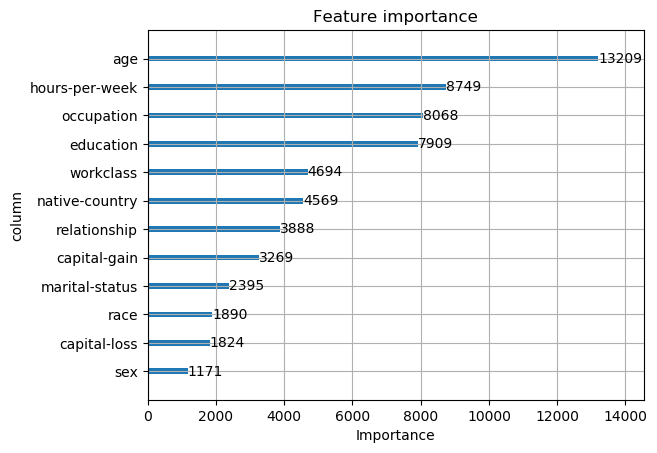
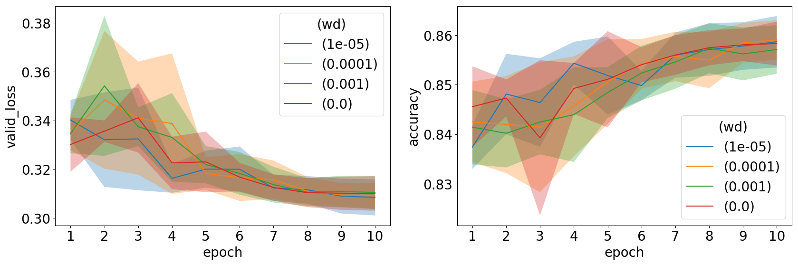

# Deep Learning for Tabular Data \label{chp:td}

## Introduction

In Chapters 2 and 3 we covered the basics of neural networks, as well as the more recent advances in deep learning.
The aim of this chapter is to explore ways in which the modern deep learning approaches in Chapter 3 may be leveraged in the application of deep learning for tabular data (DLTD).
In Chapter 1 we alluded to the differences of tabular data compared to unstructured data (such as images, and data used in text and speech applications).
The widely acclaimed successes of deep learning typically occur in areas such as computer vision, NLP and audio processing.
However, in the literature only a handful of publications report successful implementation of deep learning for tabular data.
In these papers, applications include recommender systems [@haldar2018]; click-through rate prediction[^ctr] [@Song2018]; analysis of electronic health records [@Rajkomar2018]; and transport related problems [@Brebisson2015].
Not much research has been done in the area of deep learning for tabular data, therefore it is often unclear how to solve certain modelling challenges.
Hence the tabular data domain is still dominated by tree-based models such as random forests and gradient boosted trees.
This begs the question as to why deep learning is not nearly as effective here as it is in most other data domains.
The aim of this chapter is to help illuminate this issue, and to indicate promising directions towards improving current state-of-the-art performances.

The structure of the chapter is based upon the challenges that occur when using deep learning for tabular datasets, as identified and described in \Sref{sec:tabchal}.
For each challenge, we reconsider the issue, review the literature to discuss current methodology, and (where possible) provide suggestions towards improving these approaches.
We start in \Sref{sec:inp_rep} by considering ways to represent input features in tabular data.
\Sref{sec:feat_int} is devoted to approaches that are used to leverage feature interactions.
A large part of this chapter is devoted to methodology which facilitates sample efficiency; we discuss in detail in \Sref{sec:samp_eff}.
This is followed by a brief discussion of ways to interpret deep neural networks for tabular data in \Sref{sec:interp}.
In the final section, the 1cycle policy and hyperparameter selection in DLTD are discussed, in addition to a selection of miscellaneous topics that do not fit into the above framework.

[^ctr]: To predict the probability of a user clicking an an item, which is of critical interest in online applications.

## Input Representation \label{sec:inp_rep}

One of the key design considerations when constructing a deep neural network for tabular data is the input representation, *i.e.* the way in which one should numerically represent each feature.
This choice may heavily influence the ability of the neural net to extract patterns from the input, as well as optimisation efficiency during training.
This is a more difficult decision in the case of tabular data, since here features are typically highly heterogeneous [@Shavitt2018].
A representation may be optimal for some features, but not for others, and we want to ensure that no feature dominates the others during training.
Moreover, a tabular dataset typically contains both continuous and categorical features, where different approaches are needed to process each.
Tabular dataset are often high-dimensional and very sparse. 
This is a scenario in which the adverse effects of improper input representations is magnified, as noted by many [@Song2018, @Wang2017b, @Qu2016, @Cheng2016, @Covington2016].
An example of an extremely high-dimensional and sparse tabular dataset is the so-called Criteo dataset[^criteo].
Its feature dimension is ~30 million, with a sparsity of ~99%.

[^criteo]: https://www.kaggle.com/c/criteo-display-ad-challenge

### Numerical Features

A major advantage of tree-based methods is that the scale and distribution of features hardly matter.
The only requirement is that their relative ordering should be meaningful.
With neural networks we are not that fortunate.
Neural networks are very sensitive to the scale and distribution of its inputs [@Ioffe2015]. 
If features are measured on different scales, a single feature might dominate the weight updates.
In this case, if a feature contains a large value, it may throw off the optimisation procedure, thereby causing gradients to 'explode' or to 'vanish' [@Clevert2015].
The implication is that proper standardisation of all continuous features in tabular data is mandatory.

The optimal standardisation in DLTD varies between datasets.
Hence the only way to know for sure which normalisation to apply to numeric features is by means of experimentation.
The typical standardisation approach for numerical features in deep learning is to do mean centering and variance scaling, *i.e.* $\tilde{x}=(x-\mu)/\sigma$, where $\mu$ and $\sigma$ are the mean and standard deviation of $X$ respectively ($x\in X$).
One would expect this transformation to also be sufficient for tabular data, but in practice it has often been found otherwise.

In @haldar2018 the authors propose first inspecting the distribution of each feature.
If a feature seems to follow a normal distribution, standard normalisation, *viz.* $(x-\mu)/\sigma$, may be performed.
However, if a feature seems to approximately follow a power law distribution, it should rather be transformed via $\log\left((1+x)/(1+\text{median})\right)$.
The above mapping ensures that the bulk of the values lie within {-1,1}, and that the median feature value is close to zero.
Consider for example the effect of this transformation on two continuous features (*viz.* Age and Hours-per-week) in the Adult dataset.
This is illustrated in \autoref{fig:contnorm}.
We see in (a) that the features have roughly the same scale, but their distributions are totally different; and in (b) that after applying mean centering and unit variance scaling, the values of the Hours-per-week feature mostly lie in {-1,1}, however many Age values remain outside {-1,1}.
Consequently, we apply the power distribution transformation in @haldar2018, and observe that all Age values now lie within {-1,1}. 
Of course the downside of the above approach is that it involves a manual process and very cumbersome in high-dimensional data setups.

```{r, out.width="33%", fig.cap='The effect of normalisation on continuous variables.\\label{fig:contnorm}', fig.subcap=c('Original', 'Gaussian Norm', 'Power Norm'), fig.show='hold'}
knitr::include_graphics(c('figures/cont_vars.png', 'figures/gaus_norm.png', 'figures/power_norm.png'))
```
With a view to reduce potential high variances exhibited by numeric features, @Song2018 suggests transforming a numeric feature via $\log^{2}(x)$ if $x>2$.
This was successful in their use-case, but it is hard to imagine that this solution will generalise to many other applications.
Note that the @Song2018 transformation causes a discontinuity at $x=2$, as well as a possible overlap between values that were originally less than 2 with those that were greater than 2.
In addition, it does not take care of extreme values on the negative side.
@Wang2017b simply use the standard log transform, *i.e.* $\log{x}$, to normalise continuous features.

@Covington2016 also report appropriate normalisation of numeric features critical for DLTD to converge.
Their approach is to transform numeric features to be equally distributed in [0,1).
This is done using the cumulative distribution $\tilde{x}=\int_{\infty}^{x}df$, where $f$ is the distribution of $x$.
The integral is approximated using linear interpolation on the quantiles of the feature values computed as a preprocessing step.

An option for numeric feature normalisation which we have not yet encountered in the DLTD literature, is to specify the initial layer to numeric features to be a batch normalisation layer.
This will affect the same type of scaling as in the case of zero mean and unit variance transformation, but the transformation parameters are learned from each batch.
Hereby the need to preprocess numeric features is removed.
The caveat is that the transformation quality depends on the batch statistics.
That is, in cases where the batch is not representative of the full data distribution (which is likely if the batch size is small), the training procedure might be negatively affected.

### Categorical Features \label{sec:cat_inp}

Most of the sparsity in tabular datasets is induced by categorical features.
Since neural networks cannot process discrete categories or objects, we need to find a numeric representation for each class.
The standard approach is to use one-hot encoded categorical features.
That is, the one-hot encoded form corresponding to a categorical feature with (say) three levels, is $[1,0,0]$ for Level 1; $[0,1,0]$ for Level 2; and $[0,0,1]$ for Category 3.

Multiple inefficiencies occur when using one-hot encodings in neural networks.
Clearly its use introduces sparsity to the data: the dimension of the one-hot encoded form is equal to the number or categories in a feature.
Thus, if a dataset consist of many high-cardinality features (*i.e.* features with a large number of categories), the data will be extremely sparse and difficult to model.
If not handled properly, sparse data may easily cause neural networks to overfit [@Covington2016].
The presence of categorical features with many levels also increases size requirements of the first linear NN layer, which in turn creates a need for more computing power and memory.

The other problem with one-hot encodings of categorical features is that there is no notion of similarity and distances between categories.
In this representation, all categories lies equally far apart, no matter how semantically similar or dissimilar they are.
This makes it harder for the model to learn useful patterns.

An alternative to one-hot encodings as representations of categorical features for neural networks is the use of *entity embeddings*.
The first publication on entity embeddings in the context of deep learning followed as a result of a taxi destination prediction challenge [@Brebisson2015].
This was followed by a paper by @Guo2016, wherein the authors succesfully used entity embeddings in order to predict the total sales of a store.
Furthermore, companies such as [Instacart](https://tech.instacart.com/deep-learning-with-emojis-not-math-660ba1ad6cdc) and [Pinterest](https://medium.com/the-graph/applying-deep-learning-to-related-pins-a6fee3c92f5e) report the effective use of entity embeddings on their internal datasets. 
Currently all research on deep learning for tabular data facilitate entity embeddings - see for example @Song2018, @Wang2017b, @Covington2016 and @Zhou2017.
The reason for their all-round use is the way in which they are able to ameliorate the issues of one-hot encoded representations.

An entity embedding entails exactly the same operations as with (word) embeddings (discussed in \Sref{sec:embeds}), only they are applied to categories instead of words.
Therefore, an entity embedding assigns a numeric vector representation to each level in a categorical feature.
For example, Level 1 is embedded as $[0.05,-0.1,0.2]$; whereas Levels 2 and 3 are embedded as $[0.2,0.01,0.3]$ and $[-0.1,-0.2,0.05]$ respectively.
In a formulation similar to the one in \Sref{sec:embeds}, note that the embedding for the $j$-th categorical feature is defined by
$$
\boldsymbol{e}_{j}=V_{j}\boldsymbol{x}_{j},
$$
where $\boldsymbol{x}_{j}$ denotes the one-hot encoded vector representation of the $j$-th categorical input, where and $V_{j}$ is the associated embedding/weight matrix.
The weights in $V_{j}$ are learned along with all of the other parameters in the network.
Once all categorical features have been embedded, their representations may be concatenated and passed on to the network layers that follow.

Entity embeddings have been found to significantly speed up the training process and to reduce the memory footprint of a neural network.
This in turn serves to further improve the generalisation ability of a network as stated in @Covington2016 and @Guo2016.
The above advantages are especially useful when working with high-dimensional and sparse inputs (in tabular data).
Suppose we have available a dataset with two categorical features, $X_{1}$ and $X_{2}$, with cardinality $C_{1}$ and $C_{2}$, respectively.
Furthermore, suppose that the first hidden layer in the neural network is presented with inputs of size $q$.
Hence, we need to project an observation with these two features into a vector representation of the same size.
If we were to use one-hot encoded representations of $X_{1}$ and $X_{2}$,we would need a weight matrix of size $(C_{1}+C_{2})\times q$.
However, if we use entity embeddings of $X_{1}$ and $X_{2}$, we may create two weight matrices of sizes $C_{1}\times q/2$ and $C_{2}\times q/2$, which is half the number of parameters needed in the case of one-hot encoded representation.

The size of an embedding (*i.e.* the number of features that represent similarities between inputs) is a hyperparameter of the model and again there is no way to specify this value *a priori*. 
Therefore, most publications rely on a grid search in order to find the optimal size.
For example, @Song2018 experiment with embedding sizes 8, 16, 24 and 32; and found the value 16 to work the best, whereas @Cheng2016 reported an embedding size of 32 to be optimal in their use-case.
Thus, it is clear that appropriate specification of the size hyperparameter depends on the data at hand, and on the network architecture to be used.

@Wang2017b and @Brebisson2015 made use of different embedding sizes for each categorical feature.
Intuitively it seems to make sense to incorporate different embedding sizes for categorical features with different levels of complexity.
In the above papers, the following sizes are proposed:

- $6\times(\text{cardinality})^{\frac{1}{4}}$ [@Wang2017b]
- $\max(2, \min(\text{cardinality}/2,50))$ [@Brebisson2015]

In addition to advantages in terms of speed and memory usage, the use of entity embeddings as opposed to one-hot encoding maps similar values to lie close to each other in the embedding space.
Hence it reveals the intrinsic properties of categorical variables, which cannot be obtained by using one-hot encoding.
This allows us to interpret the classes of the categorical features.
Embeddings may also easily be visualised, thereby facilitating interpretation of the data and of the decision making process of the network.
In more detail, the weights associated with the projection of each category onto the embedded space may be plotted using any dimension reduction technique (such as t-sne or PCA).
We may subsequently compare categories based on relative distances and positions in the reduced space.
To illustrate, reconsider the 'Education' categorical feature in the Adult dataset (introduced in Chapter 2).
In \autoref{fig:edu_embed} a two-component PCA of its embedding matrix is plotted.
From this figure it is clear that the school categories all lie in the bottom-right corner of the space, with some notion of ranking from Grade 5 (top-right) to Grade 12 (bottom-left).
The tertiary education classes lie in a separate cluster and very conveniently, their levels of education coincide with the vertical axis.


In order to verify whether entity embeddings are able to learn useful information, besides plotting the embedding matrix, one may also feed them (along with the continuous features) to other learning algorithms and observe the change in model performance.
Along these lines @Guo2016 tested the use of embeddings from trained NNs as inputs to a set of machine learning methods.
They report that the use of embeddings improved the performance of all tested ML procedures by a significant margin.
Moreover, these embeddings may be re-used in different machine learning tasks, obviating the need for them to be re-learned in other data scenarios.

The entity embedding approach is very flexible.
If, for example, two features have overlapping categories, one may re-use the embedding for the one feature on the second feature. 
@Zhou2017 holds and interesting view of the case of multi-hot categorical features. 
That is, where an observation of a categorical feature may simultaneously be assigned more than one level.
The embedding layer for that instance then outputs a list of embeddings having the same length as the number of categories associated with that instance and feature.
Using some pooling operation, the list of embeddings are subsequently projected back to a fixed-length representation.

### Combining Features

Once all continuous and categorical features have been processed and embedded, we need a way to combine them before their input may be transmitted to the rest of the network.
The standard approach is to concatenate each categorical variable embedding to the continuous variables, as was done in @haldar2018 and @Wang2017b for example. 
This is illustrated in \autoref{fig:comb_rep}.
The potential problem with this approach, however, is that some features might be over-represented in the resulting vector.
Suppose for example that one of the continuous features are very important for prediction.
When the continuous feature is concatenated with the entity embeddings, since all entity embeddings each take up more space in the combined representation, it may happen that the contribution of the continuous predictor may be diluted.

In @Song2018 the authors embed both numerical and categorical features into the same embedded space.
Mapping both types of features into the same feature space facilitates more effective learning of interactions between the mixed set of features.
Here the embedding for the $j$-th numerical features is obtained by
$$
\boldsymbol{e}_{j}=\boldsymbol{v}_{j}x_{j}
$$
where $x_{j}$ is a scalar and where $\boldsymbol{v}_{j}$ denotes the associated weight vector.

```{r, fig.cap="Combined representation of continuous and categorical features.\\label{fig:comb_rep}", fig.align='center', out.width="30%"}
knitr::include_graphics("figures/mix_rep.png")
```

## Learning Feature Interactions \label{sec:feat_int}

In most machine learning tasks it is known that the greatest performance gains are typically achieved by means of feature engineering, whereas improved algorithms often only result in incremental performance boosts.
In feature egineering one strives to use the original features to create a new set of features.
This is done using domain expertise or by exploiting *a priori* knowledge of the data at hand.
Using more informative features obtained in this way facilitates simpler estimation of the target, and capturing high-order interactions between features.
Hence feature engineering is viewed as a crucial step in order to learn as much as possible from a training dataset.
Unfortunately it entails a very laborious process.

Indeed, it is widely stated that in predictive modelling, typically 80% of the effort is devoted to steps involved during preprocessing, merging, customising, and cleaning of datasets [@Rajkomar2018].
Perhaps this is party due to the fact that feature engineering is not a structured process and usually consists of many unsuccesful trials and experimentation before more useful features are found.
The effort associated with feature engineering could have been alleviated by more domain knowledge, but this is not always readily accessible.

A huge advantage of using neural networks on tabular data (and other data structures) is that the feature engineering process can be automated to some extent.
That is, a neural network can learn these optimal feature transformations and interactions implicitly during the training process.
In this way, the hidden layers of a neural network may be viewed as a feature extractor which is optimised to map the network inputs into the best possible feature space for the final layer of the network to operate in.

The traditional approach towards automatic feature engineering in NNs is to stack a few fully-connected layers in order to map the input representation to the output, as was done in @Covington2016.
The set of fully connected layers are used to implicitly model all feature interactions and in ideal world, we would expect this architecture to be sufficient.
In practice however, without current learning algorithms, a simple MLP is not good enough to learn all types of interactions.
A fully connected model structure leads to very complex optimisation hyperplanes, thereby increasing the risk of falling into local optimums.

Therefore, it is necessary to explicitly leverage expressive feature combinations, or to encourage the network to learn better high-order feature interactions.
The above objective receives attention in publications such as @Song2018, @Wang2017b, @Qu2016 and @Guo2017.
The restrictions that we impose on a fully connected structure may further assist in limiting the size of the network, in turn causing learning to be more efficient.

Having motivated the importance of feature engineering, and emphasised the importance of further developing feature extraction methodology for neural networks, in the remainder of this section we focus on ways to assist a network to determine which features to combine in order to form meaningful high-order features.
We briefly review some of the suggestions in the literature, whereafter we discuss the methodology which we believe to be the most powerful in terms of learning feature interactions.

In @Wang2017b, the authors makes a case for finding a bounded-degree of feature interactions.
They argue that all Kaggle competions are won when feature engineering comprises low-degree interactions.
This stands in contrast to automatic feature engineering in deep neural networks, where highly non-linear interactions are typically learned.
Therefore, in @Wang2017b an automated way of constructing cross-features is proposed, and called a *cross-network*.
A feature cross is a synthetic feature that encodes nonlinearity in the feature space by multiplying two or more input features together.
In a cross-network, each layer produces higher-order interactions based on existing ones, and keeps the interactions from previous layers. 
More specifically, a cross-network consists of cross-layers which may be formalised as follows:
$$
\boldsymbol{x}_{l+1}=\boldsymbol{x}_{0}\boldsymbol{x}_{l}^{\intercal}\boldsymbol{w}_{l}+\boldsymbol{b}_{l}+\boldsymbol{x}_{l},
$$
where $\boldsymbol{x}_{l}$ denotes the output from the $l$-th cross-layer and the input to the $(l+1)$-th cross-layer, and where $\boldsymbol{x}_{0}$ is the combined input representation. 
Furthermore, $\boldsymbol{w}_{l}$ and $\boldsymbol{b}_{l}$ represent the associated weight and bias parameters respectively.
Each cross-layer adds back its input after a feature crossing in the same fashion as a skip-connection.
Hence the degree of cross-features grows with increasing cross-network depth.
The authors experimented with 1-6 cross-layers and found a depth of six to yield the best results.
In parallel with the cross-networks in @Wang2017b, the authors also train a standard deep neural network in order to learn highly non-linear feature interactions.
The DNN accepts the same input, and its output is then concatenated with that of the cross-network.

In @Qu2016, the idea of a so-called *product layer* is proposed.
A product layer calculates pairwise inner or outer products of all feature combinations and concatenate them to all linear combinations.
The output is then sent to two fully connected layers.

In contrast to the approach in @Wang2017b, in @Guo2017 and @Cheng2016 the authors aim to capture both low and high-order interactions.
In both papers this is achieved by means of introducing two parallel networks, and learn the high-order interactions by means of a deep neural network. 
For the low order interactions, @Cheng2016 uses a shallow but wide neural network, and @Guo2017 use a separate supervised learning model called a *factorisation machine* [@Rendle2010].
Again the output of the two streams are concatenated, and the resulting output is transmitted to the classification layer.

### Attention \label{sec:tab_att}

Based on the results presented in the paper by @Song2018 and on findings reported in deep learning research in general, we deem attention to be the most promising mechanism to model feature interactions. 
In this section, note that we focus on a recent contribution by @Song2018.
In this paper a so-called *multi-head self-attention* mechanism is used. 
This mechanism is referred to as the *interacting layer*.
Broadly, within the interacting layer each feature is allowed to interact with every other feature.
During training, the interacting layer then automatically determines which of those interactions are relevant to the output.
Multiple identical self-attention modules ("heads") are used, but each allowed to have different weights since a feature is likely involved in different combinatorial features.

In order to further explain the attention mechanism, consider a feature $j$ and suppose that we want to determine which high-order interactions (which involve feature $j$) are meaningful.
We start by first defining the correlation between features $j$ and $k$ under attention head $h$ as follows:
$$
\alpha_{j,k}^{(h)}=\frac{\exp{\left(\phi^{(h)}(\boldsymbol{e}_{j},\boldsymbol{e}_{k})\right)}}{\sum_{l=1}^{L}
\exp{\left(\phi^{(h)}(\boldsymbol{e}_{j},\boldsymbol{e}_{l})\right)}},
$$
where $\boldsymbol{e}_{l}$, $l=1,\dots,L$ denotes the embedding of the $l$-th features, and where $\phi^{(h)}(.,.)$ is an attention function which defines the similarity between two features.
An attention function may either be defined by a trainable layer, or by a simple inner product:
$$
\phi^{(h)}(\boldsymbol{e}_{j},\boldsymbol{e}_{k})=\left<W_{\text{query}}^{(h)}\boldsymbol{e}_{j},W_{\text{key}}^{(h)}\boldsymbol{e}_{k} \right>,
$$
where $W_{\text{query}}^{(h)}$ and $W_{\text{key}}^{(h)}$ are transformation matrices which map the original embedding space into new spaces of the same dimension.
The representation of feature $j$ in subspace $h$ is then updated by combining all relevant features, as guided by the coefficients $\alpha_{j,k}^{(h)}$.
That is:
$$
\tilde{\boldsymbol{e}}_{j}^{(h)}=\sum_{k=1}^{K}\alpha_{j,k}^{(h)}W_{\text{value}}^{(h)}\boldsymbol{e}_{k},
$$
where $\tilde{\boldsymbol{e}}_{j}^{(h)}$ denotes the combination of feature $j$ and its relevant features under attention head $h$.
Note that $\alpha_{j,k}^{(h)}$ for $k=1,\dots,K$ sum to 1 after undergoing a logit transform (or softmax operation).
From the above, $\tilde{\boldsymbol{e}}_{j}^{(h)}$ thus denotes a learned combinatorial feature.
Since a feature may be involved in various different combinations, we use multiple heads to extract multiple combinations, *i.e.* $\{\tilde{\boldsymbol{e}}_{j}^{(h)}\}_{h=1}^{H}$, where $H$ is the number of self-attention heads chosen.
In @Song2018 the value of $H$ is set equal to 2, but this is typically a hyperparemeter that needs to be fine-tuned.
After finding the combinatorial features, they are all concatenated into a single vector, *viz.* $\tilde{\boldsymbol{e}}_{j}$.
The output is then finally combined with the original raw input, and sent through a ReLU activation:
$$
\boldsymbol{e}_{j}^{\text{res}}=\text{ReLU}\left(\tilde{\boldsymbol{e}}_{j}+W_{\text{res}}\boldsymbol{e}_{j}\right).
$$
Note that the above mapping from $\boldsymbol{e}_{j}$ to $\boldsymbol{e}_{j}^{\text{res}}$ is performed for each feature.
In this way the interacting layer is formed.
Clearly therefore, activations of the interacting layer forms a representation of the high-order features of its inputs.
Multiple interacting layers may be stacked on-top of each other in order to form arbitrary order combinatorial features.

In a similar idea to attention, in @Zhou2017 the attention weights to apply to the input of an attention layer is produced by a linear layer and learned along the rest of the network.
Interestingly in this paper, the authors remove the softmax layer as a way to mimic probabilities and to reserve the intensity of activations.

Skip connections are also used in both @Song2018 and @Wang2017b to connect features modelling low level interactions with features modelling high order interactions. 
Their conclusion is that the use of skip connections improves the performance of a neural network.

### Self-Normalising Neural Networks

In the DLTD literature, one rarely encounters an optimal network depth higher than three of four layers.
The reason is that a fully connected model result in very complex optimisation hyperplanes which increases the risk of falling into local optima.
A proposed way of training deeper neural networks is to make use of *self-normalising neural networks* [@Klambauer2017].
These networks were developed as alternatives to the use of batchnorm layers, since the latter often become unstable when using SGD or stochastic regularisation techniques such as dropout.
This is especially the case in fully connected neural networks, where the resulting instability manifests in terms of high-variance training errors.

The self-normalising neural network is simply a neural network which implements a novel activation function called the *SeLU*.
The SeLU activation assists the network in maintaining zero mean and unit variance for activations at all network levels.
In addition to obviating the need for a BatchNorm layer, SeLUs are much more immune to exploding or vanishing gradients.
The definition of the SeLU activation function follows below:
$$
\text{selu}(x)=\lambda 
\begin{cases}
x & \text{if}~~~x>0\\
\alpha e^{x}-\alpha & \text{if}~~~x\le 0\\
\end{cases}
$$
where $\lambda=1.0507$ and $\alpha=1.6733$ are special constants derived in the paper.

In @Klambauer2017, the application of SeLUs were tested using 121 classification datasets from the UCI Machine Learning repository.
Here the performance of DNNs with SeLU activations were compared to the performance of other DNNs, and to that of completely different classifiers (including random forests and SVMs).
The various models were compared using a pairwise Wilcoxon test on their ranked accuracies.
It was found that in the case of datasets with less than 1000 obervations, random forests and SVMs performed the best.
However, in the case of datasets with more than 1000 observations, DNNs with SeLU activations outperformed all other models.
Despite the above promising results, we have not yet seen SeLUs used in any tabular dataset applications.

## Sample Efficiency \label{sec:samp_eff}

Application of deep learning neural networks to tabular data is hindered by the typical size of these datasets.
Tabular datasets are usually not nearly as large as unstructured datasets used to train neural networks for image and text classification.
Moreover, in contrast to the ImagNet dataset for computer vision, or the Wikipedia corpora for NLP, there exists no large tabular dataset which may facilitate transfer learning.
In this section we propose two techniques towards overcoming the above problem, *viz.* data augmentaion and unsupervised pre-training.

### Data Augmentation

In the context of neural networks for tabular data, the topic of data augmentation is rarely studied.
This is in part due to the fact that the augmentations used in standard deep learning applications (such as computer vision and NLP) do not make sense in the case of tabular data.
For example, one cannot rotate or scale an observation in a tabular data set without contorting its true nature and/or meaning.
There are however some transformations that do make sense for tabular input.
In this section we discuss is the injection of random noise by means of so-called *marginalised corrupted features* (MCF), *blank-out corruption*, *swap noise* and *mixup augmentation*.

When working with images, we may randomly perturb pixel intensities by a small amount so that it is still possible to make sense of the image content.
For example, adding the value 1 to all pixels and colors in an image, will simply brighten the image.
Such a translation can however not be used in tabular data application, since the inputs are mostly not measured on the same scale and therefore the addition of noise might result in feature values that lie outside the distribution that generated them. 
Thus, in order to inject random noise to a tabular data sample, the values to be added should be scaled in relation to the range of each input feature.
Subsequently also, the validity of the resulting value for a particular feature should be verified.
Incorporating some noise may potentially also cause a model to be more robust to small variations in the data.
Along these lines, @VanDerMaaten2013 suggest an augmentation approach called marginalised corrupted features.
In the MCF approach, noise are generated from some chosen distribution and used to transform the input values.
In @VanDerMaaten2013, they experimented with Gaussian, Laplace and Poisson distributions for generating noise.
But it is typically unclear beforehand which corruption distributions are useful for what types of data.
In addition, this corruption procedure is only applicable to numerical features.

In the original 'denoising autoencoders' paper [@Vincent2008], note that a so-called *blank-out corruption* procedure is used.
Blank-out corruption entails the random selection of a subset of the input features, and masking their values with zeros.
This resembles dropout regularisation, but applied to the inputs.
The only problem with this approach is that for some features a zero value actually carries some meaning.
Hence, features should be 'blanked out' using some unique value that does not belong to the range of their distributions. 

Another input corruption approach that has empirically been shown to work well[^portoseg], is the technique called *swap noise* [@kasar2018].
The swap noise procedure corrupts inputs by randomly swapping input values with those of other samples in the datasets, thereby ensuring that the corrupted input at least assume valid feature values.
The use of swap noise is illustrated in \autoref{tab:swpns}.

[^portoseg]: https://www.kaggle.com/c/porto-seguro-safe-driver-prediction/discussion/44629

```{r}
df = read_csv('../data/adult/adult_sample.csv')
new_row <- df[4,]
new_row[1] <- df[1,1]
new_row[5] <- df[5,5]
df <- rbind(df, new_row)

df[1,1] <- cell_spec(df[1,1], color='blue')
df[5,5] <- cell_spec(df[5,5], color='green')
df[7,1] <- cell_spec(df[7,1], color='blue')
df[7,5] <- cell_spec(df[7,5], color='green')
df[7,2] <- cell_spec(df[7,2], color='red')
df[7,3] <- cell_spec(df[7,3], color='red')
df[7,4] <- cell_spec(df[7,4], color='red')
df[7,6] <- cell_spec(df[7,6], color='red')

kable(df, 'latex', caption = 'Swap Noise Example.\\label{tab:swpns}', booktabs=TRUE, escape = FALSE) %>% 
  kable_styling(position = 'center') %>% 
  row_spec(4, color='red') %>% 
  group_rows('Original Dataset', 1,6) %>% 
  group_rows('Sample with swap noise', 7,7)
```

Finally in this section, we consider the mixup augmentation approach [@Zhang2017].
Here artifical samples are created by means of the following formulation:
$$
\tilde{\boldsymbol{x}}=\lambda\boldsymbol{x}_{i}+(1-\lambda)\boldsymbol{x}_{j}\\
\tilde{\boldsymbol{y}}=\lambda\boldsymbol{y}_{i}+(1-\lambda)\boldsymbol{y}_{j}\\,
$$
where $\boldsymbol{x}$ denotes an input vector, where $\boldsymbol{y}$ represents a one-hot encoded output vector, and where $\lambda\in[0,1]$.
Furthermore, $(\boldsymbol{x}_{i}, \boldsymbol{y}_{i})$ and $(\boldsymbol{x}_{j}, \boldsymbol{y}_{j})$ are two samples drawn at random from the training data.
Thus, mixup assumes that linear interpolations of input vectors lead to linear interpolations of corresponding targets.
We visualise the creation of artificial samples by means of mixup augmentation on a toy dataset in  \autoref{fig:simple_dataset_mixup}.


The parameter $\lambda$ governs the strength of the interpolation between the input-output pairs.
The closer $\lambda$ lies to 0 or 1, the closer the artificial sample will be to an actual training sample.
The authors suggest using $\lambda\sim\text{Beta}(\alpha, \alpha)$ for $\alpha\in(0,\infty)$, since this makes it more likely for the mixed-up sample to lie closer to one of the original samples (as opposed to midway inbetween two samples).
Best performances were obtained for $\alpha\in[0.1,0.4]$.
In cases where the $\alpha$ value was set too high, underfitting occur.

Typically data augmentation procedures depend on the dataset at hand and requires expert knowledge.
It is therefore difficult to invent novel, generic ways to augment tabular data.
Still, from the way in which mixup augmentation is defined, it is clear that this procedure may be used in the context of any type of data (including tabular datasets).

Mixup data augmentation may be understood in terms of a mechanism encouraging a model to behave linearly inbetween training samples.
@Zhang2017 show that this linear behaviour reduces the amount of undesirable variation when predicting new samples lying further away from the set of training samples.
The authors also show empirically that training using mixup augmentation is more stable in terms of both model predictions and gradient norms.
This is because mixup leads to decision boundaries that transition linearly between classes, resulting in smoother predictions.

In @Zhang2017, the use of mixup data augmentation was tested on six tabular classification datasets from the UCI Machine Learning repository.
The network architecture that was used for this purpose involves a two-layer MLP with 128 neurons in each layer, and a batch size of 16.
It was found that mixup improved prediction performance in the case of four out of the six datasets considered.

In conclusion, it is important to note that all data augmentation metods presented here require hyperparameters to be tuned. 
When using swap noise and blank-out for example, the proportion of feature values to be corrupted needs to be specified.
In mixup augmentation, the mixup weight needs to be set.
Since these parameters control the strength of regularisation, their values are important and should be carefully tuned.

### Unsupervised Pretraining

Recall that unsupervised pretraining was described in \Sref{sec:tl}, and presented as a very effective way of training deep neural networks.
There we have seen that, by automatically learning useful feature combinations in an unsupervised fashion, pretraining may also be used to address the feature engineering issue. 
However, in the literature we only found two papers that make use of pretraining in the context of tabular data.
These are @Zhang2016 and @Miotto2016.
Both papers made use of pretraining with DAEs.
In the latter paper, a stacked denoising autoencoder is used as feature learning method.
The representations derived from the DAE are subsequently passed on to supervised learning algorithms, thereby enabling improved predictions.
This approach is used in a medical application, where general-purpose patient representations facilitate clinical predictive modelling.

There are a lot of unknowns when it comes to using DAEs for pretraining.
First we need to decide on the structural hyperparameters of the network (for example the number and sizes of layers).
Thereafter we need to decide which learning parameters to choose.
Currently, parameter selection is an aspect which have not yet been as thoroughly explored as hyperparameter selection for supervised neural networks.

In addition we of course also need to decide which DAE loss function to use, where in this regard, a choice depends on the type of inputs.
If all inputs are numeric, we may use the common MSE loss, but if the inputs include categorical features, more consideration is needed.
@Miotto2016 transformed all continuous features to lie within [0,1], whereas all categorical features were one-hot encoded.
This enabled the use of binary cross-entropy as loss function.
If we wish to use entity embeddings for categorical features, we can however not use their approach.
A suggestion is to, for each categorical feature, import a separate multiclass cross-entropy loss function, and to use MSE loss for continuous features.
The losses for categorical and continuous features may then be combined in order to obtain a total loss.
The weights to be assigned to the two losses is an aspect which has not yet been researched.

Instead of the feature extraction method followed in @Zhang2016 and @Miotto2016, we propose treating unsupervised pretraining as a transfer learning problem.
That is, we suggest replacing the output layer of the DAE with the required output layers for the supervised learning task.
Then one may first train the newly added layers, keeping the lower level DAE layers fixed.
Subsequently, all layers may be trained simultaneously.
Rather using this approach the feature extractor part of the DAE may still be tuned in order to be optimal for the supervised learning task.
We experiment with the above approach in the following chapter.

### Regularisation

Since regularisation may also be used to facilitate sample efficiency, we provide a brief discussion of the topic in this section. 
In Chapter 3, dropout was discussed as a popular form of regularisation, which is also true for DLTD and found in a lot of work such as @Song2018, @Zhang2016, @Qu2016, @Guo2017.
In the original paper by @Sriva2014, it was advised that the dropout parameter $p$ (which specifies the percentage of neurons to discard), should lie between 0.5 and 1.
The exact value for $p$ is typically determined using a grid search, and results in the literature indicate the optimal percentage to be data- and model dependent (compare for example the optimal $p$ in @Song2018, @Zhang2016, @Qu2016, @Guo2017).

Interestingly, @haldar2018 reported that dropout was not effective in their application.
In their analysis of this result, they hypothesise that dropout produces invalid input scenarious instead of mimicking valid scenarios that may be missing in the training data.
This may distract the model during training causing it to be suboptimal for 'real' examples.
Therefore, the authors rather opt for hand-crafted noise shapes which takes into account the distribution of a relevant feature, similar to the MCF approach. 

The other form of regularisation used in the context of tabular data, is weight decay, used in @Song2018, @Wang2017b, @Zhang2016, @Qu2016 and @Zhou2017,
Note that @Zhang2016 compared dropout with L2 regularisation, and found dropout to be better.

A different angle to regularisation makes use of the fact that the importance of each feature with respect the target is different for tabular and unstructured data.
In computer vision for example, a large number of pixels have to change before an image resembles an entirely different object.
In tabular data, on the other hand, a very small change in a single feature may result in large changes with respect to predictions [@Shavitt2018].
In the latter paper, it is mentioned that this aspect may be addressed by means of including a separate regularisation term for each of the weights in the network. 
The learning loss is thus:
$$
L(D,W,\Lambda)=L(D,W)+\sum_{i=1}^{M}\exp({\lambda_{i}})\cdot \left\|w_{i}\right\|,
$$
where $D=\left\{(x_{i},y_{i})\right\}_{i=1}^{N}$ are the training samples, $W$ the weights of the model and $\Lambda=\{\lambda_{i}\}_{i=1}^{M}$ are the regularisation coefficients for each of the $M$ parameters in the network.
These regularisation terms are treated as additional model hyperparameters.
Unfortunately it is clear that the above approach is totally impracticable.
The only way to train these hyperpararmeters is through repeated tweaking and validating and this is not possible in a gradient-based method.
A workaround is to make these regularisation parameters trainable, as is the case with all other modules in the network.
This is achieved by minimising the so-called counterfactual loss function, a novel objective proposed by @Shavitt2018.
The counterfactual loss is the emprical loss $L(D,W)$, where the weights have already been updated using the regularised loss $L(D,W,\Lambda)$.
Results obtained from empirical work in the paper by @Shavitt2018 are promising.
It was found that training neural networks by means of optimising the counterfactual loss leads to the NNs outperforming all other NN regularisation approaches.

## Interpretation \label{sec:interp}

The importance of model interpretation was mentioned in Chapter 3.
A good understanding of a model helps one to improve the model in the areas where it is weak.
Stated in another way, if one cannot explain the way in which a prediction is arrived at, one cannot be sure about its accuracy.
In most of the literature for deep learning, thus far relatively little attention has been given to model interpretability.
Luckily in the context of tabular data, some of the modern deep learning architecture provide more options in terms of simpler interpretation. 
In terms of modern NN architectures, in this section, we briefly discuss neural network interpretation as facilitated by the use of entity embeddings and attention layers.
We also discuss model independent interpretation by means of permutation test, and illustrate this approach on the Adult dataset introduced in Chapter 1.

With regard to the use of entity embeddings, note that these may easily be visualised once projected into a low-dimensional space.
This was done \autoref{fig:edu_embed}.
For a second example, the interested reader may refer to an illustration in the paper by @Zhou2017.

An attention layer can also be used to provide insight into the relative importance of certain feature combinations, as may be seen in the work by @Song2018 and @Zhou2017.
Relative importance measures are obtained from the attention weights $\alpha$, which in turn are based upon feature similarities.
From these we may infer which features are combined to make predictions for certain observations.
As an example, the output after using the above approach, as obtained in @Song2018, is displayed in \autoref{fig:plt_att}.
Also see @Shavitt2018 for how feature importance were evaluated using the regularisation strength of the learned per weight regularisation parameters $\lambda_{i}$, $i=1,\dots,M$.


@haldar2018 applied a model agnostic model interpretation algorithm in the context of DLTD.
The authors made use of the permutation importance algorithm in order to evaluate the importance of features.
However, they reached the same conclusion as stated in \Sref{sec:interp_ma}, *viz.* that the permutation test did not produce sensical results because the features were not independent.
Independent permutation of the features created examples that never occur in real life, and the deduced importance of features in this invalid space is misleading. 
Subsequently the authors attempted to identify redundant features, which to some extent alleviated the above issue. 

For illustration purposes, the remainder of this section is devoted to an implementation of a permutation importance plot on an NN fitted to the Adult dataset.
In order to obtain a more robust estimate and standard errors, we perturbed each feature five times and measure the NN performance in terms of the log-likelihood loss function.
Our results are displayed in \autoref{fig:imp} (note that the standard errors were too small to be incorporated in the figure).
The horizontal axis measures the average drop in the log loss function when a feature is shuffled before prediction.
The feature ranking makes intuitive sense.
It is reassuring to see that the features 'gender', 'race' and 'native-country' are some of the less important features when predicting income.


Next we compare permutation importance with feature rankings obtained from knowledge distillation to a boosted trees algorithm (see \Sref{sec:interp_ns}).
To recap the process, we use the predictions of the neural network trained on the Adult dataset as the target for a boosted model to predict.
The inputs to the neural network and boosted model are of course the same.  
Once the boosted model has been trained on these targets, we may extract feature importances based upon the number of times that the individual trees used a certain feature to split on.
The obtained feature importance values are displayed in \autoref{fig:imp_xgb}.



In the two approaches, the variable rankings are more or less the same.
The only exceptions are the rankings obtained in the case of the 'marital-status' and 'fnlwgt' features.
This difference might be caused by the permutation importance method not picking up on multivariate feature interactions.
Therefore, it incorrectly perceives 'marital-status' to be an important feature, although in reality the performance drop is actually caused by another feature dependent on 'marital-status'.
The other explanation we can give is that decision trees are more likely to split on features with more splitting points, and since the 'fnlwgt' feature is the feature with most unique values in the dataset, this might have contributed to the reason 'fnlwgt' was considered to be so important in the case of the boosted model.
The above differences in interpretation illustrates that one should take care when interpreting models.
It seems to be a good idea to make use of more than one source of information when possible.

## Hyperparameter Selection \label{sec:hs_tb}

Thus far, we have come across a plethora of hyperparameters to be tuned if we want to sucessfully fit a deep neural network to tabular data.
Broadly speaking, there are structural hyperparameters to select, such as the number of layers and the type of activation functions to use; and there are also learning algorithm hyperparameters to specify, for example the learning rate or weight decay to be used.
In term of structural parameters, since there are no shared patterns among diverse tabular datasets, it is very difficult to design a universal architecture to use in all setups.
In most of the literature, typically a grid search over many combinations of hyperparameter values is performed [@Song2018; @Wang2017b; @Zhang2016; @Qu2016; @Guo2017; @Covington2016].
Most of these parameter values are very dependent on the dataset and other modeling choices; hence the need to tune them.
The main structural hyperparameters tuned in the majority of the papers may be listed as follows: hidden layer size, number of hidden layers, activation functions, and the shape of fully-connected layers (*i.e.* a constant-, increasing-, decreasing- or diamond shape).
The optimal hyperparameter values found varied accross publications, indicating once again the necessity of a hyperparameter tuning step in the case of uncustomary datasets and models.
With regard to hyperparameter selection, we include some experiments of our own (similar to the experiments conducted in the aforementioned papers) in \autoref{app:B}.

In terms of hyperparameters specific to the optimisation algorithm (like learning rate, batch size, learning rate decay, *etc.*), not much experimentation was done in the researched papers.
The only choice that were shown was selecting the learning rate over a grid of values, as in @Zhang2016 and @Wang2017b, and kept the selection constant during training.
Most of the work used the Adam optimiser and early stopping to prevent overfitting [@Song2018; @Wang2017b; @Zhang2016].
Large batch sizes were chosen in @Song2018 and @Wang2017b, 1024 and 512 respectively.

Clearly, the 1cycle policy and the concept of superconvergence has not yet been tested in the tabular data setting.
Therefore we will test its effectiveness here using the Adult dataset.
We compare it against a constant learning rate.
The evaluation method is described in \Cref{chp:exp}.
We first do a learning rate range test and find that the optimal learning rate bounds for the 1cycle policy is 0.01 and 0.1.
In our experiment we compare training a neural network with a fixed learning rate at the lower bound, 0.01, a neural network with a fixed learning rate at the upper bound, 0.1 and a neural network with a 1cycle learning rate schedule in these bounds.
The results are displayed in \autoref{fig:cyc_test}.
From the green line, we see that when training with too large of a (constant) learning rate, the validation loss struggles to converge.
Training with the smaller constant learning rate (blue line) works better in this case, but the losses plateau quite early on and shows no sign of improving.
The 1cycle learning rate update policy (orange line) shows the best validation loss and accuracy of the three methods.
This proves that the 1cycle policy is also effective when working with tabular data.


Since the weight decay plays and important part in the super-convergence phenomena, we do an experiment to find the optimal value and to see how it influences the performance.
By the suggestion of @Smith2018 we try weight decay values for $10^{-3}$, $10^{-5}$ and 0.
First we do a learning rate range test with the different weight decays to identify the best value.
The results are displayed in \autoref{fig:wd_range}.
From the range test it seems that a weight decay of $10^{-5}$ gives the best performance.
To check that this result holds during a full training run, we do an experiment to compare the full training runs with the different weight decays.
The results are displayed in \autoref{fig:wd_test}.
From the results it shows that the learning rate range test is a good indicator of the optimal weight decay, since in the full training run, the model with weight decay of $10^{-5}$ performed the best.
Note that the differences between the training runs are small, and thus if we were to choose one of the other weight decays for this task, we would have only performed slightly worse.





