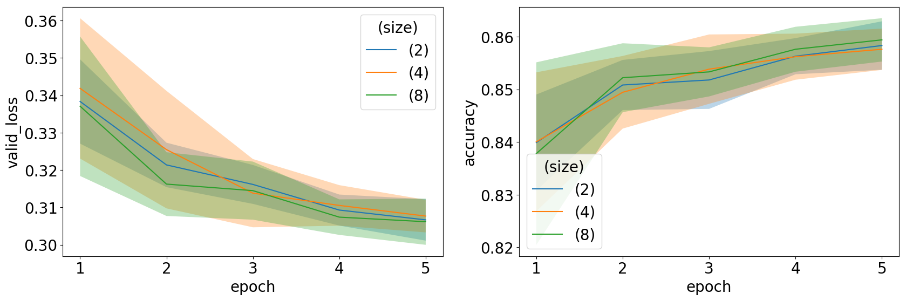
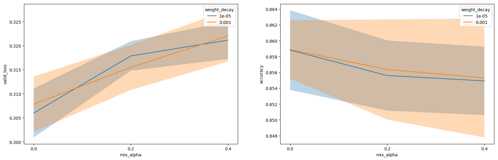
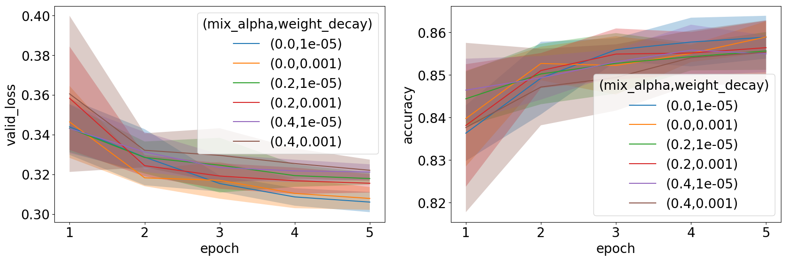

# Experiments \label{chp:exp}

## Introduction

The main objective in this chapter is to better understand the behaviours of certain neural network model architectures, and their parameters.
The empirical work presented here also serves as verification in terms of the observations reported in the literature.
Our focus is on the same deep learning modelling challenges as discussed in \autoref{chp:td}.
These are:

- appropriate input representation;
- learning from feature interactions; and
- enhancing sample efficiency.

The reader will note that the aspect of model interpretation is not listed above, since this challenge was covered in \autoref{sec:interp}.

Appropriate specification of more general hyperparameters such as learning rate, batch size, layer size and layer depth does not form part of the focus in our experimentations. 
The reason is that these do not form part of the main challenges presented by the use of neural networks for tabular data, and also, with some of these parameters we have already experimented in Chapter 4.
Nevertheless, since these parameters are tightly linked with each other and with other model parameters, where appropriate, their specification is still done using a hyperparameter grid search.
Our findings with regard to these grid searches may be found in \Cref{app:B}.

An outline of the remainder of the chapter is as follows: 
In \Sref{sec:datasets} we discuss the dataset that was used in the empirical study, and motivate the reason for having selected this specific dataset.
Thereafter, in \Sref{sec:eval}, we discuss the general methodology followed, as well as the measures of evaluation for each method. 
The experiments may be found in \Sref{sec:rep_exp}, \Sref{sec:exp_int} and \Sref{sec:exp_samp}.
In \Sref{sec:rep_exp} we compare the performance of various entity embedding sizes.
\Sref{sec:exp_int} is devoted to an investigation of the use of several approaches towards modelling high-order feature interactions, whereas in \Sref{sec:exp_samp} we evaluate the different approaches to avoid overfitting in constrained data environments.

In this chapter we aim for good empiricism by exploring many hyperparamters in various data scenarios and by performing cross-validation in order to obtain unbiased performance measures along with standard errors.
Our goal is not necessarily to beat the benchmark, but instead consists of simple experiments designed to aid in understanding techniques.

## The Dataset \label{sec:datasets}

We chose to conduct our empricial work on the Adult dataset. This was done for the following reasons:

+ **Simplicity**: The Adult dataset is representative of a real-world scenario, while not having specific modelling challenges (such as plenty of missing values or highly imbalanced classes). This fits in with our goal of evaluating models on a generic tabular dataset (as opposed to one that requires special attention or the skills of a domain expert). Thus when in terms of prediction performance, a specific network architecture is found to fall short, we may know that this may be attributed to the model, and not to some peculiarity inherent in the data.
+ **Minimal preprocessing**: We want to focus our time on training the algorithms and not on preprocessing the data. The Adult dataset is a relatively 'clean' dataset.
+ **Open access**: Since we want our work to be reproducible, we want the dataset that we use to be accessible to everyone.
+ **Good size**: We have seen that fitting deep neural networks requires large datasets. Hence in order to yield optimal performance we prefer at least a medium sized dataset. If one wants to test models using smaller datasets, one may simply run the experiments on a subset of the data.
+ **Strong baselines**: The Adult dataset has been used in other deep neural network studies, and therefore the performance of several methods on this dataset have been reported in the literature. In order to know how well we are doing, we need to be able to compare our performances with those of others.

For more specifics regarding the Adult dataset, the reader is referred to \autoref{app:data}

## General Methodology \label{sec:eval}

### Loss Function and Evaluation Metric

Recall the learning problem associated with the Adult dataset, *viz*. to predict whether or not an indivdual earns more than $50,000 a year. 
Since this is a binary classification task, we train a neural network to optimise the binary cross-entropy loss function, as defined in \Sref{sec:backprop} (where of course we set $K=2$).
This is the standard loss function typically optimised when fitting NNs for binary classification [@Song2018, @Wang2017b, @Zhang2016, @Qu2016].
Note that during training, the accuracy of the neural network will also be monitored.
Accuracy is used when monitoring the training process since this measure is often simpler to interpret.
Note however that the neural network is not trained to optimise its accuracy. 
In this sense the binary cross-entropy may be seen to act as differentiable proxy to the accuracy.

### Cross-validation

We made use of five-fold cross validation [@Hastie2009, p. 241] to estimate the performance of a model. 
Cross-validation is very often used to estimate performance measures in tabular data applications.
The approach is needed since in small to medium sized datasets, there are not enough data points to be able to split off a test dataset that may not be used during training.
Cross-validation involves randomly partitioning the dataset into five equal parts.
Each data part takes turns to be used for validation, while the remaining four parts are then used to train the model.  
Note that in this way, five model performance measurements are obtained.
We may subsequently compute the average over these five measurements, thereby obtaining a less biased estimate of the performance of a model.
The partitioning and training steps in five-fold cross-validation are depicted in \autoref{fig:cv}.

Another advantage of cross-validation is that it yields a standard error associated with the performance estimate.
In our results, standard errors will be displayed on figures, thereby providing confidence interval estimates of performances via *i.e.* $\mu\pm\sigma$.
This should be helpful in terms of determining the significance of reported differences in performance.

One may ask why we make use of cross-validation while in deep learning research it is common practice to estimate performances using the validation set approach. 
See for example [@Klambauer2017, @Song2018, @Zhang2016].
In the validation set approach, a dataset is partitioned into a training-, validation- and (sometimes) also into a test dataset.
In contrast to cross-validation, partitioning is performed only once.
The problem with a once-off split is that it provides only a single estimate of the performance of a model.
Standard errors cannot be obtained, therefore the variance of a performance estimate cannot be gaged.
Also in terms of bias, cross-validation performs better than the validation set approach, since the size of the training sets in cross-validation is closer to the size of the original training set.
Cross-validation is therefore typically preferred to the validation set approach.
However, bearing the computation intensity of training neural networks in mind, the use of cross-validation in deep learning seems to be very impractical. 
Repetitive partitioning and training steps are much more costly than in the case of tabular data.
Fortunately, deep learning is mostly applied to large datasets.
In these cases, large test sets are available, thereby obviating the need for cross-validation.
Therefore in summary, we make use of cross-validation since our tabular dataset allows (and calls for) its use.
In deep learning, the validation set method is practical and sufficient, since test datasets are large enough.

### Preprocessing

As mentioned in \label{sec:datasets}, in our empirical analyses we aim to avoid feature engineering and preprocessing.
We therefore did not create any new feature combinations.
The only mandatory preprocessing steps involved:
- mapping the text in categorical features to integer values (this was of course necessary to be able to apply entity embeddings);
- standard normal scaling of the continuous features (which was necessary for optimisation algorithms), 
- mean imputation of missing values in the case of continuous features, and assign a "null" category to missing values in the case of categorical features.
Note that we did not perform any *a priori* feature selection steps since we wanted the model to learn which features are relevant.

### Hyperparameter Specification

If not stated otherwise, we made us of simple MLPs to map input representations to income predictions.
Based on our findings in \Sref{sec:hs_tb}, we decided to train all networks using the 1cycle policy (and the Adam optimiser).
Note that the hyperparameter selection process suggested by @Smith2018 in this context is a manual process.
Therefore we make use of the @Smith2018 approach only during the first experiment, thereby finding appropriate values for the learning rate, for the number of epochs, and for weight decay (called 'training hyperparameters' in this section).
These parameter values are then used in all empirical work to follow.
This initial search for appropriate training hyperparameter values is reported in \autoref{app:B}.
Note that in the second and third experiments, the parameter selection process was rerun in cases where the fitted model changed significantly from the previous experiment to the next.
Also, whenever we encountered instability during training, the parameter selection process was redone.

Following the above hyperparameter specification methodology, note that in each experiment we definitely do not expect to find the optimal model.
The hyperparameter selection approach should however prove sufficient for comparing performances.
Luckily also, according to @Smith2018, NNs have been found to be quite robust with respect to the specification of training hyperparameter values.

With regard to the specification of structural hyperparameter values, we experimented with the dropout percentage, and with the width and depth of the network.
Again we found optimal values for these parameters once off, *viz.* in the first experiment.
Thereafter, these parameter values were kept fixed.
More details regarding the specification of structural hyperparameter values may be found in \autoref{app:B}.

## Input Representation \label{sec:rep_exp}

### Embedding Size

In this section we report on our experimentation with respect to the effect of embedding size on the prediction performance of a neural network.
Specifically, we consider the use of 2, 4 and 8 neurons in the embedding layers.
These values are chosen since in our setup, we expect the ideal embedding size to be a small value, but not so small that it is unable to capture all of the signal conveyed by the available features.

As stated in \Sref{sec:rep_exp}, we expect there to be an optimal embedding size for each variable, depending on the cardinality of the variable, and on how complex its relationship is with the other variables and with the target.
Recall that in \Sref{sec:cat_inp} a set of rules for representation of categorical variables is proposed, where these rules depend on the cardinality of each categorical feature.
In addition to experimenting with embedding sizes, we would therefore also like to see whether these rules are able to, also in our data setup, provide reasonable performances.

The results of the first experiment (in which we compared three pre-specified embedding sizes) are displayed in \autoref{fig:exp_emb_f}.
In the lefthandside panel, note that the loss function value, obtained for the validation data is plotted against the number of epochs; whereas in the righthandside panel the validation accuracy is plotted on the y-axis.
Shaded areas indicate standard errors.
From this figure, since at epoch 5, the blue line lies below the red and green lines, it is clear that an embedding size of 2 is preferred. 
One reason for this may be that for these data, categorical features are not that important in terms of enhancing prediction accuracy. 
Therefore a smaller representation may assist in reducing noise.

In order to investigate the effect of cardinality dependence, we compared the constant size 2 embeddings with the rules from @Wang2017b and @Brebisson2015.
The results of this experiment are shown in \autoref{fig:exp_emb_r}.
From the figure we infer that there is almost no difference between the three approaches.
Brebisson's method performs sightly better on the validation loss and the fixed size of 2 performs the best on accuracy.
On other datasets this result will most likely be different if the categorical features contain more rich information.

## Feature Interactions \label{sec:exp_int}

### Attention

We believe attention is the most promising approach to modelling high-order interactions between features for tabular data, since it has been so effective in other data domains.
To test this assuptiom we implemented a multi-head attention module as described in [@Song2018] so that we can compare it to a standard neural network.
We did not have the computing power to try different configurations for this module and thus we went with the biggest configuration that could be run in reasonable time.
We chose $H=3$ (Number of heads) and use embedding sizes of 3 all-round.
We only used on multi-head attention layer and connected its output to a single hidden layer of size 200, which in turn is connected to the output layer.
We compared it to a simple MLP with a similar number of total parameters.
The results of this experiment is given in \autoref{fig:exp_att5}.
The model with the attention mechanism performs worse than the one without and exhibits higher variance.
In the future we would like to experiment with more of the hyperparameters of the multi-head attention module and try stacked attention layers.
It will be interesting to see how this results would change if the dataset had more features.

### SeLU

Deeper networks can help us learn higher-order feature interactions.
The SeLU activation function is supposed to help us train deeper neural networks.
Therefore we compare it to the ReLU activation function over two models, one with 2 layers and the other with 8, to investigate its impact on performance.
The SeLU activation function was implemented with its special weight intitialisation, but no dropout was used.
In \autoref{fig:selu_all} and \autoref{fig:selu_best} we observe that the model with 8 layers and SeLU activations, perform the best overall in terms of the validation loss, but in terms of accuracy the ReLU model with 2 layers showed the best results.
The differences observed are minor which leads us to believe that the choice is not that important and that sticking with shallow ReLU networks are sufficient until more experiments are done.

### Skip-Connections

Another mechanism we can use to make deeper networks possible is a skip-connection.
Skip-connections may also help to combine different orders of feature interactions.
The skip connection combines the activations before and afer a linear layer through an elementwise addition.
We tested networks with skip-connections for a shallow and a deep neural network.
The results are summarised in \autoref{fig:resid_epoch} and \autoref{fig:resid_best}.
On average did the deeper neural network perform better and in terms of the validation loss did the skip-connections slightly improve the performance.
Again, there is very little between the two types and thus we cannot say one is better thant the other.
For simplicity sake, we would suggest not using skip-connections, until more experiments have been done.

## Sample Efficiency \label{sec:exp_samp}

We did an experiment to see how the number of samples available to the network for training influences its learning ability.
We trained the network at training set sizes of 1000, 2000, 4000, 8000, 16000 and 32000.
The results are reported in \autoref{fig:sampsize}.
As expected, the network performs better as the training set increases, but the increase diminish as the sample size gets higher.
We do observe a strange results where the model trained only using 4000 samples exhibit one of the best accuracies.

### Data Augmentation

Mixup was the most promising form of data augmentation from our literature review.
In this experiment we want to investigate how mixup with different mixup ratios influence the performance of our neural networks on the adult dataset.
Since data augmentation also acts as a form of regularisation, we want to see the interaction between weight decay and mixup ratios.
We experimented with mixup $\alpha$-ratios of [0,0.4] and with weight decays of [$10^{-5}$, $10^{-3}$] on a neural network with 3 hidden layers of 200 units each.
The results of the experiment are captured in \autoref{fig:exp_mix_best} and \autoref{fig:exp_mix_epoch}.

The results indicate that mixup is not improving the validation loss or the accuracy of the models.
It is also interesting to see the interaction between mixup and weight decay.
Since both are forms of regualrisation we would expect one to reduce the need of the other, but this is not what the results suggest.
Although a promising technique from the literature, we think the value of mixup depends on the dataset and whether or not interpolating between samples makes sense.

### Unsupervised Pretraining

Here we investigate whether or not DAEs as a method of unsupervised pretraining is beneficial to a supervised learning neural network.
We trained a DAE with swap noise for 15 epochs on the Adult dataset, with the swap noise proportion set at 15%.
The DAE had 3 hidden layers of 500 units each.
Then we transfer the learned weights to a supervised learning network, also with 3 hidden layers of 500 units.
But the supervised network has a different output layer to the DAE.
Therefore we first keep the transferred weights fixed and train only the last layer of the supervised learning network, as a way of initialising its weights.
Otherwise if we would have trained all the weights together from the start, the random weights of the output layer might have interfered with the learned weights in the hidden layers.
Once the output layer is initialised with this process, we can train all of the network simultaneously.
This final stage of training is showed in \autoref{fig:exp_pretr} where we compare it to a model without pretraining.
We see that in terms of both the accuracy and the validation loss that the pretrained model has an advantage over the trained from scratch classifier.
This makes sense since the pretrained model does not have to start from a random initialisation.
But as training continues this gaps becomes smaller.
In terms of the validation loss the two models are equivalent when training completed, but in terms of the accuracy the trained from scratch classifier outperformed the pretrained model.
We do not believe these results are conclusive since there are still so many avenues to explore for unsupervised pretraining with DAEs.
We do not know yet how to design the DAE in terms of its network architecture, amount of noise injected, lenght of training cycle, etc, and then what the best way is of transferring this knowledge to a classifier.
As a test to validate if the DAE learned something useful one can feed the activations from one of the DAE hidden layers to another machine learning algorithm and see whether these representations perform better than with the raw data.
From the results of this basic implementation, we do still believe that there is value in this approach and that it warrants further exploration.

## General Thoughts

We ran thorough experiments for the most promising techniques in deep learning for tabular data.
In most of the experiments there were not clear differences between the performances of the different techniques.
Our one hypothesis is that the Adult dataset does not lend itself to more advanced modelling techniques and that the basic neural network is close to the best one can get.
Our other concern is that the greedy fashion of our hyperparameter selection has limited the various approaches.
Since it was not feasible to tune the required paramters for all models in all folds, we selected a set of paramters from initial experiments and used them for most of the experiments.
But since these parameters are so inter-connected, chaning one already means that the others are not optimal anymore.
We were aware of this limitation from the start, but we still do not know however to what extent it influenced our results.

