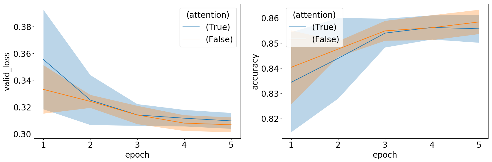
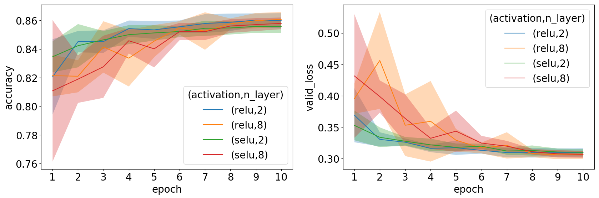
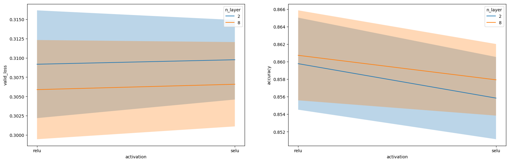

# Experiments \label{chp:exp}

## Introduction

The main objective in this chapter is to better understand the behaviours of certain neural network model architectures (and their parameters).
The empirical work presented here also serves as verification in terms of the observations reported in the literature.
Our focus is on the same deep learning modelling challenges as discussed in \Cref{chp:td}.
These are:

- appropriate input representation;
- learning from feature interactions; and
- enhancing sample efficiency.

The reader will note that the aspect of model interpretation is not listed above, since this challenge was covered in \Sref{sec:interp}.

Appropriate specification of more general hyperparameters such as learning rate, batch size, layer size and layer depth does not form part of the focus in our experimentations. 
The reason is that these do not form part of the main challenges presented by the use of neural networks for tabular data, and also, with some of these parameters we have already experimented in Chapter 4.
Nevertheless, since these parameters are tightly linked with each other and with other model parameters, where appropriate, their specification is still done using a hyperparameter grid search.
Our findings with regard to these grid searches may be found in \Cref{app:B}.

An outline of the remainder of the chapter is as follows: 
In \Sref{sec:datasets} we discuss the dataset that was used in the empirical study, and motivate the reason for having selected this specific dataset.
Thereafter, in \Sref{sec:eval}, we discuss the general methodology followed, as well as the measures of evaluation for each method. 
The experiments may be found in \Sref{sec:rep_exp}, \Sref{sec:exp_int} and \Sref{sec:exp_samp}.
In \Sref{sec:rep_exp} we compare the performance of various entity embedding sizes.
\Sref{sec:exp_int} is devoted to an investigation of the use of several approaches towards modelling high-order feature interactions, whereas in \Sref{sec:exp_samp} we evaluate the different approaches to avoid overfitting in constrained data environments.

In this chapter we aim for good empiricism by exploring many hyperparameters in various data scenarios and by performing cross-validation in order to obtain unbiased performance measures along with standard errors.
Our goal is not necessarily to beat the benchmark, but instead consists of simple experiments designed to aid in understanding techniques.

The code for developing the models and running the experiments were written in Python.
The deep learning library, Pytorch, was used to build the different neural networks.
Many of the common layers, like the linear layer or the ReLU activation, for example, are provided by the library and we are left with combining these layers to form the models we required.
However, some of the more modern layers/modules, like the attention mechanism or the SELU activation for example, are not yet provided by the library and therefore we wrote our own implementations thereof.

The optimisation of the neural networks were done with the help of the Fastai library which provides convenient utility functions for training with the 1cycle policy.
We wrote code that builds on this library to perform various tasks required for these experiments, for example: cross-validation, hyperparameter selection, pretraining, data augmentation, transfer learning and visualising results.
One may refer to \autoref{app:code} for more detail on the code and where to access it.

## The Dataset \label{sec:datasets}

We chose to conduct our empricial work on the Adult dataset. This was done for the following reasons:

+ **Simplicity**: The Adult dataset is representative of a real-world scenario, while not having specific modelling challenges (such as plenty of missing values or highly imbalanced classes). This fits in with our goal of evaluating models on a generic tabular dataset (as opposed to one that requires special attention or the skills of a domain expert). Thus, when in terms of prediction performance, a specific network architecture is found to fall short, we may know that this may be attributed to the model, and not to some peculiarity inherent in the data.
+ **Minimal preprocessing**: We want to focus our time on training the algorithms and not on preprocessing the data. The Adult dataset is a relatively 'clean' dataset.
+ **Open access**: Since we want our work to be reproducible, we want the dataset that we use to be accessible to everyone.
+ **Good size**: We have seen that fitting deep neural networks requires large datasets. Hence, in order to yield optimal performance we prefer at least a medium sized dataset. If one wants to test models using smaller datasets, one may simply run the experiments on a subset of the data.
+ **Strong baselines**: The Adult dataset has been used in other deep neural network studies, and therefore the performance of several methods on this dataset have been reported in the literature. In order to know how well we are doing, we need to be able to compare our performances with those of others.

The Adult dataset, originally used in @Kohavi1996, is data that was extracted from the census bureau database[^cens] and can be accessed from this link[^adult_dl].
The task here is to predict whether or a not a certain person's income exceeds $50,000 per year.
Thus, it is posed as a binary classifcation problem.

[^cens]: http://www.census.gov/en.html
[^adult_dl]: http://archive.ics.uci.edu/ml/datasets/Adult

In total there are 14 features and 48,842 observations.
Two-thirds of the observations were randomly selected to form the training set and the rest allocated to the test set.
Note, that we will not use any of the observations in the test set during our experiments.
Hyperparemeter and model selection decisions are made based on the validation dataset performance and then if we wish we can evaluate the selected models on the test set for the most accuracte estimation of the generalisation ability of the models.

The details for each of the features are listed below.
We indicate the continuous features and the classes for the categorical features.

+ *age*: continuous

+ *workclass*: Private, Self-emp-not-inc, Self-emp-inc, Federal-gov, Local-gov, State-gov, Without-pay, Never-worked

+ *education*: Bachelors, Some-college, 11th, HS-grad, Prof-school, Assoc-acdm, Assoc-voc, 9th, 7th-8th, 12th, Masters, 1st-4th, 10th, Doctorate, 5th-6th, Preschool

+ *marital-status*: Married-civ-spouse, Divorced, Never-married, Separated, Widowed, Married-spouse-absent, Married-AF-spouse

+ *occupation*: Tech-support, Craft-repair, Other-service, Sales, Exec-managerial, Prof-specialty, Handlers-cleaners, Machine-op-inspct, Adm-clerical, Farming-fishing, Transport-moving, Priv-house-serv, Protective-serv, Armed-Forces

+ *relationship*: Wife, Own-child, Husband, Not-in-family, Other-relative, Unmarried

+ *race*: White, Asian-Pac-Islander, Amer-Indian-Eskimo, Other, Black

+ *sex*: Female, Male

+ *capital-gain*: continuous

+ *capital-loss*: continuous

+ *hours-per-week*: continuous

+ *native-country*: United-States, Cambodia, England, Puerto-Rico, Canada, Germany, Outlying-US(Guam-USVI-etc), India, Japan, Greece, South, China, Cuba, Iran, Honduras, Philippines, Italy, Poland, Jamaica, Vietnam, Mexico, Portugal, Ireland, France, Dominican-Republic, Laos, Ecuador, Taiwan, Haiti, Columbia, Hungary, Guatemala, Nicaragua, Scotland, Thailand, Yugoslavia, El-Salvador, Trinadad&Tobago, Peru, Hong, Holand-Netherlands

Note, we removed the following variables from the analysis: *education-num* and *fnlwgt*.

The effect of the continuous features on the target are plotted in \autoref{fig:ad_cont} with the use of kernel density estimations.
A kernel density estimate plot shows the distribution of a single variable and can be thought of as a smoothed histogram (it is created by computing a kernel, usually a Gaussian, at each data point and then averaging all the individual kernels to develop a single smooth curve).
The counts of the categories for each of the categorical features, partitioned by the response, can be found in \autoref{fig:ad_cat}.
The highest reported accuracy in the original paper [@Kohavi1996] was 85.9% by the NBTree algorithm and in an unpublished experiment[^kag_exp] one researcher achieve ~88% accuracy with boosted trees.

[^kag_exp]: https://www.kaggle.com/kanav0183/catboost-and-other-class-algos-with-88-accuracy

## General Methodology \label{sec:eval}

### Loss Function and Evaluation Metric

Recall the learning problem associated with the Adult dataset, *viz*. to predict whether or not an indivdual earns more than $50,000 a year. 
Since this is a binary classification task, we train a neural network to optimise the binary cross-entropy loss function, as defined in \Sref{sec:backprop} (where of course we set $K=2$).
This is the standard loss function typically optimised when fitting NNs for binary classification (@Song2018, @Wang2017b, @Zhang2016, @Qu2016).
Note that during training, the accuracy of the neural network will also be monitored.
Accuracy is used when monitoring the training process since this measure is often simpler to interpret.
Note however that the neural network is not trained to optimise its accuracy. 
In this sense the binary cross-entropy may be seen to act as differentiable proxy to the accuracy.

Another common way of representing classification results of models are with the use of Receiver Operating Characteristic (ROC) curves.
This is a 2-dimensional plot of the sensitivity and specificity of the classification model. 
It thus presents an extra dimension of the classification.
We computed the ROC curve along with its (area under the curve) AUC score for one of the better performing networks on the Adult dataset in \autoref{fig:roc}.
The network had three layers of 512 neurons each, ReLU activations, network-wide dropout of 0.2 and trained with the 1cycle policy.
We also followed the cross-validation approach explained in the next section.
This network and training configuration was chosen after evaluating the results of this chapter.
Although the ROC curve is useful in general, we found very little variation between the curves of different models and therefore decided to exclude it from the results of the other experiments, since it added no clear value to the interpretation thereof.

### Cross-validation

We made use of five-fold cross validation [@Hastie2009, p. 241] to estimate the performance of a model. 
Cross-validation is very often used to estimate performance measures in tabular data applications.
The approach is needed since in small to medium sized datasets, there are not enough data points to be able to split off a test dataset that may not be used during training.
Cross-validation involves randomly partitioning the dataset into five equal parts.
Each data part takes turns to be used for validation, while the remaining four parts are then used to train the model.  
Note that in this way, five model performance measurements are obtained.
We may subsequently compute the average over these five measurements, thereby obtaining a less biased estimate of the performance of a model.
The partitioning and training steps in five-fold cross-validation are depicted in \autoref{fig:cv}.

Another advantage of cross-validation is that it yields a standard error associated with the performance estimate.
In our results, standard errors will be displayed on figures, thereby providing confidence interval estimates of performances via *i.e.* $\mu\pm\sigma$.
This should be helpful in terms of determining the significance of reported differences in performance.

One may ask why we make use of cross-validation while in deep learning research it is common practice to estimate performances using the validation set approach. 
See for example @Klambauer2017, @Song2018 and @Zhang2016.
In the validation set approach, a dataset is partitioned into a training-, validation- and (sometimes) also into a test dataset.
In contrast to cross-validation, partitioning is performed only once.
The problem with a once-off split is that it provides only a single estimate of the performance of a model.
Standard errors cannot be obtained, therefore the variance of a performance estimate cannot be gaged.
Also in terms of bias, cross-validation performs better than the validation set approach, since the size of the training sets in cross-validation is closer to the size of the original training set.
Cross-validation is therefore typically preferred to the validation set approach.
However, bearing the computation intensity of training neural networks in mind, the use of cross-validation in deep learning seems to be very impractical. 
Repetitive partitioning and training steps are much more costly than in the case of tabular data.
Fortunately, deep learning is mostly applied to large datasets.
In these cases, large test sets are available, thereby obviating the need for cross-validation.
Therefore in summary, we make use of cross-validation since our tabular dataset allows (and calls for) its use.
In deep learning, the validation set method is practical and sufficient, since test datasets are large enough.

### Preprocessing

As mentioned in \Sref{sec:datasets}, in our empirical analyses we aim to avoid feature engineering and preprocessing to see if a neural network can learn these optimal representations automatically.
We therefore did not create any new feature combinations or manipulated the existing ones.
The only mandatory preprocessing steps involved:
- mapping the text in categorical features to integer values (this was of course necessary to be able to apply entity embeddings);
- standard normal scaling of the continuous features (which was necessary for optimisation algorithms), 
- mean imputation of missing values in the case of continuous features, and assign a "null" category to missing values in the case of categorical features.
Note that we did not perform any *a priori* feature selection steps since we wanted the model to learn which features are relevant.

### Hyperparameter Specification

If not stated otherwise, we made us of simple MLPs to map input representations to income predictions.
Based on our findings in \Sref{sec:hs_tb}, we decided to train all networks using the 1cycle policy (and the Adam optimiser).
Note that the hyperparameter selection process suggested by @Smith2018 in this context is a manual process.
Therefore, we make use of the @Smith2018 approach only during the first experiment, thereby finding appropriate values for the learning rate, for the number of epochs, and for weight decay (called 'training hyperparameters' in this section).
These parameter values are then used in all empirical work to follow.
This initial search for appropriate training hyperparameter values is reported in \autoref{app:B}.
Note that in the second and third experiments, the parameter selection process was rerun in cases where the fitted model changed significantly from the previous experiment to the next.
Also, whenever we encountered instability of the loss function during training, the parameter selection process was redone.

Following the above hyperparameter specification methodology, note that in each experiment we definitely do not expect to find the optimal model.
The hyperparameter selection approach should however prove sufficient for comparing performances.
Luckily also, according to @Smith2018, NNs have been found to be quite robust with respect to the specification of training hyperparameter values.

With regard to the specification of structural hyperparameter values, we experimented with the dropout percentage, and with the width and depth of the network.
Again we found optimal values for these parameters once off, *viz.* in the first experiment.
Thereafter, these parameter values were kept fixed.
More details regarding the specification of structural hyperparameter values may be found in \autoref{app:B}.

## Input Representation \label{sec:rep_exp}

### Embedding Size

In this section we report on our experimentation with respect to the effect of embedding size on the prediction performance of a neural network.
Specifically, we consider the use of 2, 4 and 8 neurons in the embedding layers.
These values are chosen since in our setup, we expect the ideal embedding size to be a small value, but not so small that it is unable to capture all of the signal conveyed by the available features.

As stated in \Sref{sec:rep_exp}, we expect there to be an optimal embedding size for each variable, depending on the cardinality of the variable, and on how complex its relationship is with the other variables and with the target.
Recall that in \Sref{sec:cat_inp} a set of rules for representation of categorical variables is proposed, where these rules depend on the cardinality of each categorical feature.
In addition to experimenting with embedding sizes, we would therefore also like to see whether these rules are able to, also in our data setup, provide reasonable performances.

The results of the first experiment (in which we compared three pre-specified embedding sizes) are displayed in \autoref{fig:exp_emb_f}.
In the left panel, note that the loss function value, obtained for the validation data is plotted against the number of epochs; whereas in the right panel the validation accuracy is plotted on the y-axis.
Shaded areas indicate standard errors.
From this figure, since the green line lies mostly below the red and blue lines in the left panel and mostly above them in the right panel, it is clear that an embedding size of 8 is preferred. 
One reason for this may be that for these data, categorical features are quite important in terms of enhancing prediction accuracy and that a relatively large vector is needed to describe the categories.

In order to investigate the effect of cardinality dependence, we compared the constant size 2 embeddings with the rules from @Wang2017b and @Brebisson2015.
The results from this experiment are shown in \autoref{fig:exp_emb_r}.
From the figure we infer there to be almost no difference between the three approaches.
In terms of accuracy, the fixed size of 2 performed the best. 
In datasets where categorical features contain more information and vary substantially in terms of its properties, one may however expect this result to be different.

## Feature Interactions \label{sec:exp_int}

### Attention

Since attention is so effectively used in other data domains, we believe it to be the most promising approach towards modelling high-order interactions between features for tabular data.
In order to test this hypothesis, we implemented our own multi-head attention module, as described in @Song2018.
In this way, our results are comparable to those produced by a standard neural network.
We did not have the computing power to try different configurations for this module and thus we went with the largest possible configuration that could be run in reasonable time.
We chose the number of head, $H$, to be 3, and made use of embedding sizes of 3 throughout.
Moreover, we only made use of a single multi-head attention layer, and connected its output to a single hidden layer of size 200, which in turn was connected to the output layer.
The performance of the above architecture was then compared to the performance of simple MLP with a similar number of total parameters.
The results of this experiment are reported in \autoref{fig:exp_att5}.
The left panel plots the average loss on the validation set over each of the five epochs and the right panel, the average accuracy.
Surprisingly, the model with the attention mechanism (blue line, "*attention*=True") performed worse than the MLP (orange line, "*attention*=False") on its own; its predictions exhibiting higher variance than the MLP.
A possible explanation is that the hyperparameter specification in the attention layers was inadequate, or that the single attention layer is not complex enough.
In the future therefore, we would like to experiment with more of the hyperparameters of the multi-head attention module and also try out stacked attention layers.
Moreover, one wonders in which way the above results would have changed if a dataset with more features were used. 

### SeLU Activations

In Chapter 3 we have seen that deeper networks can help us learn higher-order feature interactions.
The SeLU activation function is supposed to help us train deeper neural networks.
Therefore, we compare use of SeLUs to use of the ReLU activation using two networks.
The first network was specified to have two layers, whereas the second network had eight layers in total.
The SeLU activation function was implemented using its customised weight initialisation method, but no dropout was used.
In \autoref{fig:selu_all} we plot the average (over each fold) loss and accuracy on the validation set for each of the epochs for the different models and in \autoref{fig:selu_best} we plot the average loss and accuracy on the validation set of the final models.
We observe that in terms of validation loss and accuracy, the model with eight layers using ReLU activations emerged as the winner.
However, the differences are so minor that, in the absence of more evidence, we tend to still recommend the use of shallow ReLU networks.

### Skip Connections

Another mechanism which have contributed to the successful implementation of deeper networks is skip connection.
Apart from facilitating more efficient neural network training, skip connections have been found to alleviate the degradation problem, thereby improving the prediction performance of deep neural networks.
Skip connections are often also used to combine different orders of feature interactions.
Using this mechanism, elementwise addition (or other concatenation functions) may be used in order to combine input and output before and after a linear layer.
In our empirical work, we investigate the performances of both a shallow (with 2 hidden layers) and a deep network (with 6 hidden layers) using skip connections.
The results are summarised in \autoref{fig:resid_epoch} and in \autoref{fig:resid_best}, where the average (over each fold) loss and accuracy is plotted for each epoch and for the final model, respectively.
The models with skip connections are indicated by "*residual*=True" in the figure legend and "*residual*=False" otherwise.
On average, the deeper neural network with skip connections performed slightly better on the validation data, but once again, performances of the different networks are very similar.
At this stage we therefore recommend the simpler design of not using skip connections.

## Sample Efficiency \label{sec:exp_samp}

In the next experiment we investigate the effect of the number of samples on the prediction performance of a neural network.
Therefore, the network was optimised using training dataset of sizes of 1000, 2000, 4000, 8000, 16000 and 32000.
The results are reported in \autoref{fig:sampsize}.
As expected, the network performs better with an increase in the training set size, where the enhancements in performance diminishes in the case of higher sample size values.

### Data Augmentation

From the literature review in Chapter 3, mixup augmentation emerged as seemingly the most promising form of data augmentation.
In this experiment we wanted to investigate the way in which the application of mixup (own implementation), using various mixup ratios, influences the performance of neural networks on the Adult dataset.
Since data augmentation also acts as a form of regularisation, we also wanted to investigate the interaction between weight decay and mixup ratios.
We experimented with mixup $\alpha$-ratios of 0 and 0.4, and with weight decays of [$10^{-5}$, $10^{-3}$] in a neural network with 3 hidden layers, consisting of 200 units each.
The results of the experiment are displayed in \autoref{fig:exp_mix_best} and in \autoref{fig:exp_mix_epoch}.

The results indicate that mixup is not improving either the validation loss or the accuracy of the models.
The observed interaction between mixup and weight decay is an interesting aspect of the experiment.
Whereas one might expect the use of mixup to reduce the need for weight decay and vice versa, this notion is not supported by our results.
Although from the literature mixup seems to be a promising technique, its success seems to be domain specific.
Our suggestion would be that for tabular data, mixup should only be used when interpolating between samples makes sense.

### Unsupervised Pretraining

In our final experiment, we investigated whether or not the use of DAEs in unsupervised pretraining yield output which may be beneficial to a (supervised) neural network for tabular data.
Therefore, we trained a DAE with swap noise (own implementation) for 15 epochs on the Adult dataset.
We set the swap noise proportion equal to 15%, and the DAE had 3 hidden layers consisting of 500 units each.
The learned weights were subsequently carried over to a supervised learning network, where the latter also comprised 3 hidden layers consisting of 500 units each.
Note that the supervised network had a different output layer than that of the DAE.
Therefore, we first kept the transferred weights fixed, and trained only the last layer of the supervised learning network.
This is done in order to initialise the network weights.
Otherwise, if we simultaneously trained all the weights from the start, random weights to the output layer might have interfered with learned weights in the hidden layers.
Once the output layer is initialised with this process, we may train all layers of the network simultaneously.
This final stage of training is showed in \autoref{fig:exp_pretr}, where we compare it to the final stage of training of a model without pretraining.
In terms of both accuracy and validation loss, we see that the pretrained model has an advantage over the classifier that was trained-from-scratch.
The above result makes sense, since the pretrained model does not have to start from a random initialisation.
However as expected, as training continues, this gaps gradually decreases.

Since there are still so many avenues to explore for unsupervised pretraining with DAEs, we do not believe these results to be conclusive.
We do not yet know the best way to design DAEs in terms of their network architectures, the amount of noise injected, and the lengths of training cycles.
Furthermore, investigation into the preferred way of transferring the learned knowledge from a DAE to the supervised classifier, remains outstanding.
The results of this basic implementation seems to indicate that the use of unsupervised pretraining in the context of tabular data warrants further exploration.

## Summary

This chapter was devoted to a discussion of the empirical work that was done in order to test some of the latest successful mechanisms in the field of deep learning.
Specifically, application of these methodologies were investigated in the context of tabular data.

Fairly disappointingly, in all 9 experiments, we did not find significant differences between the performances of the techniques considered.
Therefore, regarding preferences with respect to methodologies for appropriate input representation, for learning from feature interactions and for leveraging sample efficiency, no clear recommendations could unfortunately be made.

Our one hypothesis is that the Adult dataset does not lend itself to more advanced modelling techniques and that the basic neural network is close to the best one can get.
Our other concern is that the greedy fashion of our hyperparameter selection has limited the various approaches.
Since it was not feasible to tune the required parameters for all models in all folds, we selected a set of parameters from initial experiments and used them for most of the experiments.
But since these parameters are so inter-connected, changing one already means that the others are not optimal anymore.
We were aware of this limitation from the start, but we still do not know however to what extent it influenced our results.
